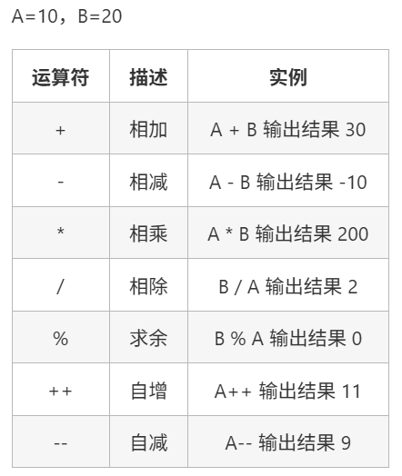
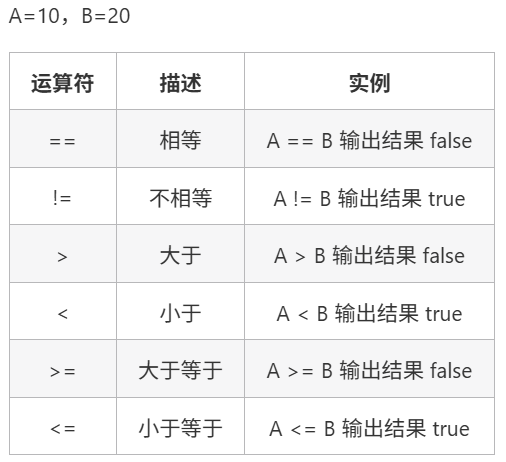
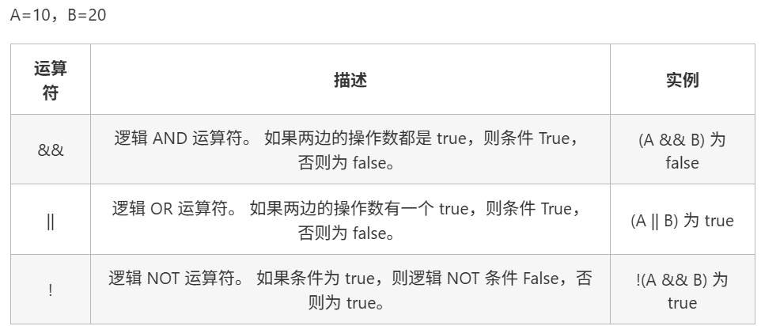
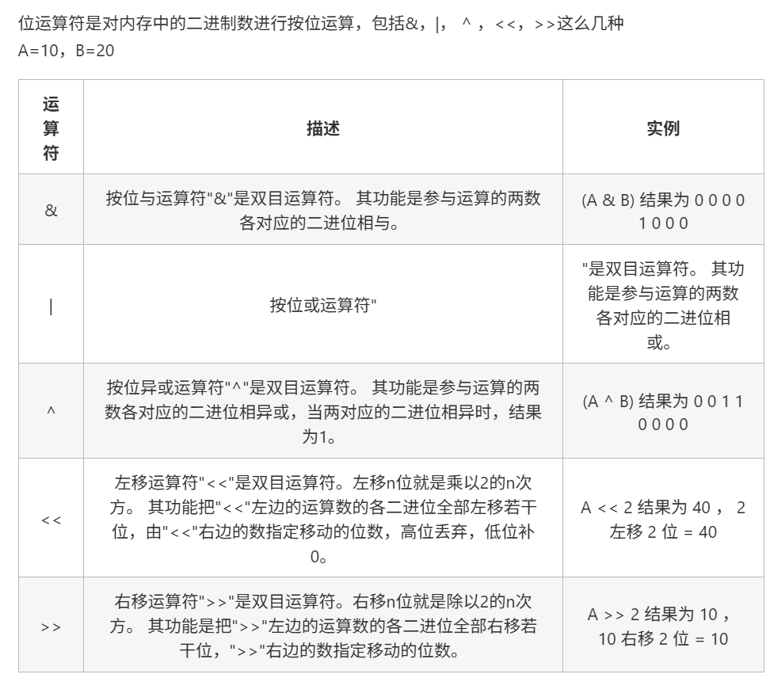
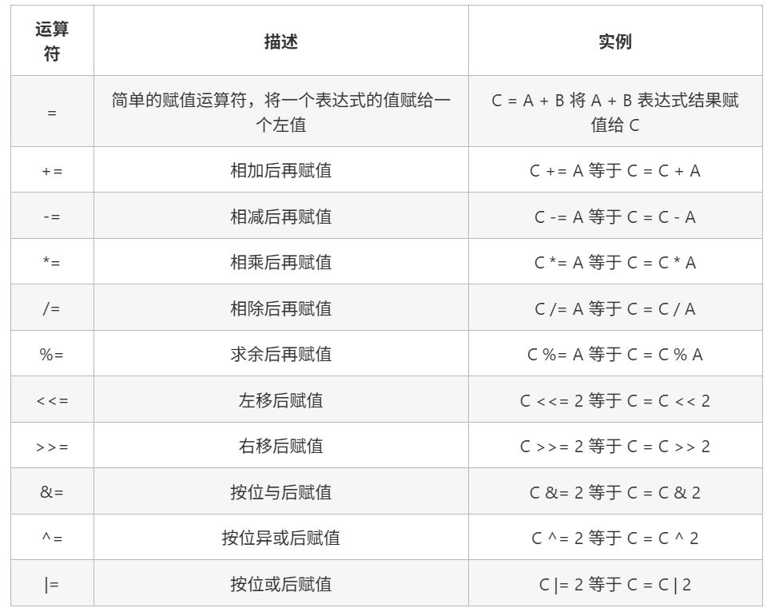
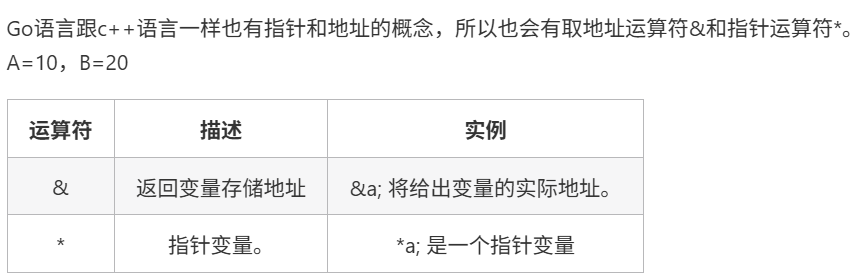

### Go学习笔记

#### 一、Go的基础语法

##### 1. Go语言的特点

- 简单，易于上手
- 并发编程基于 Goroutines 和 Channels，自带了功能丰富的标准库
- 具有更加出色的内存使用量和垃圾回收能力

##### 2. Go源码结构

```go
package main
import "fmt"
func main(){
    fmt.Println("Hello World!")
}
```

1. 第一行表示源码文件属于 main 包，main 包是每个 Go 应用程序都包含的包，有且只有一个；
2. 第二行表示导入名为 “fmt” 的包，一旦导入必须被使用；
3. 从第三行开始到最后，是 main() 函数，程序的入口函数，有且只有一个，且必须声明在main包中（使用大括号包裹函数体）；
4. 第四行调用了 fmt 包中的 Println() 函数，将特定的内容输出到控制台上。

**添加注释**

- 单行注释：`//`
- 多行注释：`/* */`

##### 3. Go语言变量

命名方式：字母、数字、下划线，且不能以数字开头。

示例：`var identifier type`

**变量声明的几种方式**

1. 指定变量类型，未初始化则为0值：

```go
package main
import "fmt"
func main() {
    var a string = "Hello" // 声明一个变量并初始化
    fmt.Println(a)

    var b int    // 没有初始化就为零值
    fmt.Println(b)

    var c bool   // bool 零值为 false
    fmt.Println(c)
}
```

未初始化默认值：

- 数值型（含complex64 / 128）：0

- 布尔型：false

- 字符串：""

- 以下几种为nil（空指针）：

```go
package main

import "fmt"

var a *int
var b []int
var c map[string]int
var d chan int
var e func(string) int
var f error

func main() {
    fmt.Println("Hello World!")
    fmt.Println(a == nil)
    fmt.Println(b == nil)
    fmt.Println(c == nil)
    fmt.Println(d == nil)
    fmt.Println(e == nil)
    fmt.Println(f == nil)
}
```

2. 根据值自行判定变量类型（相当于省略后面的类型）

示例：`var v_name = value`

```go
package main
import "fmt"
func main() {
    var d = true
    fmt.Println(d)
}
```

3. 使用 := 来进行声明

```go
package main
import "fmt"
func main() {
    f := "Hello" // var f string = "Hello"
    fmt.Println(f)
}
```

`f := "Hello"`相当于`var f string = "Hello"`的简写。

4. 多变量声明：

```go
//类型相同多个变量, 非全局变量
var vname1, vname2, vname3 type
vname1, vname2, vname3 = v1, v2, v3

var vname1, vname2, vname3 = v1, v2, v3 // 和 python 很像,不需要显示声明类型，自动推断

vname1, vname2, vname3 := v1, v2, v3 // 出现在 := 左侧的变量不应该是已经被声明过的，否则会导致编译错误

// 这种因式分解关键字的写法一般用于声明全局变量
var (
    vname1 v_type1
    vname2 v_type2
)
```

变量生命周期：程序存活时间，不发生内存逃逸的情况下，局部变量是函数存活时间。

##### 4. Go语言常量

常量是一个简单的标识符，程序运行时不能被修改。数据类型只能是bool，number（int， float，complex）和string类型。

定义方式：`const identifier [type] = value`

```go
const b string = "abc"   // 显式常量定义
const b = "abc"          // 隐式常量定义

/* 多个同类型声明 */
const a, b = "abc", "def"
```

**用于枚举**

Go的枚举一般用常量表示，没有专门的枚举类型。

```go
const (
    Unknown = 0
    Success = 1
    Fail = 2
)
```

**iota**

`iota`是一个特殊常量，在`const`关键字出现时将被重置为0（const内部第一行之前），`const`中每新增一行常量将使`iota`计数一次。

因此，`iota`可看成`const`语句块内部的行索引。

```go
const (
    a = iota
    b = iota
    c = iota
)

// 例子
package main

import "fmt"

func main() {
    const (
        a = iota      // 0
        b             // 1
        c             // 2
        d = "ha"      // 独立值，iota = 3
        e             // "ha"，iota = 4
        f = 100       // iota = 5
        g             // 100，iota = 6
        h = iota      // 7，恢复计数
        i             // 8
    )
    fmt.Println(a, b, c, d, e, f, g, h, i)
}
```

##### 5. Go语言运算符

分为：

- 算术运算符
- 关系运算符
- 逻辑运算符
- 位运算符
- 赋值运算符
- 其他运算符

**算术运算符**



**关系运算符**



**逻辑运算符**



**位运算符**



**赋值运算符**



**其他运算符**



##### 6. Go语言结构体

**定义**

```go
type Student struct {
    ID int
    Name string
    Age int
    Score int
}
```

**初始化**

1. 键值对方式

```go
package main

import "fmt"

type Student struct {
    ID int
    Name string
    Age int
    Score int
}

func main() {
    st := Student{
        ID : 100,				// 注意逗号不能省
        Name : "zhangsan",
        Age : 18,
        Score : 98,
    }
    fmt.Printf("学生st: %v\n", st)
}
```

2. 值列表的方式

```go
package main

import "fmt"

type Student struct {
    ID int
    Name string
    Age int
    Score int
}

func main() {
    st := Student{
       101,
       "lisi",
       20,
       97,
    }
    fmt.Printf("学生st: %v\n", st)
}
```

**成员访问**

使用`.`来进行访问，`.`前可以是结构体变量或者指针

```go
package main

import "fmt"

type Student struct {
    ID int
    Name string
    Age int
    Score int
}

func main() {
    st1 := Student{
        ID : 100,
        Name : "zhangsan",
        Age : 18,
        Score : 98,
    }
    fmt.Printf("学生1的姓名是: %s\n", st1.Name)
    
    st2 := &Student{
        ID : 101,
        Name : "lisi",
        Age : 20,
        Score : 97,
    }
    fmt.Printf("学生2的分数是: %d\n", st2.Score)
}
```

##### 7. Go语言数组与切片

**数组的定义**

```go
// 1. 最基础的定义方式
var scores [3]int  // 定义一个能存放3个整数的数组

// 2. 定义时直接赋值
var prices = [3]float64{10.99, 20.99, 30.99}

// 3. 让编译器自动计算长度
names := [...]string{"张三", "李四", "王五"}

// 4. 指定特定位置的值
colors := [5]string{0: "红", 2: "蓝", 4: "绿"}  // [红 "" 蓝 "" 绿]
```

**数组的特点**

1. 长度固定
2. 只能存同类型数据
3. 长度是类型的一部分：`[3]int`和`[5]int`是不同类型

```go
package main

import "fmt"

func main() {
    // 成绩管理系统
    var scores [5]int = [5]int{95, 89, 92, 88, 96}
    
    // 计算平均分
    sum := 0
    for _, score := range scores {
        sum += score
    }
    average := float64(sum) / float64(len(scores))
    fmt.Printf("平均分：%.2f\n", average)
}
```

**切片**

**切片的定义**

```go
// 1. 直接创建
fruits := []string{"苹果", "香蕉", "橙子"}

// 2. 使用make函数创建
numbers := make([]int, 3, 5)  // 长度为3，容量为5的切片

// 3. 从数组创建
arr := [5]int{1, 2, 3, 4, 5}
slice := arr[1:4]  // [2 3 4]
```

**切片的核心概念**

切片本质其实不是数组，底层是一个结构体。

```go
type SliceHeader struct {
    Data uintptr  // 指向底层数组
    Len  int      // 当前长度
    Cap  int      // 容量
}
```

1. 指针：指向底层数组的第一个可见元素
2. 长度：当前能看到多少个元素（len）
3. 容量：从切片起点到底层数组末尾的元素个数（cap）

```go
package main

import "fmt"

func main() {
    // 创建一个购物清单
    shoppingList := []string{"牛奶"}
    
    // 添加商品
    shoppingList = append(shoppingList, "面包")
    shoppingList = append(shoppingList, "水果", "蔬菜")
    
    fmt.Printf("购物清单：%v\n", shoppingList)
    fmt.Printf("清单长度：%d\n", len(shoppingList))
    fmt.Printf("清单容量：%d\n", cap(shoppingList))
    
    // 复制切片
    backup := make([]string, len(shoppingList))
    copy(backup, shoppingList)
    
    fmt.Printf("备份清单：%v\n", backup)
}
```

**注意事项**

1. 切片是引用类型，多个切片可能共享同一个底层数组
2. append可能导致重新分配内存，生成新的底层数组
3. 使用make创建切片时，可指定容量来减少内存重新分配次数

**适用场景对比**

1. 使用数组：当知道数据的确切长度且不会改变时
2. 使用切片：
   - 处理动态数据，如用户输入的列表
   - 需对数据进行频繁的增删操作
   - 作为函数参数传递（更灵活）

##### 8. Go语言Map

**Map的定义**

Map类似于哈希表和字典，提供了一种键值对的存储方式。

```go
// 1. 使用make函数创建
scoreMap := make(map[string]int)

// 2. 创建时直接初始化
studentScores := map[string]int{
    "张三": 95,
    "李四": 88,
    "王五": 92,
}

// 3. 声明一个空map
var prices map[string]float64
// 注意：声明后需要通过make初始化才能使用
prices = make(map[string]float64)
```

**Map的基本操作**

```go
package main

import "fmt"

func main() {
    // 创建一个存储水果价格的map
    fruitPrices := make(map[string]float64)
    
    // 添加键值对
    fruitPrices["苹果"] = 5.5
    fruitPrices["香蕉"] = 3.8
    fruitPrices["橙子"] = 4.2
    
    // 获取值
    applePrice := fruitPrices["苹果"]
    fmt.Printf("苹果的价格是：%.2f元\n", applePrice)
    
    // 修改值
    fruitPrices["苹果"] = 5.8
    
    // 删除键值对
    delete(fruitPrices, "香蕉")
    
    // 遍历map
    for fruit, price := range fruitPrices {
        fmt.Printf("%s的价格是：%.2f元\n", fruit, price)
    }
}
```


