## Leetcode打卡

### 一、Hot100

#### 1. 哈希

##### 1.1 两数之和

* 题目链接：[1. 两数之和](https://leetcode.cn/problems/two-sum/)
* 题目描述：给定一个整数数组 `nums` 和一个整数目标值 `target`，请你在该数组中找出 **和为目标值** *`target`* 的那 **两个** 整数，并返回它们的数组下标（不能使用两次相同的元素）。
* 思路：使用哈希表，用**空间换时间**，哈希表存每个数的下标，然后先枚举右边的数的下标，再去找左边的数的下标，最后再存储当前数的下标。

> 注意这里的顺序是先查询再存储，若先存储再查询则可能出现重复下标

- 代码

```python
class Solution:
    def twoSum(self, nums: List[int], target: int) -> List[int]:
        n = len(nums)
        d = {}          # 存下标
        for i, x in enumerate(nums):
            if d.get(target - x) is not None:
                return [i, d[target - x]]
            d[x] = i
```

---

##### 1.2 字母异位词分组

- 题目链接：[49. 字母异位词分组](https://leetcode.cn/problems/group-anagrams/)
- 题目描述：给你一个字符串数组，请你将 **字母异位词** 组合在一起。可以按任意顺序返回结果列表。
- 思路：排序后相等的即为字母异位词。用哈希表分组，把排序后的字符串当作哈希表的 key，排序前的字符串加到对应的列表中（哈希表的 value）。
- 代码

```python
class Solution:
    def groupAnagrams(self, strs: List[str]) -> List[List[str]]:
        d = collections.defaultdict(list)
        for s in strs:
            sorted_s = "".join(sorted(s))
            d[sorted_s].append(s)
        return list(d.values())
```

---

 ##### 1.3 最长连续序列

- 题目链接：[128. 最长连续序列](https://leetcode.cn/problems/longest-consecutive-sequence/)
- 题目描述：给定一个未排序的整数数组 `nums` ，找出数字连续的最长序列（不要求序列元素在原数组中连续）的长度。设计并实现时间复杂度为 `O(n)` 的算法。
- 思路：对于 *nums* 中的元素 *x*，以 *x* 为起点，不断查找下一个数 *x*+1,*x*+2,⋯ 是否在 *nums* 中，并统计序列的长度。（优化一：将nums中的数存放到**哈希集合**中；优化二：在查找前先判断x-1是否在哈希集合中，避免冗余查找。
- 代码

```python
class Solution:
    def longestConsecutive(self, nums: List[int]) -> int:
        n = len(nums)
        st = set(nums)      # 创建哈希集合

        ans = 0
        for x in st:
            if x - 1 in st:
                continue
            y = x + 1
            while y in st:      # 最后y - 1是最后一个在集合中的数
                y += 1
            ans = max(ans, y - x)
        
        return ans
```

---

#### 2. 双指针

##### 2.1 移动零

- 题目链接：[283.移动零](https://leetcode.cn/problems/move-zeroes/description/?envType=study-plan-v2&envId=top-100-liked)
- 题目描述：给定一个数组 `nums`，编写一个函数将所有 `0` 移动到数组的末尾，同时保持非零元素的相对顺序。
- 思路：用双指针维护一个全0区间`[l, r - 1]`，然后从头开始搜索，l 始终指向0，当r指向的数nums[r]不为0时就与nums[l]交换
- 代码

```python
class Solution:
    def moveZeroes(self, nums: List[int]) -> None:
        """
        Do not return anything, modify nums in-place instead.
        """
        n = len(nums)
        l = r = 0           # [l, r - 1]为一个全0区间
        while r < n:
            if nums[r]:     # nums[r]不为0则与0交换
                nums[l], nums[r] = nums[r], nums[l]
                l += 1
            r += 1
```

---

##### 2.2 盛水最多的容器

- 题目链接：[11. 盛最多水的容器](https://leetcode.cn/problems/container-with-most-water/)
- 题目描述：

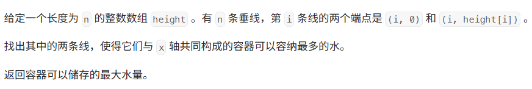

- 思路：双指针，定义两个在区间端点的左右指针，每次先计算当前所构成的矩形的面积：`s = (r - l) * min(height[l], height[r])`，然后更新答案；如果左指针的高度更低，那么当前左指针无论与区间内右边任何柱子构成的矩形面积都不会再增加（因为宽度一定减小，然后高度由最低的那根柱子确定，所以总体面积不可能增加），因此左指针向前移动（这根柱子没有价值了），反之则移动右指针。
- 代码：

```python
class Solution:
    def maxArea(self, height: List[int]) -> int:
        n = len(height)
        ans = 0
        l, r = 0, n - 1
        
        while l < r:
            s = (r - l) * min(height[l], height[r])
            ans = max(ans, s)
            if height[l] < height[r]:
                l += 1
            else:
                r -= 1
        return ans
```

---

##### 2.3 三数之和

- 题目链接：[15. 三数之和](https://leetcode.cn/problems/3sum/)
- 题目描述：给定整数数组，找出其中和为0且不重复的三元组。
- 思路：对数组进行排序，这样可以让重复的数挨在一起方便去。然后遍历数组，先对第一个数去重，接着在后面的区间定义双指针来找另外两个数，当总和不为0时逐渐缩小区间范围，总和为0时再对另外两个数进行去重操作。
- 代码：

```python
class Solution:
    def threeSum(self, nums: list[int]) -> list[list[int]]:
        n = len(nums)
        nums.sort()         # 排序
        ans = []

        for i in range(n):
            x = nums[i]
            if x > 0:
                break
            
            if i > 0 and x == nums[i - 1]:      # 去重第一个数
                continue
            
            l, r = i + 1, n - 1
            while l < r:
                s = x + nums[l] + nums[r]
                if s < 0:
                    l += 1
                elif s > 0:
                    r -= 1
                else:                   # s = 0
                    ans.append([x, nums[l], nums[r]])
                    # 去重第二和第三个数
                    while l < r and nums[l] == nums[l + 1]:
                        l += 1
                    while l < r and nums[r] == nums[r - 1]:
                        r -= 1
                    l += 1
                    r -= 1
        return ans
```

---

##### 2.4 接雨水

- 题目链接：[42. 接雨水](https://leetcode.cn/problems/trapping-rain-water/)
- 题目描述：

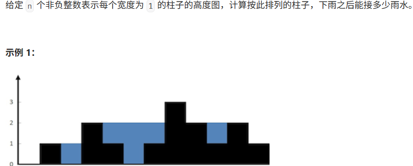

- 思路：能否产生积水取决于左右两边最高的墙中较短的墙，定义两个左右指针，然后在遍历过程中更新左边和右边的最高的墙，如果l_max < r_max，则说明左边格子的储水上限已经到顶了，那么直接计算l_max - height[l]，反之则计算右边格子的积水。
- 代码：

```python
class Solution:
    def trap(self, height: List[int]) -> int:
        n = len(height)
        l, r =  0, n - 1
        l_max, r_max = 0, 0
        ans = 0
        
        while l <= r:
            l_max = max(l_max, height[l])       # 先更新左右两边最高的墙
            r_max = max(r_max, height[r])
            
            if l_max < r_max:                   # 能否产生积水取决于较短的墙
                ans += l_max - height[l]
                l += 1
            else:
                ans += r_max - height[r]
                r -= 1
        
        return ans
```

---

#### 3. 滑动窗口

##### 3.1 无重复字符的最长子串

- 题目链接：[3. 无重复字符的最长子串](https://leetcode.cn/problems/longest-substring-without-repeating-characters/)
- 题目描述：找出字符串中不含重复字符的最长子串的长度。
- 思路：维护一个滑动窗口，当遇到重复字符的时候就将左边界往后持续移动直到窗口内的字符不重复。
- 代码：

```python
class Solution:
    def lengthOfLongestSubstring(self, s: str) -> int:
        cnt = Counter()
        l = 0
        ans = 0
        # [l, r]维护一个滑动窗口
        for r, c in enumerate(s):
            cnt[c] += 1
            while cnt[c] > 1:               # 当前字符有重复，开始向右滑动
                cnt[s[l]] -= 1          
                l += 1
                
            ans = max(ans, r - l + 1)   # 不重复时的长度来更新答案
        return ans 
```

---

##### 3.2 找到字符串中所有字母异位词 

- 题目链接：[438. 找到字符串中所有字母异位词](https://leetcode.cn/problems/find-all-anagrams-in-a-string/)
- 题目描述：有两个字符串`s`和`p`， 找到`s`中所有`p`的异位词的子串并返回其起始索引。
- 思路：先统计一下p的字符频次，然后维护一个滑动窗口，每遇到字符就将其减一，当该字符的频次小于0时说明不合法（遇到了不是p的字符或者超过了p中原有的字符频次），接着将左边界向右移动，同时添加字符频次。如果当前合法区间的长度跟p的长度一样，那么则找到其中一个子串。
- 代码：

```python
class Solution:
    def findAnagrams(self, s: str, p: str) -> List[int]:
        cnt = Counter(p)
        l = 0
        ans = []
        for r, c in enumerate(s):
            cnt[c] -= 1
            while cnt[c] < 0:
                cnt[s[l]] += 1
                l += 1
            if r - l + 1 == len(p):
                ans.append(l)

        return ans
```

---

#### 4. 子串

##### 4.1 和为K的子数组

- 题目链接：[560. 和为 K 的子数组](https://leetcode.cn/problems/subarray-sum-equals-k/)
- 题目描述：给定整数数组，统计该数组中和为K的子数组（连续非空序列）的个数。
- 思路：利用前缀和+哈希表，我们想找`s[j] - s[i - 1] = k`出现了多少次，变形可得：`s[i - 1] = s[j] - k = s - k`，因此可以将找该区间转变为找具体的某个点。

> 注意：cnt[0] = 1本质表示在没有任何元素之前，前缀和为0的情况已经出现了一次。

- 代码：

```python
class Solution:
    def subarraySum(self, nums: List[int], k: int) -> int:
        cnt = defaultdict(int)
        ans = 0
        s = 0
        cnt[0] = 1              # 初始化

        for x in nums:
            s += x
            ans += cnt[s - k]
            cnt[s] += 1

        return ans
```

---

##### 4.2 滑动窗口最大值

* 题目链接： [239. 滑动窗口最大值](https://leetcode.cn/problems/sliding-window-maximum/)

* 题目描述：给定一个数组，找到长度为`k`的滑动窗口的最大值（每次向右移动一位）。

* 思路：每遇到一个元素，就把前面比它小的（或相同的）元素删掉。用单调队列（双端）实现对元素的增删，且满足队列的单调性。

* 代码

```python
class Solution:
    def maxSlidingWindow(self, nums: List[int], k: int) -> List[int]:
        ans = []
        q = deque()     # 双端队列保存下标（可判断队首是否离开窗口）
        
        for i, x in enumerate(nums):
            # 入
            while q and nums[q[-1]] <= x:
                q.pop()     # 删去左边比它小的元素
            q.append(i)

            # 出
            l = i - k + 1
            if q[0] < l:    # 队首离开窗口
                q.popleft()
            
            # 记录答案
            if l >= 0:
                ans.append(nums[q[0]])

        return ans
```

---

##### 4.3 最小覆盖子串

* 题目链接： [76. 最小覆盖子串](https://leetcode.cn/problems/minimum-window-substring/)

* 题目描述：给定2个子串`s`和`t`，找出s中包含t的最短子串（包括重复字符）。

* 思路：双指针，移动子串右端点然后判断s子串中是否包含t，如果包含则判断是否缩小答案区间，同时移除子串左端点

* 代码

```python
class Solution:
    def minWindow(self, s: str, t: str) -> str:
        cnt_t = Counter(t)      # 统计t中字母出现次数
        cnt_s = Counter()       # 统计s子串字母出现次数
        ans_l, ans_r = -1, len(s)
        l = 0
        for r, c in enumerate(s):   # 移动子串右端点
            cnt_s[c] += 1           # 右端点字母加入子串
            while cnt_s >= cnt_t:       # 如果s子串中包含t
                if r - l < ans_r - ans_l:   # 判断是否更短
                    ans_l, ans_r = l, r
                cnt_s[s[l]] -= 1            # 移除子串左端点
                l += 1
        return "" if ans_l < 0 else s[ans_l: ans_r + 1]               
```

---

#### 5. 数组

##### 5.1 最大子数组和

* 题目链接：[53. 最大子数组和](https://leetcode.cn/problems/maximum-subarray/)
* 题目描述：找出数组中的连续子数组的最大和
* 思路：1. 前缀和 + 贪心，遍历求前缀和并且维护最小前缀和，用两者之差来求子数组和并更新答案；2. DP求解（拼接思想）。

```python
"""
写法一：前缀和+贪心
"""
class Solution:
    def maxSubArray(self, nums: List[int]) -> int:
        n = len(nums)
        min_pre = pre = 0   # 计算最小前缀和与当前前缀和
        ans = -inf
        for x in nums:
            pre += x
            ans = max(ans, pre - min_pre)   # 两者之差即为区间和
            min_pre = min(min_pre, pre)     # 需要先计算再更新最小前缀和
        return ans
"""
写法二：DP
"""
class Solution:
    def maxSubArray(self, nums: List[int]) -> int:
        n = len(nums)
        f = [0] * n
        f[0] = nums[0]      # 初始值
        for i in range(1, n):
            f[i] = max(f[i - 1], 0) + nums[i]   # 如果左边的子数组最大和为负，则不用拼接
        
        return max(f)
```

---

##### 5.2 合并区间

- 题目链接：[56. 合并区间](https://leetcode.cn/problems/merge-intervals/)
- 题目描述：合并所有重叠的区间，返回一个不重叠的区间数组。
- 思路：先将数组按照左端点排序，然后判断当前区间的`st`与合并区间的`la_ed`，如果`la_ed >= st`说明需要合并，更新新的区间的右端点，否则不需要合并直接将区间加入答案。

```python
class Solution:
    def merge(self, intervals: List[List[int]]) -> List[List[int]]:
        ans = []
        intervals.sort(key=lambda p: p[0])
        la_st, la_ed = intervals[0]
        for st, ed in intervals[1:]:      # 从第二个区间开始
            if la_ed >= st:               # 有重叠，需要合并区间
                la_ed = max(la_ed, ed)
            else:                         # 无重叠，添加之前的结果，更新新的区间
                ans.append([la_st, la_ed])
                la_st, la_ed = st, ed
        ans.append([la_st, la_ed])        # 添加最后一个区间
        return ans
    
"""
灵神题解
"""
class Solution:
    def merge(self, intervals: List[List[int]]) -> List[List[int]]:
        ans = []
        intervals.sort(key=lambda p: p[0])
        
        for x in intervals:
            if ans and x[0] <= ans[-1][1]:
                ans[-1][1] = max(ans[-1][1], x[1])
            else:
                ans.append(x)
        return ans
```

---

##### 5.3 轮转数组

- 题目链接：[189. 轮转数组](https://leetcode.cn/problems/rotate-array/)
- 题目描述：将数组中的元素向右轮转移动k个位置。
- 思路：通过3次反转实现

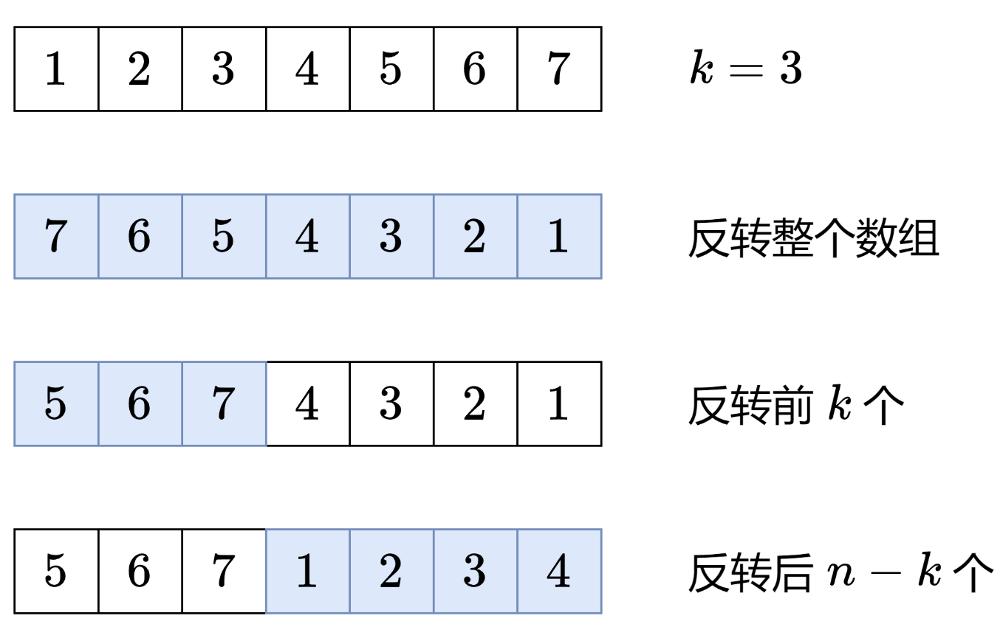

- 代码

```python
class Solution:
    def rotate(self, nums: List[int], k: int) -> None:
        def reverse(i, j):
            while i < j:
                nums[i], nums[j] = nums[j], nums[i]
                i += 1
                j -= 1
                
        n = len(nums)
        k %= n          # 轮转k次 == 轮转k % n次
        reverse(0, n - 1)
        reverse(0, k - 1)
        reverse(k, n - 1)
        
"""
一般写法：使用额外数组
"""
class Solution:
    def rotate(self, nums: List[int], k: int) -> None:
        n = len(nums)
        tmp_nums = [0] * n
        for i in range(n):
            tmp_nums[(i + k) % n] = nums[i]

        nums[:] = tmp_nums
```

##### 5.4 除了自身以外的数组的乘积

- 题目链接：[238. 除了自身以外数组的乘积](https://leetcode.cn/problems/product-of-array-except-self/)
- 题目描述：给定数组`nums`，求j新数组`answer`，其中`answer[i]`是`nums`中除了`nums[i]`之外的其余各元素的乘积。
- 思路：构造前后缀的乘积数组，然后再相乘。

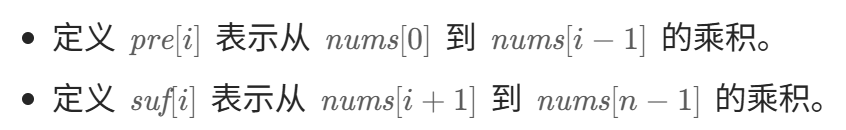

- 代码：

```python
class Solution:
    def productExceptSelf(self, nums: List[int]) -> List[int]:
        n = len(nums)
        ans = [1] * n
        pre = [1] * n
        suf = [1] * n
        
        for i in range(1, n):
            pre[i] = nums[i - 1] * pre[i - 1]
        for i in range(n - 2, -1, -1):
            suf[i] = nums[i + 1] * suf[i + 1]
        for i in range(n):
            ans[i] = pre[i] * suf[i]
        return ans
```

---

##### 5.5 缺失的第一个正数

- 题目链接：[41. 缺失的第一个正数](https://leetcode.cn/problems/first-missing-positive/)
- 题目描述：找到未排序数组中未出现的最小正整数。
- 思路：原地哈希，数组编号为`i`的对应数字应该为`i + 1`，第一个没对应正确的数字即为正确答案。
- 代码

```python
class Solution:
    def firstMissingPositive(self, nums: List[int]) -> int:
        n = len(nums)
        # 原地哈希
        for i in range(n):
            # 判断当前位置上的数是否正确（符合范围且对应），不正确则需交换
            while 1 <= nums[i] <= n and nums[nums[i] - 1] != nums[i]:
                j = nums[i] - 1
                nums[i], nums[j] = nums[j], nums[i]
        
        # 找到第一个位置不匹配的数
        for i in range(n):
            if nums[i] != i + 1:
                return i + 1
        
        # 所有学生都在正确的座位上
        return n + 1
```

> 注：这里的`nums[nums[i] - 1] != nums[i]`是为了避免陷入死循环（遇到重复数字时）

---

#### 6. 矩阵

##### 6.1 矩阵置零

- 题目链接：[73. 矩阵置零](https://leetcode.cn/problems/set-matrix-zeroes/)
- 题目描述：将矩阵中所有含0的行和列都置零。
- 思路：1. 创建两个数组分别存某行或某列是否存在0并做标记； 2. 仅在第一行和第一列做标记，将信息汇总到第一行和第一列。
- 代码

```python
class Solution:
    def setZeroes(self, matrix: List[List[int]]) -> None:
        # O(m + n) 做法
        row_zero = [0 in row for row in matrix]         # 行是否含0
        col_zero = [0 in col for col in zip(*matrix)]   # 列是否含0
        
        for i, row in enumerate(row_zero):
            for j, col in enumerate(col_zero):
                if row or col:
                    matrix[i][j] = 0                    # 将该位置置零

"""
O(1)空间做法
"""
class Solution:
    def setZeroes(self, matrix: List[List[int]]) -> None:
        # O(1) 空间做法
        m, n = len(matrix), len(matrix[0])
        first_row = 0 in matrix[0]                          # 第一行是否含0
        first_col = any(row[0] == 0 for row in matrix)      # 第一列是否含0

        # 跳过第一行和第一列遍历，将是否含0的信息汇总到第一行和第一列
        for i in range(1, m):
            for j in range(1, n):
                if matrix[i][j] == 0:
                    matrix[i][0] = 0
                    matrix[0][j] = 0
        # 跳过第一行和第一列遍历
        for i in range(1, m):
            for j in range(1, n):
                if matrix[i][0] == 0 or matrix[0][j] == 0:  # 若当前行或者列有0
                    matrix[i][j] = 0
        
        # 特判第一列
        if first_col:
            for row in matrix:
                row[0] = 0
        
        # 特判第一行
        if first_row:
            for j in range(n):
                matrix[0][j] = 0
```

---

##### 6.2 螺旋矩阵

- 题目链接：[54. 螺旋矩阵](https://leetcode.cn/problems/spiral-matrix/)
- 题目描述：给定一个矩阵，按照**顺时针螺旋**顺序返回元素
- 思路：定义方向数组，对已访问的数字进行标记，用`di`表示当前方向，然后每次移动相当于当前行列号加上方向数组。
- 代码：

```python
class Solution:
    def spiralOrder(self, matrix: List[List[int]]) -> List[int]:
        direction = [(0, 1), (1, 0), (0, -1), (-1, 0)]
        m, n = len(matrix), len(matrix[0])
        ans = []
        i = j = di = 0

        for _ in range(m * n):          # 总共需要走m * n步
            ans.append(matrix[i][j])
            matrix[i][j] = None         # 表示已经访问过
            x, y = i + direction[di][0], j + direction[di][1]
            # 若下一步位置 出界 或 已访问    (需要换方向)
            if x < 0 or x >= m or y < 0 or y >= n or matrix[x][y] is None:
                di = (di + 1) % 4
            i += direction[di][0]
            j += direction[di][1]
            
        return ans
```

---

##### 6.3 旋转图像

- 题目链接：[48. 旋转图像](https://leetcode.cn/problems/rotate-image/)
- 题目描述：将矩阵看成一个图像并顺时针旋转90°（原地修改矩阵）。
- 思路：根据数学规律来操作元素。要先对矩阵进行**转置**然后再**行翻转**。

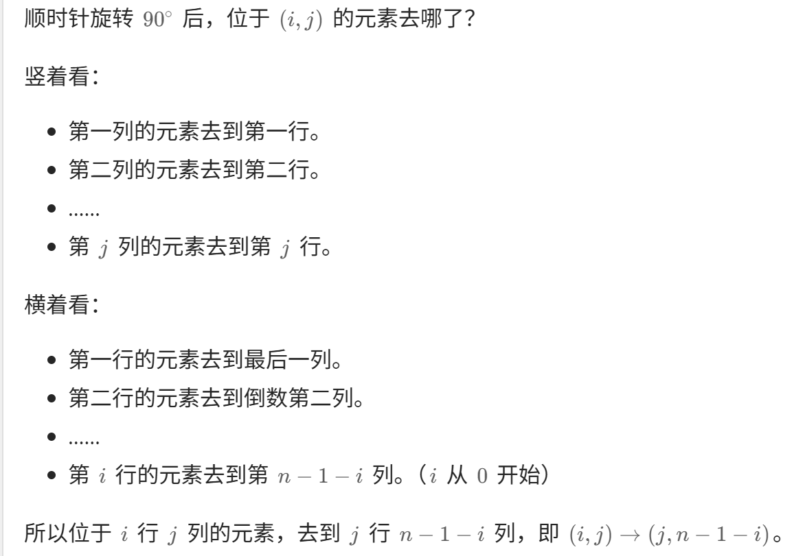

- 代码：

```python
class Solution:
    def rotate(self, matrix: List[List[int]]) -> None:
        n = len(matrix)
        
        # 转置操作
        for i in range(n):
            for j in range(i):          # 遍历主对角线下方的元素
                matrix[i][j], matrix[j][i] = matrix[j][i], matrix[i][j]
        
        # 行翻转
        for row in matrix:
            row.reverse()
"""
写法二：一次遍历
"""          
class Solution:
    def rotate(self, matrix: List[List[int]]) -> None:
        n = len(matrix)
        
        # 一次遍历实现转置和翻转
        for i, row in enumerate(matrix):
            for j in range(i + 1, n):       # 遍历主对角线上方的元素
                row[j], matrix[j][i] = matrix[j][i], row[j]
            
            row.reverse()
```

---

##### 6.4 搜索二维矩阵 II

- 题目链接：[240. 搜索二维矩阵 II](https://leetcode.cn/problems/search-a-2d-matrix-ii/)
- 题目描述：用高效算法寻找二维矩阵里的一个数，矩阵从左到右&从上到下均升序。
- 思路：从**右上角**开始找，如果这个数比`target`小，说明这一行所有元素都比`target`小；如果这个数比`target`大，说明这一列所有元素都比`target`大。
- 代码：

```python
class Solution:
    def searchMatrix(self, matrix: List[List[int]], target: int) -> bool:
        m, n = len(matrix), len(matrix[0])
        i, j = 0, n - 1             # 从右上角开始找
        while i < m and j >= 0:     # 如果还存在元素
            if matrix[i][j] == target:
                return True
            if matrix[i][j] < target:   # 这一行最大值小于target
                i += 1
            else:                       # 这一列元素全大于target
                j -= 1
        
        return False
```

---

#### 7. 链表

##### 7.1 相交链表

- 题目链接：[160. 相交链表](https://leetcode.cn/problems/intersection-of-two-linked-lists/)
- 题目描述：给你两个单链表的头节点 headA 和 headB ，请你找出并返回两个单链表相交的起始节点。如果两个链表没有交点，返回 null 。（求两个链表相交节点的指针）
- 思路：走完我的路，再走完你的路，一定会在共同点相遇（这个点就是所谓的交点），若没有共同点则在NULL相遇。

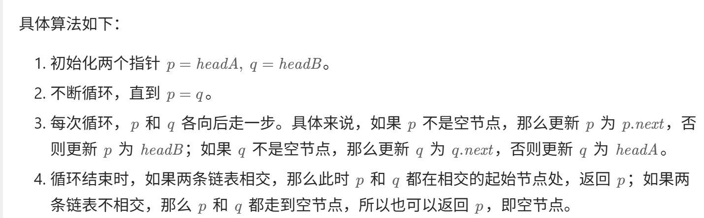

- 代码

```python
# Definition for singly-linked list.
# class ListNode:
#     def __init__(self, x):
#         self.val = x
#         self.next = None

class Solution:
    def getIntersectionNode(self, headA: ListNode, headB: ListNode) -> Optional[ListNode]:
        p, q = headA, headB
        
        # 遍历链表直到指针相交
        while p != q:
            p = p.next if p else headB
            q = q.next if q else headA
        # 若相交，指针位于交点，否则指针指向None
        return p
```

---

##### 7.2 反转链表

- 题目链接：[206. 反转链表](https://leetcode.cn/problems/reverse-linked-list/)
- 题目描述：给你单链表的头节点 `head` ，请你反转链表，并返回反转后的链表。
- 思路：
  1. 双指针/迭代：定义一个pre和cur用来表示前置节点和当前节点，然后用一个tmp临时存储cur.next节点，当cur不为空时循环反转指针。
  2. 递归：定义一个新的reverse方法来实现递归反转操作（实际上直接将双指针改为递归写法即可）。

- 代码

```python
# Definition for singly-linked list.
# class ListNode:
#     def __init__(self, val=0, next=None):
#         self.val = val
#         self.next = next
class Solution:
    def reverseList(self, head: Optional[ListNode]) -> Optional[ListNode]:
        cur = head
        pre = None
        
        # 当cur为空时循环结束
        while cur:
            tmp = cur.next
            cur.next = pre
            pre = cur           # 注意需要先修改pre，再修改cur
            cur = tmp

        return pre              # 反转结束后的新链表的头节点       
    

"""
递归写法
"""
class Solution:
    def reverseList(self, head: Optional[ListNode]) -> Optional[ListNode]:
        return self.reverse(head, None)

    def reverse(self, cur: ListNode, pre: ListNode) -> ListNode:
        if not cur:
            return pre
        tmp = cur.next
        cur.next = pre
        return self.reverse(tmp, cur)
    
"""
ACM格式
"""
import sys
from collections import *
from itertools import *
from functools import cmp_to_key
from bisect import insort, bisect_left
import heapq
input = lambda: sys.stdin.readline().strip()
sys.setrecursionlimit(100000)
class ListNode:
    def __init__(self, val = 0, next = None):
        self.val = val
        self.next = next

def build_list(nums):
    if not nums:
        return None
    head = ListNode(nums[0])
    cur = head
    for x in nums[1:]:
        cur.next = ListNode(x)
        cur = cur.next
    return head

def reverse_list(head):
    prev = None
    cur = head
    while cur:
        nxt = cur.next
        cur.next = prev
        prev = cur
        cur = nxt
    return prev

def output(head):
    vals = []
    cur = head
    while cur:
        vals.append(str(cur.val))
        cur = cur.next
    return ' '.join(vals)

def solve():
    line = input()
    if not line:
        return 
    nums = list(map(int, line.split()))
    head = build_list(nums)
    head2 = reverse_list(head)
    print(output(head2))

if __name__ == "__main__":
    solve()
```

---

##### 7.3 回文链表

- 题目链接：[234. 回文链表](https://leetcode.cn/problems/palindrome-linked-list/)
- 题目描述：判断链表是否是回文链表
- 思路：先找到链表的中间节点，然后从中间节点开始到末尾进行反转，最后分别从链表开头和反转链表开头开始找，如果有不相等的`val`说明不是回文链表，否则找完链表后没返回`False`则说明是回文链表。
- 代码：

```python
# Definition for singly-linked list.
# class ListNode:
#     def __init__(self, val=0, next=None):
#         self.val = val
#         self.next = next
class Solution:
    def midNode(self, head):
        slow = fast = head
        while fast and fast.next:
            slow = slow.next
            fast = fast.next.next
        return slow

    def reverseList(self, head):
        pre, cur = None, head
        while cur:
            tmp = cur.next
            cur.next = pre
            pre = cur
            cur = tmp
        return pre

    def isPalindrome(self, head: Optional[ListNode]) -> bool:
        mid = self.midNode(head)
        head2 = self.reverseList(mid)       # 从mid开始反转
        while head2:
            if head.val != head2.val:
                return False
            head = head.next
            head2 = head2.next
        return True
"""
ACM格式
"""
import sys
from collections import *
from itertools import *
from functools import cmp_to_key
from bisect import insort, bisect_left
import heapq
input = lambda: sys.stdin.readline().strip()
sys.setrecursionlimit(100000)
class ListNode:
    def __init__(self, val = 0, next = None):
        self.val = val
        self.next = next

def build_list(nums):
    if not nums:
        return None
    head = ListNode(nums[0])
    cur = head
    for x in nums[1:]:
        cur.next = ListNode(x)
        cur = cur.next
    return head

def midNode(head):
    slow = fast = head
    while fast and fast.next:
        slow = slow.next
        fast = fast.next.next
    return slow

def reverseList(head):
    prev = None
    cur = head
    while cur:
        nxt = cur.next
        cur.next = prev
        prev = cur
        cur = nxt
    return prev

def ishuiwen(head):
    mid = midNode(head)
    head2 = reverseList(mid)
    while head2:
        if head.val != head2.val:
            return False
        head = head.next
        head2 = head2.next
    return True

def solve():
    nums = list(map(int, input().split()))
    head = build_list(nums)
    res = ishuiwen(head)
    print("true" if res else "false")

if __name__ == "__main__":
    solve()
```

---

##### 7.4 环形链表

- 题目链接：[141. 环形链表](https://leetcode.cn/problems/linked-list-cycle/)
- 题目描述：给你一个链表的头节点 `head` ，判断链表中是否有环。
- 思路：使用快慢指针，如果链表中存在环，那么slow肯定能够走进环里，而快指针每次相对慢指针多走一步，那么一定能够相遇。
- 代码：

```python
# Definition for singly-linked list.
# class ListNode:
#     def __init__(self, x):
#         self.val = x
#         self.next = None

class Solution:
    def hasCycle(self, head: Optional[ListNode]) -> bool:
        # 快慢指针
        fast = head
        slow = head
        while fast and fast.next:
            slow = slow.next
            fast = fast.next.next
            if fast == slow:            # 相遇说明存在环
                return True
        return False
```

---

##### 7.5 环形链表II

- 题目链接：[142. 环形链表 II](https://leetcode.cn/problems/linked-list-cycle-ii/)
- 题目描述：找到链表开始入环的第一个节点，无环则返回`null`。
- 思路：

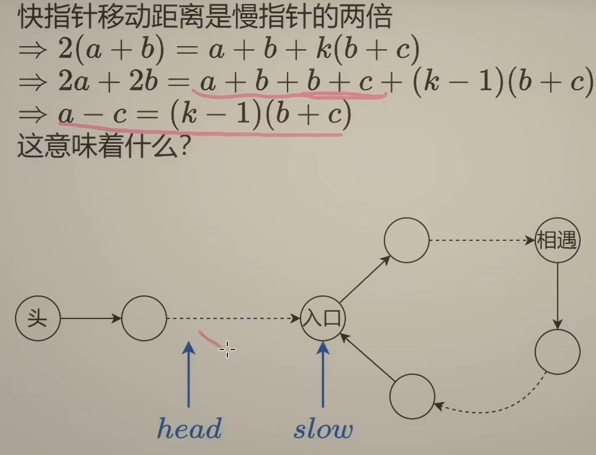

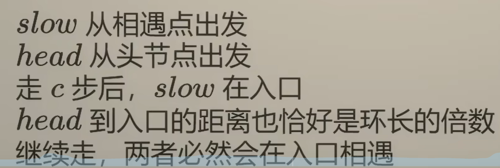

> **结论：当快慢指针相遇时，慢指针还没有走完一整圈**

- 代码：

```python
# Definition for singly-linked list.
# class ListNode:
#     def __init__(self, x):
#         self.val = x
#         self.next = None

class Solution:
    def detectCycle(self, head: Optional[ListNode]) -> Optional[ListNode]:
        # 快慢指针
        fast = head
        slow = head
        while fast and fast.next:
            slow = slow.next
            fast = fast.next.next
            if fast == slow:
                while slow is not head:         # 当slow和head相遇时为入口节点
                    slow = slow.next
                    head = head.next
                return slow
        return None
```

---

##### 7.6 合并两个有序链表

- 题目链接：[21. 合并两个有序链表](https://leetcode.cn/problems/merge-two-sorted-lists/)
- 题目描述：合并两个升序链表，并返回新链表。
- 思路：1. 迭代（尾插法），创建一个虚拟节点作为头节点的前一个节点，然后持续将两个链表中较小的节点插入到新节点中，如果最后其中一个链表有剩余的部分则直接进行拼接；2. 递归（头插法），取出当前较小的节点插在前面，递归返回的链表在后面（其中一个链表为空则返回另一个链表作为合并后的结果）
- 代码：

```python
"""
迭代写法
"""
# Definition for singly-linked list.
# class ListNode:
#     def __init__(self, val=0, next=None):
#         self.val = val
#         self.next = next
class Solution:
    def mergeTwoLists(self, list1: Optional[ListNode], list2: Optional[ListNode]) -> Optional[ListNode]:
        cur = dummy = ListNode()
        while list1 and list2:
            if list1.val < list2.val:
                cur.next = list1
                list1 = list1.next
            else:
                cur.next = list2
                list2 = list2.next
            cur = cur.next
        cur.next = list1 or list2       # 拼接剩余链表
        return dummy.next        

"""
递归写法
"""
# Definition for singly-linked list.
# class ListNode:
#     def __init__(self, val=0, next=None):
#         self.val = val
#         self.next = next
class Solution:
    def mergeTwoLists(self, list1: Optional[ListNode], list2: Optional[ListNode]) -> Optional[ListNode]:
        if list1 is None: return list2
        if list2 is None: return list1
        if list1.val < list2.val:
            list1.next = self.mergeTwoLists(list1.next, list2)
            return list1
        list2.next = self.mergeTwoLists(list1, list2.next)
        return list2
```

---

##### 7.7 两数相加

- 题目链接：[2. 两数相加](https://leetcode.cn/problems/add-two-numbers/)
- 题目描述：给定两个按逆序存储的非空链表，返回相加后的新链表。
- 思路：逆序存储的链表可以直接按顺序相加，然后模10的余数为新的数位，商为进位与下一个节点的和相加。
- 代码：

```python
# Definition for singly-linked list.
# class ListNode:
#     def __init__(self, val=0, next=None):
#         self.val = val
#         self.next = next
class Solution:
    def addTwoNumbers(self, l1: Optional[ListNode], l2: Optional[ListNode]) -> Optional[ListNode]:
        cur = dummy = ListNode()        # 哨兵节点
        carry = 0
        while l1 or l2 or carry:        # 有一个不是空节点或者还有进位
            if l1:
                carry += l1.val
                l1 = l1.next
            if l2:
                carry += l2.val
                l2 = l2.next
            cur.next = ListNode(carry % 10) # 模10的余数为下一个节点的数位
            carry //= 10                # 新的进位
            cur = cur.next
        return dummy.next               # 哨兵节点的下一个节点为头节点
    
"""
递归写法
"""
# Definition for singly-linked list.
# class ListNode:
#     def __init__(self, val=0, next=None):
#         self.val = val
#         self.next = next
class Solution:
    def addTwoNumbers(self, l1: Optional[ListNode], l2: Optional[ListNode], carry = 0) -> Optional[ListNode]:
        if l1 is None and l2 is None and carry == 0:    # 递归边界
            return None
        
        s = carry
        if l1:
            s += l1.val 
            l1 = l1.next
        if l2:
            s += l2.val
            l2 = l2.next
        # s除以10的余数为当前节点值，商为进位
        return ListNode(s % 10, self.addTwoNumbers(l1, l2, s // 10))
```

---

##### 7.8 删除链表的倒数第N个结点

- 题目链接：[19. 删除链表的倒数第 N 个结点](https://leetcode.cn/problems/remove-nth-node-from-end-of-list/)
- 题目描述：删除链表的倒数第n个结点并返回链表头结点。
- 思路：双指针，让右指针先走到第n+1个结点的位置，然后左右指针一起走，当右指针走到最后一个结点的位置时，左指针在倒数第n+1的位置，接着进行删除操作。

> 注：由于n可能为链表长度，所以需要添加哨兵结点，这样就有了第n+1个位置，同时注意**如果遇到需要删除头节点的题目，添加哨兵节点可以简化代码逻辑**

- 代码：

```python
# Definition for singly-linked list.
# class ListNode:
#     def __init__(self, val=0, next=None):
#         self.val = val
#         self.next = next
class Solution:
    def removeNthFromEnd(self, head: Optional[ListNode], n: int) -> Optional[ListNode]:
        l = r = dummy = ListNode(next=head)         # 可能删除头结点，因此添加哨兵结点简化代码

        for _ in range(n):      # 右指针向右走n步，走到第n+1个结点
            r = r.next

        while r.next:           # 右指针走到最后一个结点时，左指针走到倒数第n+1个节点
            l = l.next
            r = r.next
        l.next = l.next.next    # 左指针的下一个结点就是倒数第n个结点
        return dummy.next
```

---

##### 7.9 两两交换链表中的节点

- 题目链接：[24. 两两交换链表中的节点](https://leetcode.cn/problems/swap-nodes-in-pairs/)
- 题目描述：给定一个链表，两两交换其中相邻的节点，并返回交换后链表的头节点。
- 思路：

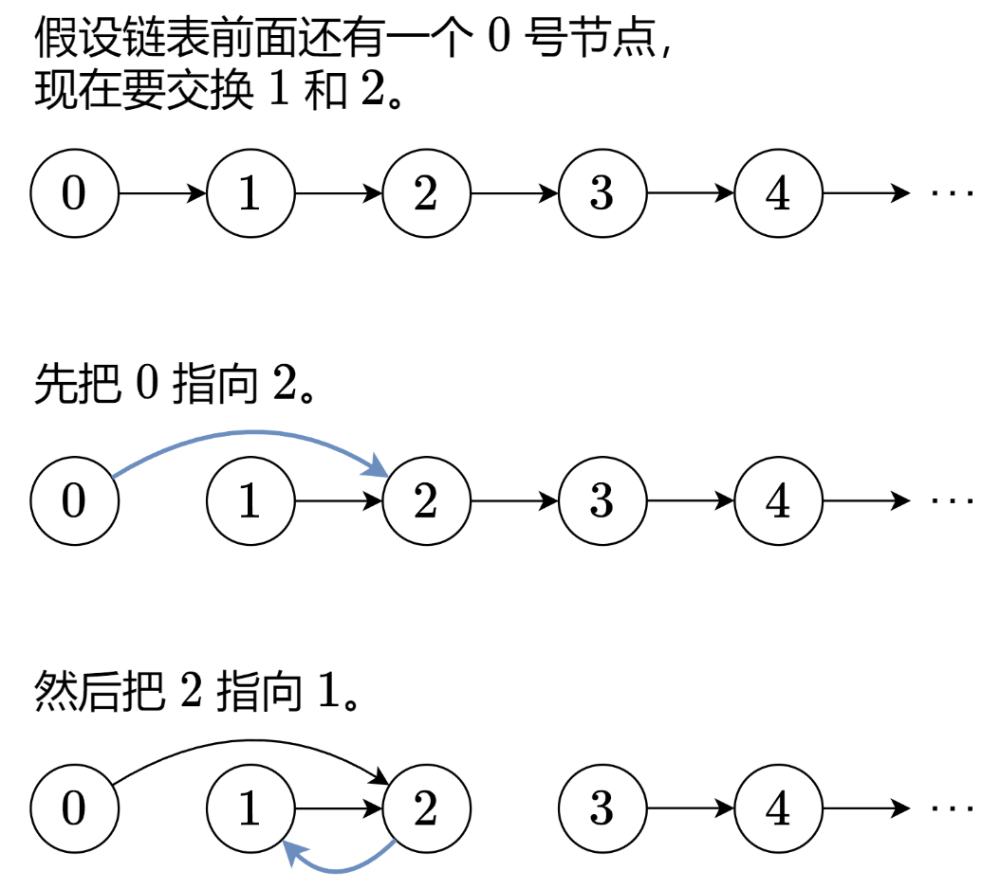

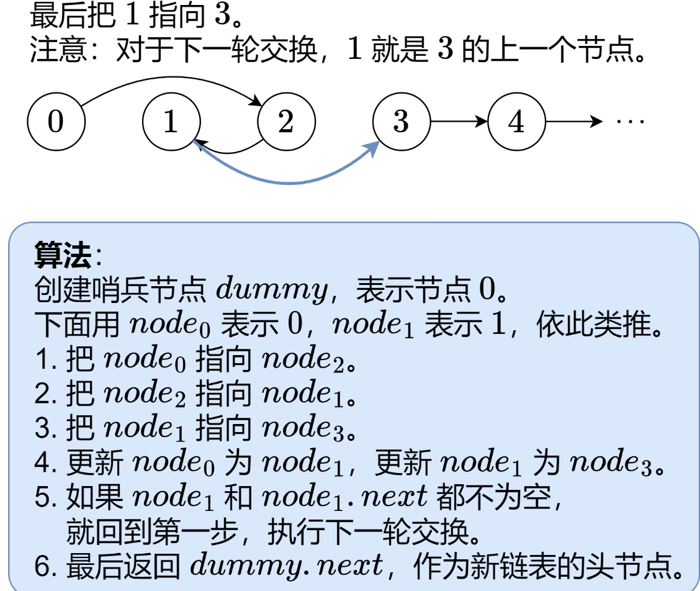

- 代码：

```python
# Definition for singly-linked list.
# class ListNode:
#     def __init__(self, val=0, next=None):
#         self.val = val
#         self.next = next
class Solution:
    def swapPairs(self, head: Optional[ListNode]) -> Optional[ListNode]:
        # 递归写法
        dummy = node0 = ListNode(next=head)  # 添加哨兵节点 
        node1 = head
        
        while node1 and node1.next:          # 至少有两个节点
            node2 = node1.next
            node3 = node2.next
            
            node0.next = node2               # 0 -> 2
            node2.next = node1               # 2 -> 1
            node1.next = node3               # 1 -> 3
            
            node0 = node1                    # 下一轮交换，1作为3的上一个节点 
            node1 = node3
            
        return dummy.next

"""
递归写法
"""
# Definition for singly-linked list.
# class ListNode:
#     def __init__(self, val=0, next=None):
#         self.val = val
#         self.next = next
class Solution:
    def swapPairs(self, head: Optional[ListNode]) -> Optional[ListNode]:
        if head is None or head.next is None:       # 不足2个结点，无需交换
            return head
        
        node1 = head
        node2 = node1.next
        node3 = node2.next

        node1.next = self.swapPairs(node3)  # 1指向递归返回的链表头
        node2.next = node1                  # 2指向1
        
        return node2                        # 返回交换后的链表头结点
```

---

##### 7.10 K个一组翻转链表

- 题目链接：[25. K 个一组翻转链表](https://leetcode.cn/problems/reverse-nodes-in-k-group/)
- 题目描述：对链表的每k个节点进行翻转（若节点数不为k的倍数，将最后剩余节点保持原来的顺序）。
- 思路：先求出链表长度，判断剩余节点是否需要翻转（翻转过程同[92. 反转链表 II](https://leetcode.cn/problems/reverse-linked-list-ii/)这道题）。额外需要做的就是将p0更新为p0.next（下一段翻转的上一个节点），由于p0.next需要更新，所以要用临时变量保存。
- 代码：

```python
# Definition for singly-linked list.
# class ListNode:
#     def __init__(self, val=0, next=None):
#         self.val = val
#         self.next = next
class Solution:
    def reverseKGroup(self, head: Optional[ListNode], k: int) -> Optional[ListNode]:
        n = 0               # 统计链表长度
        cur = head
        while cur:
            n += 1
            cur = cur.next
        
        p0 = dummy = ListNode(next=head)
        pre = None
        cur = head
        
        # k个一组进行翻转
        while n >= k:
            n -= k
            
            for _ in range(k):
                tmp = cur.next
                cur.next = pre
                pre = cur
                cur = tmp
            
            nxt = p0.next
            p0.next.next = cur
            p0.next = pre
            p0 = nxt

        return dummy.next 
```

---

##### 7.11 随机链表的复制

- 题目链接：[138. 随机链表的复制](https://leetcode.cn/problems/copy-list-with-random-pointer/)
- 题目描述：构造一个随机链表的深拷贝（随机链表额外增加随机指针random）。
- 思路：对原链表中的每个节点进行复制，构造一个交错链表，然后将`原链表节点.next(新链表节点).random 指向 原链表节点.random.next`，接着删除原链表节点即可。
- 代码：

```python
"""
# Definition for a Node.
class Node:
    def __init__(self, x: int, next: 'Node' = None, random: 'Node' = None):
        self.val = int(x)
        self.next = next
        self.random = random
"""

class Solution:
    def copyRandomList(self, head: 'Optional[Node]') -> 'Optional[Node]':
        # 复制每个节点，将新节点直接插到原节点后面
        cur = head
        while cur:
            cur.next = Node(cur.val, cur.next)
            cur = cur.next.next
        
        # 遍历交错链表中的原链表节点
        cur = head
        while cur:
            if cur.random:
                # 将复制节点的random指向random的下一个节点
                cur.next.random = cur.random.next
            cur = cur.next.next
        
        # 删除交错链表中的原链表节点，剩下的节点为新链表
        cur = dummy = Node(0, head)     
        while cur.next:                 # 当前节点的下一个节点为原链表节点
            cur.next = cur.next.next
            cur = cur.next

        return dummy.next
    
"""
哈希写法
"""
"""
# Definition for a Node.
class Node:
    def __init__(self, x: int, next: 'Node' = None, random: 'Node' = None):
        self.val = int(x)
        self.next = next
        self.random = random
"""

class Solution:
    def copyRandomList(self, head: 'Optional[Node]') -> 'Optional[Node]':
        if not head:
            return None
        
        dic = {}
        cur = head
        while cur:
            dic[cur] = Node(cur.val)
            cur = cur.next
        
        cur = head
        while cur:
            dic[cur].next = dic.get(cur.next)
            dic[cur].random = dic.get(cur.random)
            cur = cur.next
        
        return dic[head]
```

---

##### 7.12 排序链表

- 题目链接：[148. 排序链表](https://leetcode.cn/problems/sort-list/)
- 题目描述：对链表进行升序排序。
- 思路：

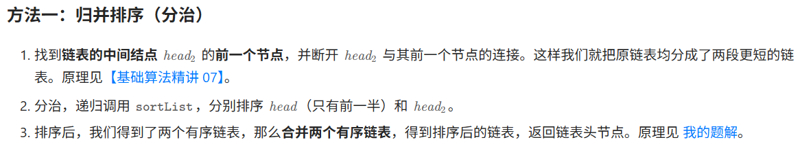

- 代码：

```python
# Definition for singly-linked list.
# class ListNode:
#     def __init__(self, val=0, next=None):
#         self.val = val
#         self.next = next
class Solution:
    def middleNode(self, head):     # 找到链表的中间节点
        slow = fast = head
        while fast and fast.next:
            pre = slow              # 记录slow的前一个节点
            slow = slow.next
            fast = fast.next.next
        pre.next = None             # 断开slow的前一个节点与slow的连接
        return slow

    def mergeTwoLists(self, list1, list2):  # 合并两个有序链表
        cur = dummy = ListNode()
        while list1 and list2:
            if list1.val < list2.val:
                cur.next = list1
                list1 = list1.next
            else:
                cur.next = list2
                list2 = list2.next
            cur = cur.next
        
        cur.next = list1 if list1 else list2
        return dummy.next

    def sortList(self, head: Optional[ListNode]) -> Optional[ListNode]:
        # 若链表为空或只有一个节点则不需要排序
        if head is None or head.next is None:
            return head
        # 找到中间节点并断开其与前一个节点的连接
        head2 = self.middleNode(head)
        # 分治
        head = self.sortList(head)
        head2 = self.sortList(head2)
        # 合并
        return self.mergeTwoLists(head, head2)
```

---

##### 7.13 合并K个升序链表

- 题目链接：[23. 合并 K 个升序链表](https://leetcode.cn/problems/merge-k-sorted-lists/)

- 题目描述：将链表数组中的所有链表合并到一个升序链表中。

- 思路：

  1. 最小堆：合并后的第一个节点一定是某链表的头节点first，而第二个节点可能是某链表的头节点或者是first的下一个节点。因此每当找到一个最小节点x就把x.next加入到集合中（入堆）并将x弹出，直到堆为空（弹出的节点按顺序拼接）。
  2. 分治：

  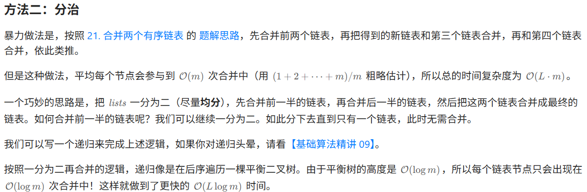

- 代码：

```python
# Definition for singly-linked list.
# class ListNode:
#     def __init__(self, val=0, next=None):
#         self.val = val
#         self.next = next

ListNode.__lt__ = lambda a, b: a.val < b.val    # 让堆可以比较节点大小

class Solution:
    def mergeKLists(self, lists: List[Optional[ListNode]]) -> Optional[ListNode]:
        cur = dummy = ListNode()
        h = [head for head in lists if head]        # 所有链表的非空节点入堆
        heapify(h)
        
        while h:
            node = heappop(h)               # 剩余节点的最小节点
            if node.next:
                heappush(h, node.next)      # 下一个节点可能是最小节点，入堆
            cur.next = node
            cur = cur.next
        return dummy.next
"""
递归写法
"""
# Definition for singly-linked list.
# class ListNode:
#     def __init__(self, val=0, next=None):
#         self.val = val
#         self.next = next
class Solution:

    def mergeTwoLists(self, list1, list2):
        dummy = cur = ListNode()
        while list1 and list2:
            if list1.val < list2.val:
                cur.next = list1
                list1 = list1.next
            else:
                cur.next = list2
                list2 = list2.next
            cur = cur.next
        cur.next = list1 if list1 else list2
        return dummy.next

    def mergeKLists(self, lists: List[Optional[ListNode]]) -> Optional[ListNode]:
        m = len(lists)
        if m == 0:
            return None
        if m == 1:
            return lists[0]
        
        left = self.mergeKLists(lists[:m // 2])     # 合并左半部分
        right = self.mergeKLists(lists[m // 2:])    # 合并右半部分
        return self.mergeTwoLists(left, right)      # 将左右两部分合并
    
"""
迭代写法
"""
# Definition for singly-linked list.
# class ListNode:
#     def __init__(self, val=0, next=None):
#         self.val = val
#         self.next = next
class Solution:

    def mergeTwoLists(self, list1, list2):
        dummy = cur = ListNode()
        while list1 and list2:
            if list1.val < list2.val:
                cur.next = list1
                list1 = list1.next
            else:
                cur.next = list2
                list2 = list2.next
            cur = cur.next
        cur.next = list1 if list1 else list2
        return dummy.next

    def mergeKLists(self, lists: List[Optional[ListNode]]) -> Optional[ListNode]:
        m = len(lists)
        if m == 0:
            return None
        step = 1				# 表示间隔的元素
        while step < m:
            for i in range(0, m - step, step * 2):		# m - step是为了保证 i+step 不越界
                lists[i] = self.mergeTwoLists(lists[i], lists[i + step])
            step *= 2
        return lists[0]
```

---

##### 7.14 LRU缓存

- 题目链接：[146. LRU 缓存](https://leetcode.cn/problems/lru-cache/)
- 题目描述：

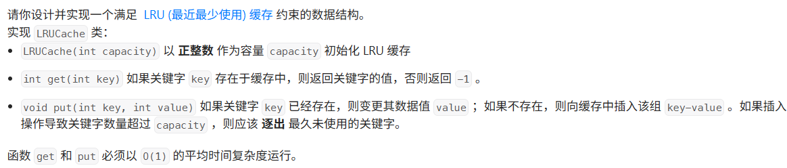

- 思路：

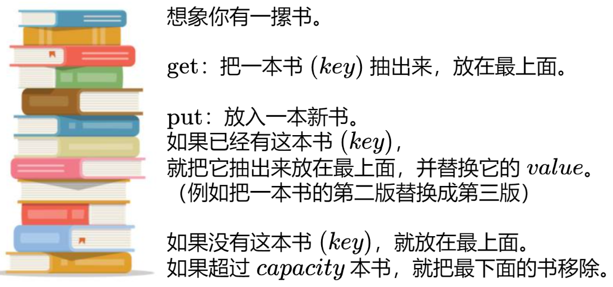

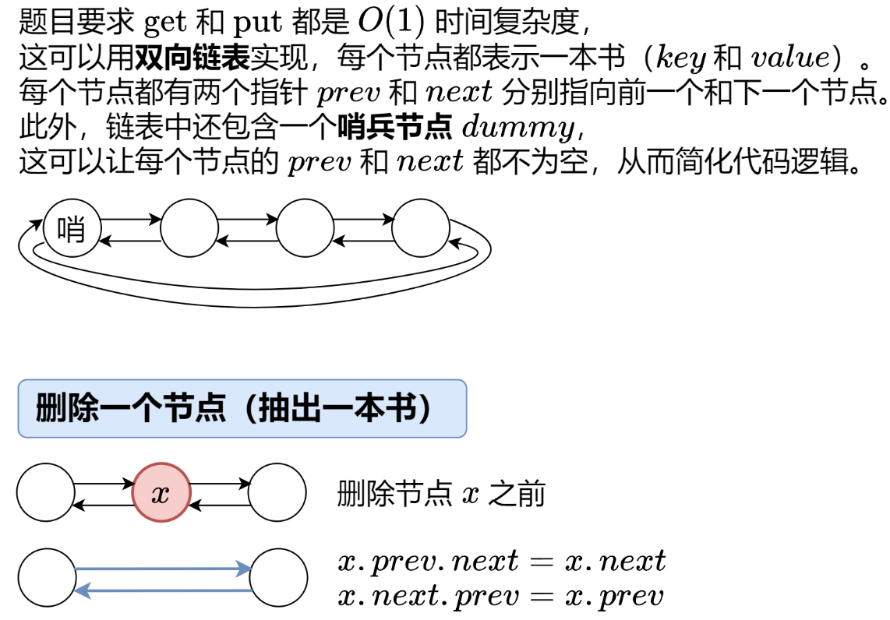

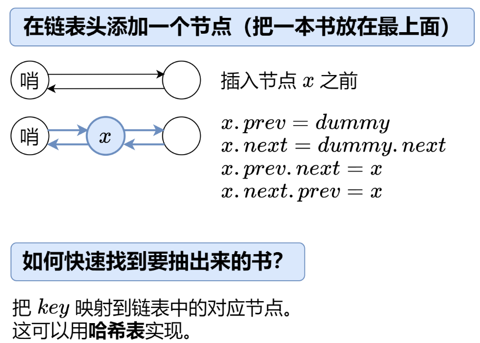

- 代码：

```python
"""
标准库写法
"""
class LRUCache:

    def __init__(self, capacity: int):
        self.capacity = capacity
        
        self.cache = OrderedDict()      # key --> value

    def get(self, key: int) -> int:
        if key not in self.cache:
            return -1
        
        # 将书抽出来放到最上面
        self.cache.move_to_end(key, last=False)
        return self.cache[key]

    def put(self, key: int, value: int) -> None:
        self.cache[key] = value     # 添加key-value或更新value
        # 把书抽出来放到最上面
        self.cache.move_to_end(key, last=False)
        if len(self.cache) > self.capacity:
            self.cache.popitem()    # 去掉最后一本书

"""
手写双向链表
"""
class Node:
    # 提高访问属性的速度，并节省内存
    __slots__ = 'prev', 'next', 'key', 'value'
    
    def __init__(self, key=0, value=0):
        self.key = key
        self.value = value

class LRUCache:

    def __init__(self, capacity: int):
        self.capacity = capacity
        self.dummy = Node()             # 哨兵节点
        self.dummy.prev = self.dummy
        self.dummy.next = self.dummy
        self.key_to_node = {}

    # 获取key对应的节点，并将该节点移到链表头部
    def get_node(self, key):
        if key not in self.key_to_node:
            return None
        node = self.key_to_node[key]
        self.remove(node)
        self.push_front(node)
        return node

    def get(self, key: int) -> int:
        node = self.get_node(key)
        return node.value if node else -1

    def put(self, key: int, value: int) -> None:
        node = self.get_node(key)  
        if node:
            node.value = value
            return
        
        self.key_to_node[key] = node = Node(key, value)
        self.push_front(node)
        if len(self.key_to_node) > self.capacity:
            back_node = self.dummy.prev
            del self.key_to_node[back_node.key]     # 需要同步删除哈希表中的记录
            self.remove(back_node)
    
    # 删除一个节点
    def remove(self, x):
        x.prev.next = x.next
        x.next.prev = x.prev

    # 在链表头添加一个节点
    def push_front(self, x):
        x.prev = self.dummy
        x.next = self.dummy.next
        x.prev.next = x
        x.next.prev = x

"""
ACM格式
"""   
import sys
from collections import *
from itertools import *
from functools import cmp_to_key
from bisect import insort, bisect_left
import heapq
input = lambda: sys.stdin.readline().strip()
sys.setrecursionlimit(100000)

class Node:
    def __init__(self, key = 0, value = 0):
        self.key = key
        self.value = value
        self.prev = None
        self.next = None

class LRUCache:
    def __init__(self, capacity):
        self.capacity = capacity
        self.dummy = Node()
        self.dummy.prev = self.dummy
        self.dummy.next = self.dummy
        self.key_to_node = {}
    
    # 获取节点并移动到链表头部
    def get_node(self, key):
        if key not in self.key_to_node:
            return None
        node = self.key_to_node[key]
        self.remove(node)
        self.push_front(node)
        return node
    
    def get(self, key):
        node = self.get_node(key)
        return node.value if node else -1
    
    def put(self, key, value):
        node = self.get_node(key)
        if node:
            node.value = value
            return 
        new_node = Node(key, value)
        self.key_to_node[key] = new_node
        self.push_front(new_node)
        if len(self.key_to_node) > self.capacity:
            back_node = self.dummy.prev
            del self.key_to_node[back_node.key]
            self.remove(back_node)
    
    def remove(self, x):
        x.prev.next = x.next
        x.next.prev = x.prev
    
    def push_front(self, x):
        x.prev = self.dummy
        x.next = self.dummy.next
        x.prev.next = x
        x.next.prev = x

def solve():
    capacity, T = map(int, input().split())
    lru = LRUCache(capacity)
    while T:
        T -= 1
        line = input()
        params = line.split()
        op = params[0]
        if op == "put":
            key = int(params[1])
            value = int(params[2])
            lru.put(key, value)
        elif op == "get":
            key = int(params[1])
            print(lru.get(key))

if __name__ == "__main__":
    solve()
```

---

#### 8. 二叉树

##### 8.1 二叉树的中序遍历

- 题目链接：[94. 二叉树的中序遍历](https://leetcode.cn/problems/binary-tree-inorder-traversal/)
- 题目描述：给定一个二叉树的根节点 `root` ，返回它的**中序**遍历 。
- 思路：1. 递归； 2. 迭代（用栈来模拟递归）。
- 代码：

```python
# Definition for a binary tree node.
# class TreeNode:
#     def __init__(self, val=0, left=None, right=None):
#         self.val = val
#         self.left = left
#         self.right = right
class Solution:
    def inorder(self, root, vec):
        if not root:
            return None
        self.inorder(root.left, vec)
        vec.append(root.val)
        self.inorder(root.right, vec)

    def inorderTraversal(self, root: Optional[TreeNode]) -> List[int]:
        vec = []
        self.inorder(root, vec)
        return vec
"""
迭代法
"""
# Definition for a binary tree node.
# class TreeNode:
#     def __init__(self, val=0, left=None, right=None):
#         self.val = val
#         self.left = left
#         self.right = right
class Solution:
    def inorderTraversal(self, root: Optional[TreeNode]) -> List[int]:
        stack = []
        res = []
        while root or stack:
            while root:
                stack.append(root)
                root = root.left
            cur = stack.pop()
            res.append(cur.val)
            root = cur.right
        return res
```

---

##### 8.2 二叉树的最大深度

- 题目链接：[104. 二叉树的最大深度](https://leetcode.cn/problems/maximum-depth-of-binary-tree/)
- 题目描述：给定一个二叉树 `root` ，返回其最大深度（二叉树的 **最大深度** 是指从根节点到最远叶子节点的最长路径上的节点数，即树的高度）。
- 思路：递归（自底向上或自顶向下）。
- 代码：

```python
"""
自底向上
"""
# Definition for a binary tree node.
# class TreeNode:
#     def __init__(self, val=0, left=None, right=None):
#         self.val = val
#         self.left = left
#         self.right = right
class Solution:
    def maxDepth(self, root: Optional[TreeNode]) -> int:
        if not root:
            return 0
        left_len = self.maxDepth(root.left)         # 左子树最大深度
        right_len = self.maxDepth(root.right)       # 右子树最大深度
        max_len = max(left_len, right_len) + 1      # 左右子树最大深度+根节点自己
        return max_len
"""
自顶向下
"""  
# Definition for a binary tree node.
# class TreeNode:
#     def __init__(self, val=0, left=None, right=None):
#         self.val = val
#         self.left = left
#         self.right = right
class Solution:
    def maxDepth(self, root: Optional[TreeNode]) -> int:
        ans = 0
        def dfs(node, depth):
            if node is None:
                return
            depth += 1
            nonlocal ans
            ans = max(ans, depth)
            dfs(node.left, depth)
            dfs(node.right, depth)
        dfs(root, 0)
        return ans
```

---

##### 8.3 翻转二叉树

- 题目链接：[226. 翻转二叉树](https://leetcode.cn/problems/invert-binary-tree/)
- 题目描述：给你一棵二叉树的根节点 `root` ，翻转这棵二叉树，并返回其根节点。
- 思路：前序遍历、后序遍历以及层序遍历（BFS）都可以，但中序遍历会存在问题（翻转两次）。
- 代码：

```python
"""
前序遍历递归写法
"""
# Definition for a binary tree node.
# class TreeNode:
#     def __init__(self, val=0, left=None, right=None):
#         self.val = val
#         self.left = left
#         self.right = right
class Solution:
    def invertTree(self, root: Optional[TreeNode]) -> Optional[TreeNode]:
        if not root:
            return
        root.left, root.right = root.right, root.left
        self.invertTree(root.left)
        self.invertTree(root.right)
        return root
    
"""
迭代写法: 前序遍历
"""
# Definition for a binary tree node.
# class TreeNode:
#     def __init__(self, val=0, left=None, right=None):
#         self.val = val
#         self.left = left
#         self.right = right
class Solution:
    def invertTree(self, root: Optional[TreeNode]) -> Optional[TreeNode]:
        if not root:
            return None
        
        stack = [root]
        while stack:
            node = stack.pop()
            node.left, node.right = node.right, node.left
            if node.right:
                stack.append(node.right)
            if node.left:
                stack.append(node.left)
        return root
"""
层序遍历写法
"""
# Definition for a binary tree node.
# class TreeNode:
#     def __init__(self, val=0, left=None, right=None):
#         self.val = val
#         self.left = left
#         self.right = right
class Solution:
    def invertTree(self, root: Optional[TreeNode]) -> Optional[TreeNode]:
        if not root:
            return None
        
        queue = collections.deque([root])
        while queue:
            node = queue.popleft()
            node.left, node.right = node.right, node.left
            if node.left:
                queue.append(node.left)
            if node.right:
                queue.append(node.right)
        
        return root
```

---

##### 8.4 对称二叉树

- 题目链接：[101. 对称二叉树](https://leetcode.cn/problems/symmetric-tree/)
- 题目描述：给你一个二叉树的根节点 `root` ， 检查它是否轴对称。
- 思路：

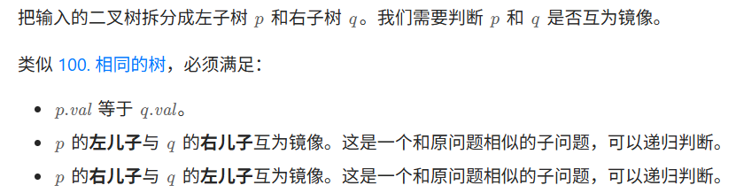

- 代码：

```python
# Definition for a binary tree node.
# class TreeNode:
#     def __init__(self, val=0, left=None, right=None):
#         self.val = val
#         self.left = left
#         self.right = right
class Solution:

    def isSymmetric(self, root: Optional[TreeNode]) -> bool:
        if not root:
            return True
            
        def dfs(left, right):
            if left is None and right is None:      # 如果两个子节点都为空
                return True
            if left is None or right is None:       # 两个子节点中有一个为空
                return False
            if left.val != right.val:               # 两个子节点都不为空但是值不相同
                return False
            return dfs(left.left, right.right) and dfs(left.right, right.left)
        
        return dfs(root.left, root.right)
        
"""
相同的树改编
"""
# Definition for a binary tree node.
# class TreeNode:
#     def __init__(self, val=0, left=None, right=None):
#         self.val = val
#         self.left = left
#         self.right = right
class Solution:
    def isSameTree(self, p, q):
        if p is None or q is None:
            return p is q
        return p.val == q.val and self.isSameTree(p.left, q.right) and self.isSameTree(p.right, q.left)

    def isSymmetric(self, root: Optional[TreeNode]) -> bool:
        return self.isSameTree(root.left, root.right)
```

---

##### 8.5 二叉树的直径

- 题目链接：[543. 二叉树的直径](https://leetcode.cn/problems/diameter-of-binary-tree/)
- 题目描述：给你一棵二叉树的根节点，返回该树的 **直径** （树中任意两个节点之间最长路径的 **长度** ，由两节点之间的边数表示）。
- 思路：遍历每个节点时，假设当前节点会拐弯。

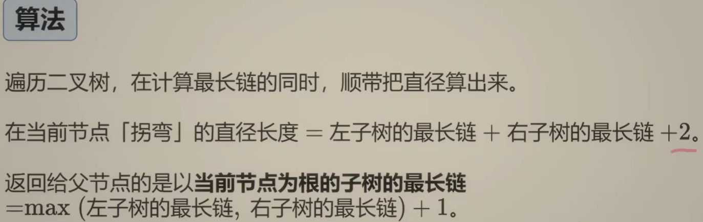

- 代码：

```python
# Definition for a binary tree node.
# class TreeNode:
#     def __init__(self, val=0, left=None, right=None):
#         self.val = val
#         self.left = left
#         self.right = right
class Solution:
    def diameterOfBinaryTree(self, root: Optional[TreeNode]) -> int:
        ans = 0
        def dfs(node):
            if node is None:
                return -1       # 后面+1时值为0
            left_len = dfs(node.left)
            right_len = dfs(node.right)
            nonlocal ans
            ans = max(ans, left_len + right_len + 2)    # 计算直径
            return max(left_len, right_len) + 1         # 返回当前节点为根的子树的最长链
        dfs(root)
        return ans
```

---

##### 8.6 二叉树的层序遍历

* 题目链接：[102. 二叉树的层序遍历](https://leetcode.cn/problems/binary-tree-level-order-traversal/)
* 题目描述：给你二叉树的根节点 `root` ，返回其节点值的 **层序遍历** 。
* 思路：
  1. 两个数组：使用nxt数组记录下一层节点，使用vals数组记录节点的值，cur表示当前节点，当cur不为空时循环操作将vals添加到答案里并将cur修改为nxt。
  2. 一个队列：队列先进先出符合一层一层遍历的逻辑，每层遍历的次数为队列的长度。
* 代码：

```python
# Definition for a binary tree node.
# class TreeNode:
#     def __init__(self, val=0, left=None, right=None):
#         self.val = val
#         self.left = left
#         self.right = right
class Solution:
    def levelOrder(self, root: Optional[TreeNode]) -> List[List[int]]:
        if root is None:
            return []
        
        ans = []
        cur = [root]        # 当前层节点
        while cur:
            nxt = []        # 记录下一层节点
            vals = []       # 记录节点的值
            for node in cur:
                vals.append(node.val)
                if node.left: nxt.append(node.left)
                if node.right: nxt.append(node.right)
            ans.append(vals)
            cur = nxt
        return ans
    
"""
队列写法
"""
# Definition for a binary tree node.
# class TreeNode:
#     def __init__(self, val=0, left=None, right=None):
#         self.val = val
#         self.left = left
#         self.right = right
class Solution:
    def levelOrder(self, root: Optional[TreeNode]) -> List[List[int]]:
        if root is None:
            return []
        
        res = []
        q = deque([root])
        while q:
            vals = []
            for _ in range(len(q)):
                node = q.popleft()
                vals.append(node.val)
                if node.left: q.append(node.left)
                if node.right: q.append(node.right)
            res.append(vals)
        return res
```

---

##### 8.7 将有序数组转换为二叉搜索树

- 题目链接：[108. 将有序数组转换为二叉搜索树](https://leetcode.cn/problems/convert-sorted-array-to-binary-search-tree/)
- 题目描述：将一个升序的数组转换为一棵平衡二叉搜索树。
- 思路：由于是有序的数组，所以直接从数组中间开始划分为左右子树，然后再递归处理左右两半。
- 代码：

```python
# Definition for a binary tree node.
# class TreeNode:
#     def __init__(self, val=0, left=None, right=None):
#         self.val = val
#         self.left = left
#         self.right = right
class Solution:
    def sortedArrayToBST(self, nums: List[int]) -> Optional[TreeNode]:
        if not nums:
            return None
        m = len(nums) // 2
        left = self.sortedArrayToBST(nums[:m])
        right = self.sortedArrayToBST(nums[m + 1:])
        return TreeNode(nums[m], left, right)

"""
写法二：不使用切片复制
"""
# Definition for a binary tree node.
# class TreeNode:
#     def __init__(self, val=0, left=None, right=None):
#         self.val = val
#         self.left = left
#         self.right = right
class Solution:
    def sortedArrayToBST(self, nums: List[int]) -> Optional[TreeNode]:
        def dfs(left, right):
            if left == right:       # 数组为空(遵循左闭右开的原则)
                return None
            m = (left + right) // 2
            return TreeNode(nums[m],dfs(left, m), dfs(m + 1, right))
        return dfs(0, len(nums))
```

---

##### 8.8 验证二叉搜索树

- 题目链接：[98. 验证二叉搜索树](https://leetcode.cn/problems/validate-binary-search-tree/)
- 题目描述：给你一个二叉树的根节点 `root` ，判断其是否是一个有效的二叉搜索树。
- 思路：在遍历的过程中判断节点的值是否满足条件即可（中序遍历的二叉搜索树是一个有序的序列）。
- 代码：

```python
"""
前序遍历
"""
# Definition for a binary tree node.
# class TreeNode:
#     def __init__(self, val=0, left=None, right=None):
#         self.val = val
#         self.left = left
#         self.right = right
class Solution:
    def isValidBST(self, root: Optional[TreeNode], left = -inf, right = inf) -> bool:
        if root is None:
            return True
        
        x = root.val
        
        return left < x < right and \
        self.isValidBST(root.left, left, x) and \
        self.isValidBST(root.right, x, right)
"""
中序遍历
"""
# Definition for a binary tree node.
# class TreeNode:
#     def __init__(self, val=0, left=None, right=None):
#         self.val = val
#         self.left = left
#         self.right = right
class Solution:
    def __init__(self):
        self.pre = -inf
    
    def isValidBST(self, root: Optional[TreeNode]) -> bool:
        if root is None:
            return True
        if not self.isValidBST(root.left):      # 左子树中有不符合条件的，直接返回False
            return False
        
        if root.val <= self.pre:                # 中：当前节点是否满足
            return False
        self.pre = root.val
        
        return self.isValidBST(root.right)      # 右：递归判断右子树
```

---

##### 8.9 二叉搜索树的第K小的元素

- 题目链接：[230. 二叉搜索树中第 K 小的元素](https://leetcode.cn/problems/kth-smallest-element-in-a-bst/)
- 题目描述：找到一个二叉搜索树的第k小的元素（k从1开始）。
- 思路：使用中序遍历，每次递归完左子树就将k减一，表示按中序遍历访问到了一个节点，若k==0则当前节点的值即为答案。
- 代码：

```python
# Definition for a binary tree node.
# class TreeNode:
#     def __init__(self, val=0, left=None, right=None):
#         self.val = val
#         self.left = left
#         self.right = right
class Solution:
    def kthSmallest(self, root: Optional[TreeNode], k: int) -> int:
        ans = 0
        def dfs(node):
            nonlocal ans, k
            if node is None or k == 0:  # 叶子节点或找到答案则不再递归
                return 
            dfs(node.left)      # 递归左边
            k -= 1              # 按中序遍历访问到了一个节点
            if k == 0:
                ans = node.val
            dfs(node.right)     # 递归右边
        dfs(root)
        return ans
```

---

##### 8.10 二叉树的右视图

- 题目链接：[199. 二叉树的右视图](https://leetcode.cn/problems/binary-tree-right-side-view/)
- 题目描述：想象从二叉树的右侧能够看到的节点值。
- 思路：先递归右子树，再递归左子树，在递归的同时记录当前节点的深度，如果深度==答案的长度（表示当前深度是首次到达的），那么添加当前节点到答案数组中。
- 代码：

```python
# Definition for a binary tree node.
# class TreeNode:
#     def __init__(self, val=0, left=None, right=None):
#         self.val = val
#         self.left = left
#         self.right = right
class Solution:
    def rightSideView(self, root: Optional[TreeNode]) -> List[int]:
        ans = []
        def dfs(node, depth):
            if node is None:
                return
            if depth == len(ans):
                ans.append(node.val)
            dfs(node.right, depth + 1)      # 保证首次遇到的是右边的节点
            dfs(node.left, depth + 1)
        dfs(root, 0)
        return ans
    

"""
层序遍历写法
"""
# Definition for a binary tree node.
# class TreeNode:
#     def __init__(self, val=0, left=None, right=None):
#         self.val = val
#         self.left = left
#         self.right = right
class Solution:
    def rightSideView(self, root: Optional[TreeNode]) -> List[int]:
        if not root:
            return []
        ans = []
        q = deque([root])
        while q:
            ans.append(q[0].val)        # 队首即为该层首次遇到的右边的节点
            for _ in range(len(q)):     # 遍历该层所有的节点
                node = q.popleft()
                if node.right:
                    q.append(node.right)
                if node.left:
                    q.append(node.left)
        return ans            
```

##### 8.11 二叉树展开为链表

- 题目链接：[114. 二叉树展开为链表](https://leetcode.cn/problems/flatten-binary-tree-to-linked-list/)
- 题目描述：给你二叉树的根结点 `root` ，请你将它展开为一个单链表。
- 思路：1. 先前序遍历，保存节点，然后再依次修改二叉树的节点。2. 头插法：按照右-左-根的顺序遍历二叉树，并采用头插法。
- 代码：

```python
# Definition for a binary tree node.
# class TreeNode:
#     def __init__(self, val=0, left=None, right=None):
#         self.val = val
#         self.left = left
#         self.right = right
class Solution:
    def flatten(self, root: Optional[TreeNode]) -> None:
        tmp = []                    # 保存前序遍历的节点
        def preorder(node):         # 前序遍历
            if not node:
                return 
            tmp.append(node)
            preorder(node.left)
            preorder(node.right)
        
        preorder(root)
        for i in range(1, len(tmp)):
            pre, cur = tmp[i - 1], tmp[i]
            pre.left = None
            pre.right = cur
            
"""
头插法写法
"""
# Definition for a binary tree node.
# class TreeNode:
#     def __init__(self, val=0, left=None, right=None):
#         self.val = val
#         self.left = left
#         self.right = right
class Solution:
    head = None
    def flatten(self, root: Optional[TreeNode]) -> None:
        """
        Do not return anything, modify root in-place instead.
        """
        if root is None:
            return
        self.flatten(root.right)
        self.flatten(root.left)
        root.left = None
        root.right = self.head          # 头插法，相当于root.next = head
        self.head = root
```

---

##### 8.12 从前序与中序遍历序列构造二叉树

- 题目链接：[105. 从前序与中序遍历序列构造二叉树](https://leetcode.cn/problems/construct-binary-tree-from-preorder-and-inorder-traversal/)
- 题目描述：给出二叉树的前序和中序遍历，构造二叉树并返回根节点。
- 思路：先找到根节点（前序的第一个节点），然后去中序根据根节点来划分左右子树的区域，接着递归建树即可。
- 代码：

```python
# Definition for a binary tree node.
# class TreeNode:
#     def __init__(self, val=0, left=None, right=None):
#         self.val = val
#         self.left = left
#         self.right = right
class Solution:
    def buildTree(self, preorder: List[int], inorder: List[int]) -> Optional[TreeNode]:
        if not preorder:            # 前序为空说明是空节点
            return None
        left_size = inorder.index(preorder[0])    # 左子树的大小
        left = self.buildTree(preorder[1: left_size + 1], inorder[:left_size])
        right = self.buildTree(preorder[left_size + 1:], inorder[1 + left_size:])
        return TreeNode(preorder[0], left, right)
```

---

##### 8.13 路径总和III

- 题目链接：[437. 路径总和 III](https://leetcode.cn/problems/path-sum-iii/)
- 题目描述：给定二叉树和一个整数，求二叉树里路径之和等于该整数的路径数目。（路径必须向下）
- 思路：枚举路径终点，使用哈希表cnt来统计前缀和出现次数，则起点个数就是 cnt[*s*−targetSum]，加入答案。
- 代码：

```python
# Definition for a binary tree node.
# class TreeNode:
#     def __init__(self, val=0, left=None, right=None):
#         self.val = val
#         self.left = left
#         self.right = right
class Solution:
    def pathSum(self, root: Optional[TreeNode], targetSum: int) -> int:
        cnt = defaultdict(int)      # k: v ==> root到node之和: 和出现的次数
        cnt[0] = 1                  # 前缀和初始化，相当于s[0] = 0
        ans = 0

        # s表示从root到node的父节点的路径之和
        def dfs(node, s):
            if node is None:
                return 

            nonlocal ans
            s += node.val
            ans += cnt[s - targetSum]       # node为路径终点，统计有多少起点

            cnt[s] += 1
            dfs(node.left, s)
            dfs(node.right, s)
            cnt[s] -= 1                     # 恢复现场
            
        dfs(root, 0)
        return ans
```

---

##### 8.14 二叉树的最近公共祖先

- 题目链接：[236. 二叉树的最近公共祖先](https://leetcode.cn/problems/lowest-common-ancestor-of-a-binary-tree/)
- 题目描述：找到二叉树的最近公共祖先
- 思路：

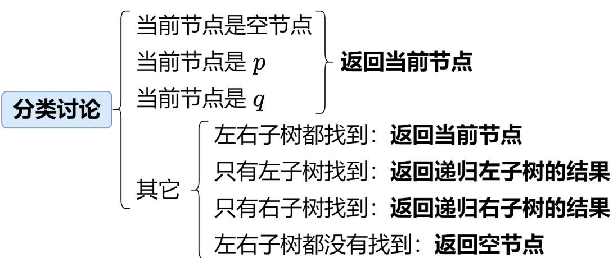

- 代码：

```python
# Definition for a binary tree node.
# class TreeNode:
#     def __init__(self, x):
#         self.val = x
#         self.left = None
#         self.right = None

class Solution:
    def lowestCommonAncestor(self, root: 'TreeNode', p: 'TreeNode', q: 'TreeNode') -> 'TreeNode':
        if root in [None, p, q]:            # 当前节点是p或q就不用继续递归了
            return root

        left = self.lowestCommonAncestor(root.left, p, q)
        right = self.lowestCommonAncestor(root.right, p, q)
        if left and right:
            return root
        if left:
            return left
        return right
```

---

##### 8.15 二叉树中的最大路径和

- 题目链接：[124. 二叉树中的最大路径和](https://leetcode.cn/problems/binary-tree-maximum-path-sum/)
- 题目描述：找到二叉树中的最大的路径和
- 思路：

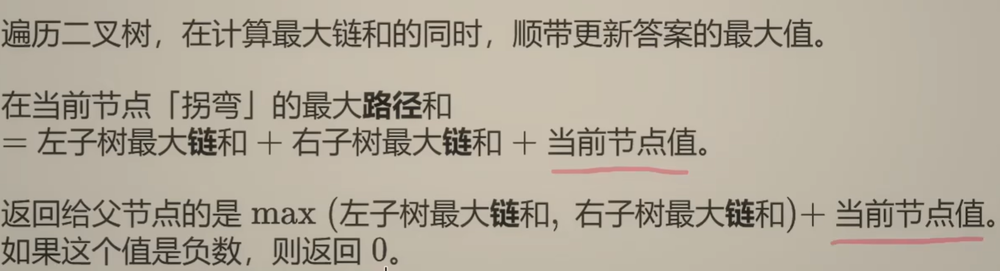

- 代码：

```python
# Definition for a binary tree node.
# class TreeNode:
#     def __init__(self, val=0, left=None, right=None):
#         self.val = val
#         self.left = left
#         self.right = right
class Solution:
    def maxPathSum(self, root: Optional[TreeNode]) -> int:
        ans = -inf
        def dfs(node):
            if node is None:
                return 0
            left_val = dfs(node.left)
            right_val = dfs(node.right)
            nonlocal ans
            ans = max(ans, left_val + right_val + node.val)     # 拼成一条链
            return max(max(left_val, right_val) + node.val, 0)  # 与0取最大值，防止子树的最大路径和为负数
        dfs(root)
        return ans
```

---

#### 9. 图论

##### 9.1 岛屿数量

- 题目链接：[200. 岛屿数量](https://leetcode.cn/problems/number-of-islands/)
- 题目描述：给你一个由 `'1'`（陆地）和 `'0'`（水）组成的的二维网格，请你计算网格中岛屿的数量。
- 思路：使用DFS，每次从新的岛（`i, j`）开始DFS并将ans加1，从上下左右四个方向走，符合条件就记录已访问`grid[i][j] = 2`，
- 代码：

```python 
class Solution:
    def numIslands(self, grid: List[List[str]]) -> int:
        m, n = len(grid), len(grid[0])
        
        def dfs(i, j):
            if i < 0 or i >= m or j < 0 or j >= n or grid[i][j] != '1':
                return 
            
            grid[i][j] = '2'
            dfs(i, j - 1)       # 向左
            dfs(i, j + 1)       # 向右
            dfs(i - 1, j)       # 向上
            dfs(i + 1, j)       # 向下

        ans = 0
        for i, row in enumerate(grid):
            for j, c in enumerate(row):
                if c == '1':                # 找到一个新的岛屿
                    dfs(i, j)
                    ans += 1
        
        return ans
"""
BFS写法
"""
class Solution:
    def numIslands(self, grid: List[List[str]]) -> int:
        m, n = len(grid), len(grid[0])
    
        def bfs(i, j):
            queue = deque([(i, j)])
            grid[i][j] = '0'
            while queue:
                x, y = queue.popleft()
                for dx, dy in [(0, -1), (0, 1), (-1, 0), (1, 0)]:
                    a, b = x + dx, y + dy
                    if a >= 0 and a < m and b >= 0 and b < n and grid[a][b] == '1':
                        grid[a][b] = '0'
                        queue.append((a, b))

        ans = 0
        for i, row in enumerate(grid):
            for j, c in enumerate(row):
                if c == '1':
                    bfs(i, j)
                    ans += 1
        return ans
```

---

##### 9.2 腐烂的橘子

- 题目链接：[994. 腐烂的橘子](https://leetcode.cn/problems/rotting-oranges/)
- 题目描述：

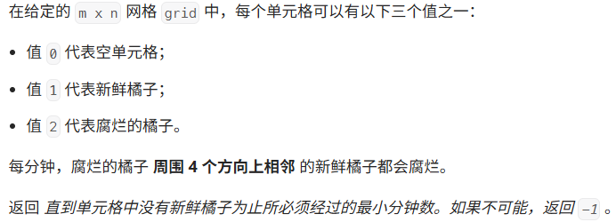

- 思路：多源BFS，先统计一开始所有腐烂的橘子的位置，然后从这些位置出发进行BFS，初始时设置变量`fresh`表示新鲜橘子的数量，如果最后这个值大于0说明不可能将所有橘子给腐烂完。
- 代码：

```python
class Solution:
    def orangesRotting(self, grid: List[List[int]]) -> int:
        m, n = len(grid), len(grid[0])
        fresh = 0                           # 统计开始时的新鲜橘子数
        q = []
        for i, row in enumerate(grid):
            for j, x in enumerate(row):
                if x == 1:
                    fresh += 1
                elif x == 2:
                    q.append((i, j))        # 开始就腐烂的橘子
        
        ans = 0
        while q and fresh:                  # 添加fresh防止多循环一次
            ans += 1
            tmp = q
            q = []
            for x, y in tmp:
                for i, j in (x - 1, y), (x + 1, y), (x, y - 1), (x, y + 1):
                    if 0 <= i < m and 0 <= j < n and grid[i][j] == 1:   # 找到新鲜橘子
                        fresh -= 1
                        grid[i][j] = 2
                        q.append((i, j))

        return -1 if fresh else ans
```

---

##### 9.3 课程表

- 题目链接：[207. 课程表](https://leetcode.cn/problems/course-schedule/)
- 题目描述：有一些必选课，它们之间有先后选修的关系，问能否选完所有课。
- 思路：相当于给一个有向图判断是否有环。先建图，采用DFS三色标记法，对每个节点x定义三种状态，然后对每个节点先标记正在访问，再遍历它的邻居看是否正在访问，是则找到环，若没找到环则标记访问完毕。
- 代码：

```python
class Solution:
    def canFinish(self, numCourses: int, prerequisites: List[List[int]]) -> bool:
        g = [[] for _ in range(numCourses)]
        for a, b in prerequisites:
            g[b].append(a)
        
        colors = [0] * numCourses
        def dfs(x):
            colors[x] = 1           # 正在访问x
            for y in g[x]:
                if colors[y] == 1 or colors[y] == 0 and dfs(y): # 找到环
                    return True
            colors[x] = 2           # x访问完毕
            return False            # 没找到环

        for i, c in enumerate(colors):
            if c == 0 and dfs(i):
                return False        # 有环
        
        return True                 # 无环  
"""
拓扑排序：BFS写法
"""
class Solution:
    def canFinish(self, numCourses: int, prerequisites: List[List[int]]) -> bool:
        ind = [0 for _ in range(numCourses)]
        adj = [[] for _ in range(numCourses)]
        queue = deque()
        # 建图
        for a, b in prerequisites:
            ind[a] += 1
            adj[b].append(a)
        # 入度为0的点入队
        for i in range(len(ind)):
            if ind[i] == 0:
                queue.append(i)
        # BFS实现拓扑
        while queue:
            x = queue.popleft()
            numCourses -= 1
            for y in adj[x]:          # 将x的邻边入度减一
                ind[y] -= 1
                if ind[y] == 0:
                    queue.append(y)
        
        return True if numCourses == 0 else False
```

> 注意：这里不能只定义两种状态（即访问或未访问过），因为两种状态无法准确判断是否有环。

---

##### 9.4 实现Trie（前缀树）

- 题目链接：[208. 实现 Trie (前缀树)](https://leetcode.cn/problems/implement-trie-prefix-tree/)
- 题目描述：用python实现Trie树。
- 思路：

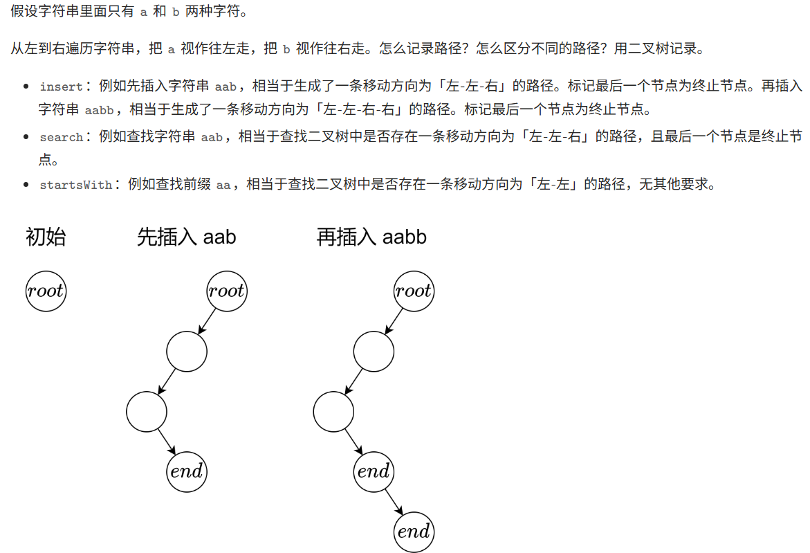

- 代码：

```python
class Node:
    __slots__ = 'son', 'end'

    def __init__(self):
        self.son = {}
        self.end = False

class Trie:
    def __init__(self):
        self.root = Node()

    def insert(self, word: str) -> None:
        cur = self.root
        for c in word:
            if c not in cur.son:
                cur.son[c] = Node()
            cur = cur.son[c]
        cur.end = True

    def search(self, word: str) -> bool:
        cur = self.root
        for c in word:
            if c not in cur.son:
                return False
            cur = cur.son[c]
        return cur.end

    def startsWith(self, prefix: str) -> bool:
        cur = self.root
        for c in prefix:
            if c not in cur.son:
                return False
            cur = cur.son[c]
        return True


# Your Trie object will be instantiated and called as such:
# obj = Trie()
# obj.insert(word)
# param_2 = obj.search(word)
# param_3 = obj.startsWith(prefix)
```

---

#### 10. 回溯

##### 10.1 全排列

- 题目链接：[46. 全排列](https://leetcode.cn/problems/permutations/)
- 题目描述：返回给定数组的全排列（任意顺序）。
- 思路：

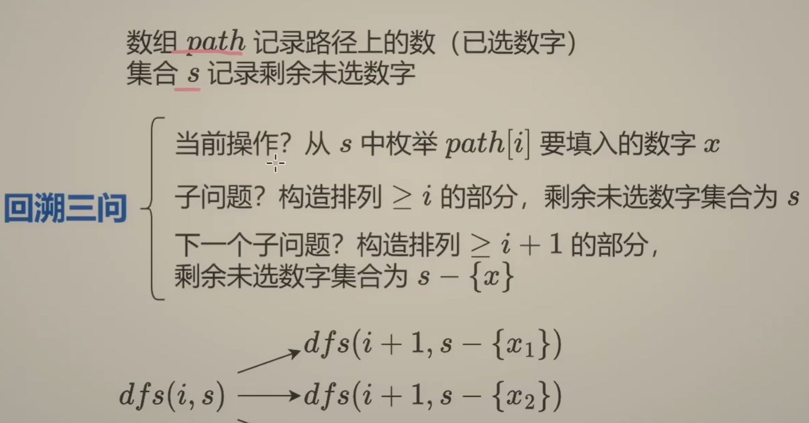

- 代码：

```python
class Solution:
    def permute(self, nums: List[int]) -> List[List[int]]:
        n = len(nums)
        path = [0] * n      
        on_path = [False] * n
        ans = []

        def dfs(i):
            if i == n:
                ans.append(path.copy())     # 需要复制数组，否则存的不是值而是内存地址
                return 
            for j, on in enumerate(on_path):
                if not on:
                    path[i] = nums[j]       # 未选的数字中选一个
                    on_path[j] = True
                    dfs(i + 1)              # dfs选第i个位置
                    on_path[j] = False      # 恢复现场
        dfs(0)
        return ans
"""
写法2
"""
class Solution:
    def permute(self, nums: List[int]) -> List[List[int]]:
        n = len(nums)
        path = [0] * n
        ans = []

        def dfs(i, s):
            if i == n:
                ans.append(path.copy())
                return 
            for x in s:
                path[i] = x
                dfs(i + 1, s - {x})

        dfs(0, set(nums))
        return ans
```

---

##### 10.2 子集

- 题目链接：[78. 子集](https://leetcode.cn/problems/subsets/)
- 题目描述：给定整数数组（其中的元素互不相同），返回该数组的所有子集。
- 思路：1. 从输入的角度考虑当前数选或不选，组合出`2^n`个子集。2. 枚举子集的第1,2，...个数选谁。
- 代码：

```python
class Solution:
    def subsets(self, nums: List[int]) -> List[List[int]]:
        n = len(nums)
        ans = []
        path = []

        def dfs(i):
            if i == n:
                ans.append(path.copy())
                return
            
            # 不选
            dfs(i + 1)
            # 选
            path.append(nums[i])
            dfs(i + 1)
            path.pop()                  # 恢复现场 
        dfs(0)
        return ans
"""
枚举要选的数
"""
class Solution:
    def subsets(self, nums: List[int]) -> List[List[int]]:
        n = len(nums)
        path = []
        ans = []
        
        # 从下标i ~ n - 1中选一个数，加到path末尾
        def dfs(i):
            ans.append(path.copy())     # 不选
            for j in range(i, n):       # 选，枚举选的数字
                path.append(nums[j])
                dfs(j + 1)              # 下一个数从 j+1 开始选
                path.pop()

        dfs(0)
        return ans
```

---

##### 10.3 电话号码的字母组合

- 题目链接：[17. 电话号码的字母组合](https://leetcode.cn/problems/letter-combinations-of-a-phone-number/)
- 题目描述：给定一个仅包含数字 `2-9` 的字符串，返回所有它能表示的字母组合。
- 思路：先将数字和要枚举的字符串对应起来，然后按照顺序进行dfs()
- 代码：

```python
MAPPED_ALPHA = ["", "", "abc", "def", "ghi", "jkl", "mno", "pqrs", "tuv", "wxyz"]
class Solution:
    def letterCombinations(self, digits: str) -> List[str]:
        n = len(digits)
        if n == 0:
            return []
        
        ans = []
        path = [''] * n

        def dfs(i):
            if i == n:
                ans.append("".join(path))
                return
            for c in MAPPED_ALPHA[int(digits[i])]:
                path[i] = c
                dfs(i + 1)
        dfs(0)
        return ans
```

---

##### 10.4 组合总和

- 题目链接：[39. 组合总和](https://leetcode.cn/problems/combination-sum/)
- 题目描述：给定一个整数数组和一个目标数，返回使数字和为目标数的所有不同组合的列表。
- 思路：选或不选（同子集型回溯），使用`dfs(i,left)`来进行回溯，注意其中的元素可以重复选。
- 代码：

```python
class Solution:
    def combinationSum(self, candidates: List[int], target: int) -> List[List[int]]:
        ans = []
        path = []

        def dfs(i, left):                           # left表示剩余要选的元素之和
            if left == 0:                           # 找到一个合法的组合
                ans.append(path.copy())
                return
            
            if i == len(candidates) or left < 0:    # 递归边界
                return 
            
            # 不选
            dfs(i + 1, left)
            # 选
            path.append(candidates[i])
            dfs(i, left - candidates[i])            # i可以重复选
            path.pop()                              # 恢复现场
        dfs(0, target)
        return ans
"""
剪枝优化版
"""
class Solution:
    def combinationSum(self, candidates: List[int], target: int) -> List[List[int]]:
        candidates.sort()
        ans = []
        path = []
        
        def dfs(i, left):
            if left == 0:
                ans.append(path.copy())
                return 
            
            if i == len(candidates) or left < candidates[i]:
                return 
            
            # 不选
            dfs(i + 1, left)
            # 选
            path.append(candidates[i])
            dfs(i, left - candidates[i])
            path.pop()
        dfs(0, target)
        return ans

"""
枚举选哪个
"""
class Solution:
    def combinationSum(self, candidates: List[int], target: int) -> List[List[int]]:
        ans = []
        path = []
        candidates.sort()

        def dfs(i, left):
            if left == 0:
                ans.append(path.copy())
                return
            
            # 枚举选哪一个
            for j in range(i, len(candidates)):
                if candidates[j] > left:        # 后面的数太大了更选不了
                    break
                path.append(candidates[j])
                dfs(j, left - candidates[j])
                path.pop()
        dfs(0, target)
        return ans
```

---

##### 10.5 括号生成

- 题目链接：[22. 括号生成](https://leetcode.cn/problems/generate-parentheses/)
- 题目描述：给定数字n，生成n对有效的括号。
- 思路：看成从2n个位置中选n个位置放左括号，在递归过程中要保证右括号的个数不能超过左括号的个数，且最终填完2n个位置时左右括号各n个。
- 代码：

```python
class Solution:
    def generateParenthesis(self, n: int) -> List[str]:
        ans = []
        path = [''] * (2 * n)
        
        def dfs(left, right):
            if right == n:
                ans.append(''.join(path))
                return
            if left < n:            # 可以继续填左括号
                path[left + right] = '('
                dfs(left + 1, right)
            
            if right < left:        # 可以填右括号
                path[left + right] = ')'
                dfs(left, right + 1)
        dfs(0, 0)
        return ans
```

---

##### 10.6 单词搜索

- 题目链接：[79. 单词搜索](https://leetcode.cn/problems/word-search/)
- 题目描述：给定二维网格和一个字符串，判断字符串是否在网格中。
- 思路：DFS + 剪枝。

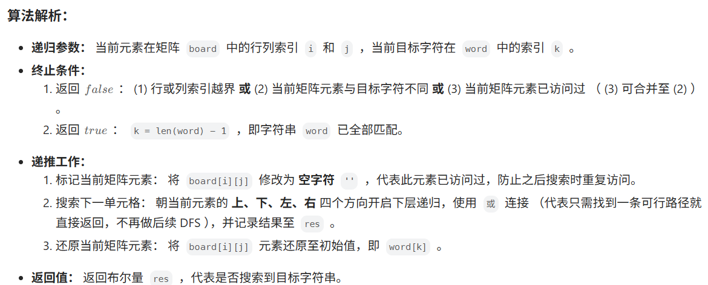

- 代码：

```python
class Solution:
    def exist(self, board: List[List[str]], word: str) -> bool:
        m, n = len(board), len(board[0])
        def dfs(i, j, k):
            if board[i][j] != word[k]:      # 不匹配
                return False
            if k == len(word) - 1:              # 找到匹配的字符串
                return True
            
            board[i][j] = ''                # 标记已访问
            for x, y in (i, j - 1), (i, j + 1), (i - 1, j), (i + 1, j):     # 看相邻的格子是否能找到匹配的字符串
                if 0 <= x < m and 0 <= y < n and dfs(x, y, k + 1):
                    return True
            board[i][j] = word[k]           # 恢复现场
            return False
        
        for i in range(m):
            for j in range(n):
                if dfs(i, j, 0):
                    return True
        return False
```

---

##### 10.7 分割回文串

- 题目链接：[131. 分割回文串](https://leetcode.cn/problems/palindrome-partitioning/)
- 题目描述：将给定字符串分割为回文子串，返回所有的方案。
- 思路：1. 从输入的视角，假设字符串之间存在逗号，考虑逗号选或不选，则可以看成子集型问题；2. 从答案的视角，枚举子串结束的位置。

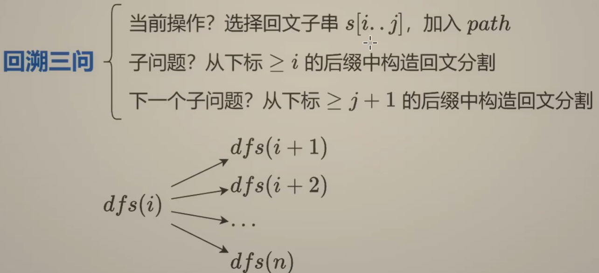

- 代码：

```python
"""
输入的视角
"""
class Solution:
    def partition(self, s: str) -> List[List[str]]:
        n = len(s)
        ans = []
        path = []
        
        # 考虑i后面的逗号怎么选
        # start为当前回文串的起始位置
        def dfs(i, start):
            if i == n:                      # s分割完毕
                ans.append(path.copy())     
                return 
            # 不选i和i+1之间的逗号
            if i < n - 1:                   # i=n-1时只能分割
                dfs(i + 1, start)
            
            # 选i和i+1之间的逗号
            t = s[start: i + 1]
            if t == t[::-1]:                # 判断是否回文
                path.append(t)
                dfs(i + 1, i + 1)           # start = i+1 表示下一个子串从i + 1开始
                path.pop()
        dfs(0, 0)  
        return ans   
"""
答案的视角
"""
class Solution:
    def partition(self, s: str) -> List[List[str]]:
        n = len(s)
        ans = []
        path = []
        
        # 考虑是s[i:]的子串如何分割
        def dfs(i):
            if i == n:
                ans.append(path.copy())
                return
            
            for j in range(i, n):       # 枚举子串的结束位置
                t = s[i: j + 1]
                if t == t[::-1]:
                    path.append(t)
                    dfs(j + 1)          # 剩余的s[j + 1:]怎么分割
                    path.pop()

        dfs(0)
        return ans
```

---

##### 10.8 N皇后

- 题目链接：[51. N 皇后](https://leetcode.cn/problems/n-queens/)
- 题目描述：将n个皇后放置在n * n的棋盘上（不能同行同列同斜线）。
- 思路: 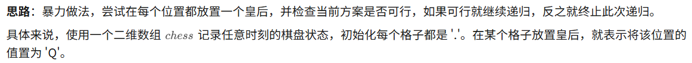
- 代码：

```python
"""
暴力写法
"""
class Solution:
    def solveNQueens(self, n: int) -> List[List[str]]:
        ans = []
        chess = [['.' for _ in range(n)] for _ in range(n)]
        def dfs(row, chess):
            if row == n:
                ans.append([''.join(r) for r in chess])
                return
            for col in range(n):
                if is_valid(row, col, chess):
                    chess[row][col] = 'Q'
                    dfs(row + 1, chess)
                    chess[row][col] = '.'

        def is_valid(row, col, chess):
            for i in range(row):            # 检查列
                if chess[i][col] == 'Q':
                    return False
            for j in range(col):
                if chess[row][j] == 'Q':    # 检查行
                    return False
            
            # 检查正对角线
            i, j = row - 1, col - 1
            while i >= 0 and j >= 0:
                if chess[i][j] == 'Q':
                    return False
                i -= 1
                j -= 1
            # 检查反对角线
            i, j = row - 1, col + 1
            while i >= 0 and j < n:
                if chess[i][j] == 'Q':
                    return False
                i -= 1
                j += 1
            return True             # 符合要求，可以放皇后

        dfs(0, chess)
        return ans

"""
优化版
"""  
class Solution:
    def solveNQueens(self, n: int) -> List[List[str]]:
        ans = []
        usedcol = [False] * n
        usedDiag1 = [False] * (2 * n - 1)
        usedDiag2 = [False] * (2 * n - 1)
        board = [-1] * n                    # 存每行皇后的列索引

        def dfs(board, row):
            if row == n:
                temp = []
                for i in board:
                    str_row = ['.' for _ in range(n)]
                    str_row[i] = 'Q'
                    temp.append(''.join(str_row))
                ans.append(temp)
                return
            
            for col in range(n):
                if usedcol[col] or usedDiag1[row - col + n - 1] or usedDiag2[row + col]:
                    continue
                board[row] = col            # 可以放皇后
                usedcol[col] = True
                usedDiag1[row - col + n - 1] = True
                usedDiag2[row + col] = True
                dfs(board, row + 1)
                usedcol[col] = False
                usedDiag1[row - col + n - 1] = False
                usedDiag2[row + col] = False

        dfs(board, 0)
        return ans
```

---

#### 11. 二分查找

##### 11.1 搜索插入位置

- 题目链接：[35. 搜索插入位置](https://leetcode.cn/problems/search-insert-position/)
- 题目描述：返回 *nums* 中的第一个（最左边的）**大于或等于** *target* 的数的下标。如果所有数都小于 *target*，返回 *nums* 的长度
- 思路：使用二分查找，有3种写法（闭区间，左闭右开区间和开区间），可以找到`>=x，>x(转成>= x + 1)， <= x(转成(>x) - 1)以及 <x(转成(>= x) - 1)`的值。
- 代码：

```python
"""
闭区间写法
"""
class Solution:
    def searchInsert(self, nums: List[int], target: int) -> int:
        n = len(nums)
        ans = 0

        l, r = 0, n - 1
        while l <= r:					# 区间不为空
            mid = (l + r) // 2
            if nums[mid] < target:
                l = mid + 1
            else:
                r = mid - 1
        ans = l
        return ans
"""
左闭右开区间写法
"""
class Solution:
    def searchInsert(self, nums: List[int], target: int) -> int:
        n = len(nums)
        ans = 0

        l, r = 0, n
        while l < r:                # 当l=r 时区间为空
            mid = (l + r) // 2
            if nums[mid] < target:
                l = mid + 1
            else:
                r = mid
        ans = l
        return ans
"""
开区间
"""
class Solution:
    def searchInsert(self, nums: List[int], target: int) -> int:
        n = len(nums)
        ans = 0

        l, r = -1, n
        while l + 1 < r:                # 当l + 1 = r时区间为空
            mid = (l + r) // 2
            if nums[mid] < target:
                l = mid
            else:
                r = mid
        ans = r             
        return ans
```

---

##### 11.2 搜索二维矩阵

- 题目链接：[74. 搜索二维矩阵](https://leetcode.cn/problems/search-a-2d-matrix/)
- 题目描述：在每行严格递增的矩阵（每行的第一个整数大于前一行的最后一个整数）中找到target。
- 思路：1. 将矩阵每行拼起来得到一个数组，然后使用二分查找。2. 排除法：每次先找矩阵右上角的元素（第一行最后一个元素），如果这个值比target小，那么排除第一行，如果比target大，则排除第一列，直到最后找到target。
- 代码：

```python
"""
暴力做法
"""
class Solution:
    def searchMatrix(self, matrix: List[List[int]], target: int) -> bool:
        tmp = [elem for row in matrix for elem in row]
        n = len(tmp)
        
        # 二分查找
        l, r = 0, n - 1
        while l <= r:
            mid = (l + r) // 2
            if tmp[mid] < target:
                l = mid + 1
            else:
                r = mid - 1
        return False if l == n or tmp[l] != target else True
"""
将数组的值对应到矩阵的行号和列号
"""
class Solution:
    def searchMatrix(self, matrix: List[List[int]], target: int) -> bool:
        m, n = len(matrix), len(matrix[0])
        l, r = 0, m * n - 1
        
        while l <= r:
            mid = (l + r) // 2
            x = matrix[mid // n][mid % n]       # a[i] ==> matrix[i // n][i % n]
            if x == target:
                return True

            if x < target:
                l = mid + 1
            else:
                r = mid - 1
        return False
"""
排除法代码
"""
class Solution:
    def searchMatrix(self, matrix: List[List[int]], target: int) -> bool:
        m, n = len(matrix), len(matrix[0])
        i, j = 0, n - 1             # 右上角元素
        while i < m and j >= 0:
            if matrix[i][j] == target:
                return True
            if matrix[i][j] < target:       
                i += 1              # 排除这一行元素
            else:
                j -= 1              # 排除这一列元素
        return False
```

---

##### 11.3 在排序数组中查找元素的第一个和最后一个位置

- 题目链接：[34. 在排序数组中查找元素的第一个和最后一个位置](https://leetcode.cn/problems/find-first-and-last-position-of-element-in-sorted-array/)
- 题目描述：给你一个按照非递减顺序排列的整数数组 `nums`，和一个目标值 `target`。请你找出给定目标值在数组中的开始位置和结束位置。
- 思路：二分查找第一个大于等于target的和第一个小于等于target的元素的位置
- 代码：

```python
class Solution:
    def biSearch(slef, nums, target):
        n = len(nums)

        l, r = 0, n - 1
        while l <= r:
            mid = (l + r) // 2
            if nums[mid] < target:
                l = mid + 1
            else:
                r = mid - 1
        return l

    def searchRange(self, nums: List[int], target: int) -> List[int]:
        left = self.biSearch(nums, target)
        if left == len(nums) or nums[left] != target:   # 没找到target或找到的第一个>=target的不是
            return [-1, -1]
        right = self.biSearch(nums, target + 1) - 1     # 将<=x转为(>=x + 1) - 1
        return [left, right]
```

---

##### 11.4 搜索旋转排序数组

- 题目链接：[33. 搜索旋转排序数组](https://leetcode.cn/problems/search-in-rotated-sorted-array/)
- 题目描述：对一个升数组进行向左旋转（某个未知的下标开始），查找数组中是否存在target。
- 思路：将target与最后一个数nums[n - 1]比较，如果比它大那么说明target在第一段（[0, i - 1]由最小值分段），否则在第二段（[i, n - 1]），根据这个性质来进行二分。
- 代码：

```python
class Solution:
    def findMin(self, nums): 		# 使用蓝红二分法           
        l, r = -1, len(nums) - 1    # 注意二分的开区间（这里的末尾索引是不满足条件的，所以从这里开始）     
        while l + 1 < r:
            mid = (l + r) // 2
            if nums[mid] < nums[-1]:
                r = mid
            else:
                l = mid
        return r                    # 返回最小值下标

    def biSearch(self, nums, l, r, target):
        while l + 1 < r:
            mid = (l + r) // 2
            if nums[mid] == target:
                return mid
            if nums[mid] < target:
                l = mid
            else:   
                r = mid
        return -1
    def search(self, nums: List[int], target: int) -> int:
        i = self.findMin(nums)
        if target > nums[-1]:           # 在第一段
            return self.biSearch(nums, -1, i, target)  
        # 在第二段
        return self.biSearch(nums, i - 1, len(nums), target)
    
"""
根据有序的区间来二分
"""
class Solution:
    def search(self, nums: List[int], target: int) -> int:
        n = len(nums)
        
        l, r = 0, n - 1
        while l <= r:
            mid = (l + r) >> 1
            if nums[mid] == target:
                return mid
            
            # 左半部分有序
            if nums[l] <= nums[mid]:
                # 在左半部分
                if nums[l] <= target < nums[mid]:
                    r = mid - 1
                else:
                    l = mid + 1
            
            else:
                if nums[mid] < target <= nums[r]:
                    l = mid + 1
                else:
                    r = mid - 1
        
        return -1
```

> 注意在寻找最小值下标时采用的是开区间的红蓝染色法，让left一定是不满足条件的位置，right一定是满足条件的位置。

---

##### 11.5 寻找旋转排序数组中的最小值

- 题目链接：[153. 寻找旋转排序数组中的最小值](https://leetcode.cn/problems/find-minimum-in-rotated-sorted-array/)
- 题目描述：找到经过多次旋转后的数组中的最小值。
- 思路：直接判断要找的数x和最后一个数的关系，若x > nums[n - 1]，说明x在第一段，一定在最小值左边，否则x要么是最小值要么在最小值右边。根据上述位置关系来进行二分。
- 代码：

```python
"""
闭区间写法
"""
class Solution:
    def findMin(self, nums: List[int]) -> int:
        l, r = 0, len(nums) - 2
        while l <= r:                       # 闭区间不为空
            mid = (l + r) // 2
            if nums[mid] > nums[-1]:        # x在第一段，target在第二段
                l = mid + 1
            else:
                r = mid - 1
        return nums[l]
```

> 注意二分的区间，由于已经知道n - 1位置的数和最后一个数的大小关系了，所以不需要再进行判断。

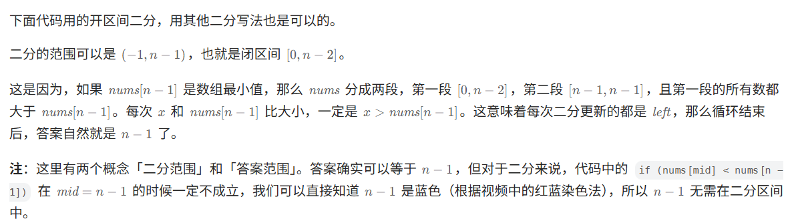

---

##### 11.6 寻找两个正序数组的中位数

- 题目链接：[4. 寻找两个正序数组的中位数](https://leetcode.cn/problems/median-of-two-sorted-arrays/)

- 题目描述：在两个升序数组中找到中位数，用`O(log(m + n))`的算法解决。

- 思路：本质上是在找第k小的数，其中`k = ceil((m +n) / 2)`，分两种情况讨论：

  1. m + n为奇数，返回第k小的数（中间数只有一个）；
  2. m + n为偶数，返回第k小的数和第k + 1小的数的平均值。

  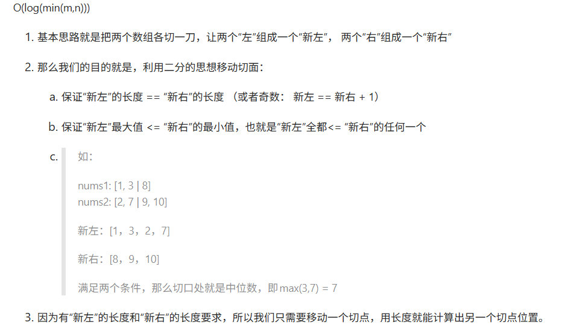

- 代码：

```python
class Solution:
    def findMedianSortedArrays(self, nums1: List[int], nums2: List[int]) -> float:
        if len(nums1) > len(nums2):
            nums1, nums2 = nums2, nums1

        m, n = len(nums1), len(nums2)
        nums1 = [-inf] + nums1 + [inf]
        nums2 = [-inf] + nums2 + [inf]

        # 循环不变量：nums1[l] <= nums2[j+1]
        # 循环不变量：nums1[r] > nums2[j+1]
        l, r = 0, m + 1             # 填充后的红蓝边界
        while l + 1 < r:
            # i为nums1的切点，j为nums2的切点
            i = (l + r) // 2
            j = (m + n + 1) // 2 - i        # 保证若m + n为奇数时左半部分长度比右半部分多一
            if nums1[i] <= nums2[j + 1]:        # 要找到nums1左半边最大的数并且这个数小于等于nums[2]右半边最小的数
                l = i
            else:
                r = i
        # 此时l即为要切的位置
        i = l
        j = (m + n + 1) // 2 - i
        max1 = max(nums1[i], nums2[j])              # 左半部分最大值
        min2 = min(nums1[i + 1], nums2[j + 1])      # 右半部分最小值
        return max1 if (m + n) % 2 else (max1 + min2) / 2
"""
归并排序做法
"""
class Solution:
    def findMedianSortedArrays(self, nums1: List[int], nums2: List[int]) -> float:
        m, n = len(nums1), len(nums2)
        L = m + n
        p1, p2 = 0, 0       # 指向2个数组开头
        pre, cur = -1, -1

        # 遍历到中位数所在位置 (L // 2)
        for _ in range(L // 2 + 1):
            pre = cur
            
            # 判断移动哪个指针
            # nums1还没走完 and (nums2走完了或者nums1的值更小)
            if p1 < m and (p2 >= n or nums1[p1] < nums2[p2]):
                cur = nums1[p1]
                p1 += 1
            else:
                cur = nums2[p2]
                p2 += 1
        if L % 2:       # 总长度为奇数
            return cur
        return (pre + cur) / 2
```

---

#### 12. 栈

##### 12.1 有效的括号

- 题目链接：[20. 有效的括号](https://leetcode.cn/problems/valid-parentheses/)
- 题目描述：给定括号字符串，判断括号是否是有效的。
- 思路：哈希表存右括号对应的左括号，遍历字符串每次加入左括号，当遇到右括号时弹出栈顶看是否匹配，最后栈为空说明全部匹配成功。
- 代码：

```python
class Solution:
    def isValid(self, s: str) -> bool:
        stack = []
        mapping = {')':'(', ']':'[', '}':'{'}
        
        for c in s:
            if c in mapping:        # 右括号
                if not stack or stack.pop() != mapping[c]:
                    return False
            else:                   # 左括号
                stack.append(c)

        return not stack            # 栈为空说明全匹配成功  
```

---

##### 12.2 最小栈

- 题目链接：[155. 最小栈](https://leetcode.cn/problems/min-stack/)
- 题目描述：设计一个支持 `push` ，`pop` ，`top` 操作，并能在常数时间内检索到最小元素的栈。

- 思路：1. 添加一个辅助栈专门存最小元素。 2. 前缀最小栈

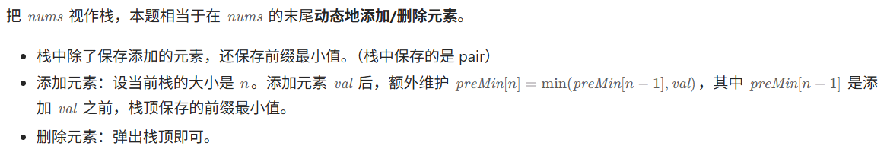

- 代码：

```python
class MinStack:

    def __init__(self):
        self.st = [(0, inf)]        # 栈底哨兵

    def push(self, val: int) -> None:
        self.st.append((val, min(self.st[-1][1], val)))

    def pop(self) -> None:
        self.st.pop()

    def top(self) -> int:
        return self.st[-1][0]

    def getMin(self) -> int:
        return self.st[-1][1]

"""
添加辅助栈写法
"""
class MinStack:

    def __init__(self):
        self.st = []
        self.min_st = []

    def push(self, val: int) -> None:
        self.st.append(val)
        if not self.min_st or val <= self.min_st[-1]:
            self.min_st.append(val)

    def pop(self) -> None:
        if self.st.pop() == self.min_st[-1]:
            self.min_st.pop()

    def top(self) -> int:
        return self.st[-1]

    def getMin(self) -> int:
        return self.min_st[-1]
```

---

##### 12.3 字符串编码

- 题目链接：[394. 字符串解码](https://leetcode.cn/problems/decode-string/)
- 题目描述：给定一个经过编码的字符串，返回它解码后的字符串。编码规则为: `k[encoded_string]`，表示其中方括号内部的 `encoded_string` 正好重复 `k` 次。
- 思路：
- 1. 使用递归：第一个字符s[0]是字母，则直接切分为s[0] + decode(s[1: ])；否则第一个字符s[0]一定是数字，那么先寻找左括号，再寻找匹配的右括号，然后将字符串分成3部分处理：int(s[: i])为倍数，s[i + 1: j]为括号内待解码的内容，s[j + 1: ]为括号后剩余的内容。
  2. 用栈来模拟递归。维护2个关键状态，res记录当前层正在构建的字符串，k记录接下来遇到的括号内容需要重复的次数。当遇到左括号时进行”递“的操作，把外层还没处理完的内容保存起来，压入栈中；遇到右括号时递归结束，恢复之前的内容进行合并。

- 代码：

```python
"""
递归写法
"""
class Solution:
    def decodeString(self, s: str) -> str:
        if not s:
            return s
        
        # s[0]是字母
        if s[0].isalpha():
            return s[0] + self.decodeString(s[1:])

        # s[0]是数字
        i = s.find('[')     # 找到左括号
        # 找右括号，注意要找第一个左括号匹配的右括号，可能存在嵌套括号
        balance = 1         # 左括号数 - 右括号数
        for j in count(i + 1):		# 也可以写成：for j in range(i + 1, len(s)):
            if s[j] == '[':
                balance += 1
            elif s[j] == ']':
                balance -= 1
                if balance == 0:
                    return self.decodeString(s[i + 1: j]) * int(s[:i]) + self.decodeString(s[j + 1:])
                
"""
栈模拟递归写法
"""
class Solution:
    def decodeString(self, s: str) -> str:
        stack, res, k = [], "", 0
        for c in s:
            if c == '[':
                stack.append([k, res])
                res, k = "", 0
            elif c == ']':
                cur_k, last_res = stack.pop()
                res = last_res + cur_k * res
            elif c.isdigit():
                k = k * 10 + int(c)
            else:
                res += c
        return res
```

---

##### 12.4 每日温度

- 题目链接：[739. 每日温度](https://leetcode.cn/problems/daily-temperatures/)
- 题目描述：给定一个整数数组 `temperatures` ，表示每天的温度，返回一个数组 `answer` ，其中 `answer[i]` 是指对于第 `i` 天，下一个更高温度出现在几天后。如果气温在这之后都不会升高，请在该位置用 `0` 来代替。
- 思路：使用单调栈解决。及时去掉无用数据，保证栈中数据有序。
- 代码：

```python
"""
从左到右遍历
"""
class Solution:
    def dailyTemperatures(self, temperatures: List[int]) -> List[int]:
        n = len(temperatures)
        ans = [0] * n
        st = []
        
        for i, x in enumerate(temperatures):
            while st and x > temperatures[st[-1]]:      # 找到第一个比栈顶元素大的数
                j = st.pop()
                ans[j] = i - j
            st.append(i)
        
        return ans
"""
从右到左遍历
"""
class Solution:
    def dailyTemperatures(self, temperatures: List[int]) -> List[int]:
        n = len(temperatures)
        ans = [0] * n
        st = []
        
        # for i, x in enumerate(temperatures):
        #     while st and x > temperatures[st[-1]]:      # 找到第一个比栈顶元素大的数
        #         j = st.pop()
        #         ans[j] = i - j
        #     st.append(i)
        
        for i in range(n - 1, -1, -1):
            x = temperatures[i]
            while st and x >= temperatures[st[-1]]:
                st.pop()
            if st:
                ans[i] = st[-1] - i
            st.append(i)

        return ans
```

---

##### 12.5 柱状图中最大的矩形

- 题目链接：[84. 柱状图中最大的矩形](https://leetcode.cn/problems/largest-rectangle-in-histogram/)
- 题目描述：给定数组表示柱子的高度，求能构成的最大矩形面积。
- 思路：对每一个高度h，找到左右第一个比它矮的作为边界(L, R)，那么以它为中心可以扩展的最大的矩形的面积为h * (R - L - 1)。
- 代码：

```python
class Solution:
    def largestRectangleArea(self, heights: List[int]) -> int:
        heights = [0] + heights + [0]       # 前后添加哨兵
        st = []                             # 栈内单调递增
        ans = 0

        for i, x in enumerate(heights):
            while st and x < heights[st[-1]]:
                j = st.pop()
                h = heights[j]
                # 右边界就是当前的i
                # 左边界就是新的栈顶
                w = i - st[-1] - 1
                ans = max(ans, h * w)
            
            st.append(i)        # 当前柱子比栈顶高，入栈

        return ans
```

---

#### 13. 堆

##### 13.1 数组中的第K个最大元素

- 题目链接：[215. 数组中的第K个最大元素](https://leetcode.cn/problems/kth-largest-element-in-an-array/)
- 题目描述：返回数组排序后的第K个最大元素。
- 思路：1. 类似于快速排序算法，用哨兵划分数组，然后再递归左右子数组进行划分，直到数组长度为1，但当数组中存在大量重复元素时，时间复杂度会退化至o(N^2)，因此使用三路划分，当第k大数字在等于基准数的子数组中时，直接返回。 2. 堆排序，维护一个长度为k的小根堆。

> 如果某次哨兵划分后基准索引正好为n - k，则说明它就是第k大的数字，直接返回。

- 代码：

```python
class Solution:
    def findKthLargest(self, nums: List[int], k: int) -> int:

        def quick_select(nums, k):
            pivot = random.choice(nums)
            big, equal, small = [], [], []
            
            for x in nums:
                if x > pivot:
                    big.append(x)
                elif x < pivot:
                    small.append(x)
                else:
                    equal.append(x)
                
            if k <= len(big):                   # 第k大的元素在big中
                return quick_select(big, k)
            if len(nums) - len(small) < k:      # 第k大的元素在small中
                return quick_select(small, k - len(nums) + len(small))

            return pivot
        return quick_select(nums, k)

"""
堆排序
"""
class Solution:
    def findKthLargest(self, nums: List[int], k: int) -> int:
        pq = []     # 数组加入小顶堆，堆内维护当前值的最大的k个数
        for x in nums:
            heapq.heappush(pq, x)       # 当前元素入堆
            if len(pq) > k:
                heapq.heappop(pq)       # 堆中元素超过k个，弹出最小的那个
        return pq[0]                    # 堆顶即为第k大的数
    
    
"""
快速选择+三路划分
"""
class Solution:
    def findKthLargest(self, nums: List[int], k: int) -> int:
        n = len(nums)
        target = n - k          # 第k大转为第 n - k 小（下标）
        left, right = 0, n - 1
        
        while left <= right:
            # 随机选择基准，三路划分
            pivot = nums[random.randint(left, right)]
            lt = left
            i = left
            gt = right

            while i <= gt:
                if nums[i] < pivot:
                    nums[lt], nums[i] = nums[i], nums[lt]
                    lt += 1
                    i += 1
                elif nums[i] > pivot:
                    nums[gt], nums[i] = nums[i], nums[gt]
                    gt -= 1
                else:
                    i += 1
                
            if target < lt:
                right = lt - 1
            elif target > gt:
                left = gt + 1
            else:
                return nums[target]
```

---

##### 13.2 前K个高频元素

- 题目链接：[347. 前 K 个高频元素](https://leetcode.cn/problems/top-k-frequent-elements/)
- 题目描述：返回数组中出现频率前 `k` 高的元素。
- 思路：1. 暴力排序取前k高频率的元素。2. 桶排序：先将出现次数相同的元素放到一个桶里（每个桶是一个列表），然后倒序遍历这个列表添加进答案，直到长度为k。
- 代码：

```python
"""
暴力法
"""
class Solution:
    def topKFrequent(self, nums: List[int], k: int) -> List[int]:
        cnt = Counter(nums)
        sorted_cnt = sorted(cnt.items(), key = lambda x: x[1], reverse=True)       # 按频次降序排序
        ans = []
        for i in range(k):
            ans.append(sorted_cnt[i][0])
        
        return ans
"""
桶排序
"""  
class Solution:
    def topKFrequent(self, nums: List[int], k: int) -> List[int]:
        cnt = Counter(nums)
        max_cnt = max(cnt.values())

        # 将出现次数相同的元素放到一个桶里
        buckets = [[] for _ in range(max_cnt + 1)]      
        for x, c in cnt.items():
            buckets[c].append(x)
        
        # 倒序遍历
        ans = []
        for bucket in reversed(buckets):
            ans += bucket
            if len(ans) == k:
                return ans

"""
小根堆
"""
class Solution:
    def topKFrequent(self, nums: List[int], k: int) -> List[int]:
        cnt = Counter(nums)
        pq = []

        for x, c in cnt.items():
            heapq.heappush(pq, (c, x))
            
            if len(pq) > k:
                heapq.heappop(pq)
        
        ans = [x for c, x in pq]
        return ans
```

---

##### 13.3 数据流的中位数

- 题目链接：[295. 数据流的中位数](https://leetcode.cn/problems/find-median-from-data-stream/)
- 题目描述：

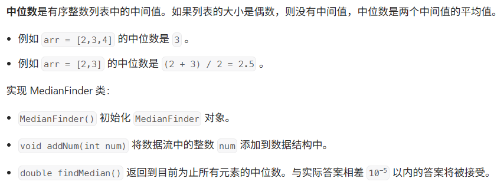

- 思路：使用最大最小堆，left为数组左半部分，right为数组右半部分，需要满足：left的所有元素均小于等于right中的所有元素== >left中的最大值小于等于right中的最小值，同时left的长度比right多一。分类讨论：如果left长度 = right长度，将要添加的num加到right中，然后去掉right中的最小值并添加到left中；如果left长度 = right长度 + 1，将要添加的num加到left中，然后去掉left的最大值并添加到right中。
- 代码：

```python
class MedianFinder:

    def __init__(self):
        self.left = []      # 最大堆
        self.right = []     # 最小堆

    def addNum(self, num: int) -> None:
        if len(self.left) == len(self.right):
            heapq.heappush(self.left, -heapq.heappushpop(self.right, num))
        else:
            heapq.heappush(self.right, -heapq.heappushpop(self.left, -num))

    def findMedian(self) -> float:
        if len(self.left) > len(self.right):
            return -self.left[0]             # 堆顶为中位数
        return (-self.left[0] + self.right[0]) / 2
```

> python内置函数只能实现小根堆，要实现大根堆需要先取相反数再压入堆中，取出来时也要记得添加负号

---

#### 14. 贪心

##### 14.1 买卖股票的最佳时机

- 题目链接：[121. 买卖股票的最佳时机](https://leetcode.cn/problems/best-time-to-buy-and-sell-stock/)
- 题目描述：给定一个数组 `prices` ，它的第 `i` 个元素 `prices[i]` 表示一支给定股票第 `i` 天的价格。求在某一天买入和卖出后获得的最大利润。
- 思路：1. 贪心：从左到右枚举，用min_v维护[0: i - 1]的最小值，在遍历过程中更新ans = max(ans, prices[i] - min_v)。通俗点理解就是，假设我在这一天卖出，那么我就需要找到前面这几天中最低的价格来买入。
- 代码：

```python
class Solution:
    def maxProfit(self, prices: List[int]) -> int:
        ans = 0
        min_v = prices[0]
        
        for x in prices:
            ans = max(ans, x - min_v)       # 答案更新在min_v更新之前
            min_v = min(min_v, x)
        return ans
```

---

##### 14.2 跳跃游戏

- 题目链接：[55. 跳跃游戏](https://leetcode.cn/problems/jump-game/)
- 题目描述：数组元素表示跳跃步数，从数组的第一个位置能否跳到最后一个位置。
- 思路：维护一个最远的位置变量，遍历过程中如果发现 位置 i > r_max，则说明到不了最后一个位置。
- 代码：

```python
class Solution:
    def canJump(self, nums: List[int]) -> bool:
        r_max = 0                   # 维护最远可到达的位置
        for i, x in enumerate(nums):
            if i > r_max:
                return False
            r_max = max(r_max, i + x)
        return True
```

---

##### 14.3 跳跃游戏II

- 题目链接：[45. 跳跃游戏 II](https://leetcode.cn/problems/jump-game-ii/)
- 题目描述：数组元素表示跳跃步数，从数组的第一个位置跳到最后一个位置所需的最小步数。
- 思路：**贪心**思想：记录当前位置的最远点cur_r和当前位置到最远点之间的最远点next_r（即下一个最远点），遍历到数组的倒数第二个元素，如果走到了cur_r，那么需要从下一个最远点next_r开始走，ans += 1。
- 代码：

```python
class Solution:
    def jump(self, nums: List[int]) -> int:
        ans = 0
        cur_r, next_r = 0, 0        # 已建造桥的右端点 + 下一座桥的右端点最大值
        
        for i in range(len(nums) - 1):
            # 遍历过程中记录下一座桥的最远点
            next_r = max(next_r, i + nums[i])
            if i == cur_r:          # 已经走到桥的右端点，必须建桥
                cur_r = next_r      # 最远可到达的点
                ans += 1          
        return ans
```

---

##### 14.4 划分字母区间

- 题目链接：[763. 划分字母区间](https://leetcode.cn/problems/partition-labels/)
- 题目描述：尽可能多的划分字符串s，且每个字母只能出现在同一个子串中，返回每个子串的长度。
- 思路：本质上是合并区间。

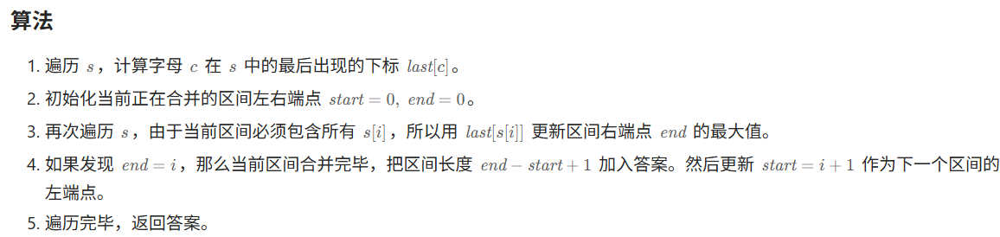

- 代码：

```python
class Solution:
    def partitionLabels(self, s: str) -> List[int]:
        last = {c: i for i, c in enumerate(s)}  # 统计每个字母出现的最后的下标
        
        ans = []
        st = ed = 0
        for i, c in enumerate(s):
            ed = max(ed, last[c])       # 更新当前区间右端点的最大值
            if ed == i:
                ans.append(ed - st + 1) # 添加区间长度
                st = i + 1
        return ans
```

---

#### 15. 动态规划

##### 15.1 爬楼梯

- 题目链接：[70. 爬楼梯](https://leetcode.cn/problems/climbing-stairs/)
- 题目描述：有n阶楼梯，每次只能爬1或2个台阶，有多少种不同的方法？
- 思路：1. 递归 + 记忆化；2. 递推 （关键在于状态定义和状态转移方程）。
- 代码：

```python
class Solution:
    def climbStairs(self, n: int) -> int:
        @cache              # 缓存装饰器，避免重复计算dfs的结果
        def dfs(i):
            if i <= 1:
                return 1
            return dfs(i - 1) + dfs(i - 2)
        return dfs(n)

"""
递推写法
"""
class Solution:
    def climbStairs(self, n: int) -> int:
        f = [0] * (n + 1)
        f[0] = f[1] = 1
        for i in range(2, n + 1):
            f[i] = f[i - 1] + f[i - 2]
        return f[n]
```

---

##### 15.2 杨辉三角

- 题目链接：[118. 杨辉三角](https://leetcode.cn/problems/pascals-triangle/)
- 题目描述：给定一个非负整数 *`numRows`，*生成「杨辉三角」的前 *`numRows`* 行。
- 思路：

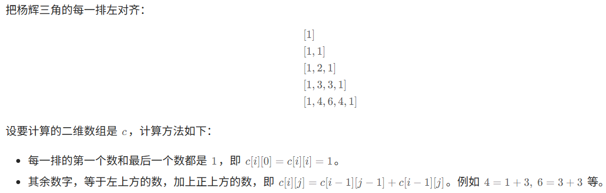

- 代码：

```python
class Solution:
    def generate(self, numRows: int) -> List[List[int]]:
        c = [[1] * (i + 1) for i in range(numRows)]
        for i in range(2, numRows):     # 从第三行开始
            for j in range(1, i):
                # 当前数 = 左上方的数 + 正上方的数
                c[i][j] = c[i - 1][j - 1] + c[i - 1][j] 
        return c
```

---

##### 15.3 打家劫舍

- 题目链接：[198. 打家劫舍](https://leetcode.cn/problems/house-robber/)
- 题目描述：

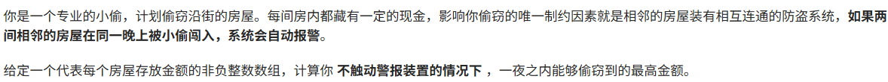

- 思路：1. 递归 + 记忆化搜索； 2. 翻译为递推；
- 代码：

```python
class Solution:
    def rob(self, nums: List[int]) -> int:
        n = len(nums)
        f = [0] * (n + 1)
        f[0], f[1] = 0, nums[0]
        for i in range(2, n + 1):
            f[i] = max(f[i - 1], f[i - 2] + nums[i - 1])

        return f[n]
    
"""
写法2
"""
class Solution:
    def rob(self, nums: List[int]) -> int:
        n = len(nums)

        if n == 0:
            return 0
        
        if n == 1:
            return nums[0]

        dp = [0] * n
        dp[0] = nums[0]
        dp[1] = max(nums[0], nums[1])

        for i in range(2, n):
            dp[i] = max(dp[i - 1], dp[i - 2] + nums[i])

        return dp[n - 1]
```

---

##### 15.4 完全平方数

- 题目链接：[279. 完全平方数](https://leetcode.cn/problems/perfect-squares/)
- 题目描述：给你一个整数 `n` ，返回 *和为 `n` 的完全平方数的最少数量* 。
- 思路：完全背包，状态转移方程为`dp[i][j] = min(dp[i - 1][j], dp[i][j - i * i] + 1)`，由于计算第i个状态只会用到第i - 1个状态，因此可简化方程：`dp[j] = min(dp[j], dp[j - i * i] + 1)`
- 代码：

```python
class Solution:
    def numSquares(self, n: int) -> int:
        dp = [inf] * (n + 10)
        dp[0] = 0
        # dp[i] = 凑出数字 i，最少需要几个完全平方数
        # 先枚举背包再枚举物品
        for i in range(1, n + 1):     
            for j in range(1, int(sqrt(i)) + 1):
                dp[i] = min(dp[i], dp[i - j * j] + 1)

        return dp[n]
```

---

##### 15.5 零钱兑换

- 题目链接：[322. 零钱兑换](https://leetcode.cn/problems/coin-change/)
- 题目描述：给定整数数组表示硬币，从中选出几个来凑成一个数，计算需要的最少的硬币个数。
- 思路：完全背包。
- 代码：

```python
class Solution:
    def coinChange(self, coins: List[int], amount: int) -> int:
        dp = [inf] * (amount + 1)
        dp[0] = 0
        
        for i in range(len(coins)):                 # 先遍历物品
            for j in range(coins[i], amount + 1):   # 再遍历背包
                if dp[j - coins[i]] != inf:
                    dp[j] = min(dp[j], dp[j - coins[i]] + 1)
                
        res = dp[amount]
        return res if res != inf else -1
```

---

##### 15.6 单词拆分

- 题目链接：[139. 单词拆分](https://leetcode.cn/problems/word-break/)
- 题目描述：给定一个非空字符串 s 和一个包含非空单词的列表 wordDict，判定 s 是否可以被空格拆分为一个或多个在字典中出现的单词。
- 思路：完全背包。定义dp[i]表示长度为i的字符串如果能被列表里的单词所拆分，则dp[i]为True，那么递推公式则为：如果 [j, i] 区间的子串在列表内，且dp[j]为True，则dp[i]也为True。
- 代码：

```python
class Solution:
    def wordBreak(self, s: str, wordDict: List[str]) -> bool:
        wordSet = set(wordDict)     # 转为哈希表，查询时间从O(n) ==> O(1)
        n = len(s)
        dp = [False] * (n + 1)
        dp[0] = True
        
        for i in range(1, n + 1):
            for j in range(0, i):
                s_sub = s[j: i]
                if s_sub in wordSet and dp[j]:
                    dp[i] = True
                    break

        return dp[n]
"""
写法二
"""
class Solution:
    def wordBreak(self, s: str, wordDict: List[str]) -> bool:
        n = len(s)
        wordSet = set(wordDict)
        dp = [False] * (n + 1)
        dp[0] = True
        
        for i in range(1, n + 1):
            for word in wordSet:
                if i >= len(word):
                    # 选or不选
                    dp[i] = dp[i] or dp[i - len(word)] and word == s[i - len(word): i]               

        return dp[n]
```

> 本题求的是**排列数**，需要注意遍历的顺序：应为先背包再物品。

---

##### 15.7 最长递增子序列

- 题目链接：[300. 最长递增子序列](https://leetcode.cn/problems/longest-increasing-subsequence/)
- 题目描述：给你一个整数数组 `nums` ，找到其中最长严格递增子序列的长度。
- 思路：定义dp[i]为以nums[i]为结尾的最长递增子序列的长度，那么对于i前面的nums[j]， 若nums[j] < nums[i]，则递推公式为：`dp[i] = max(dp[i], dp[j] + 1)`。
- 代码：

```python
class Solution:
    def lengthOfLIS(self, nums: List[int]) -> int:
        n = len(nums)
        dp = [1] * (n + 1)
        
        for i in range(1, n):
            for j in range(i):
                if nums[j] < nums[i]:
                    dp[i] = max(dp[j] + 1, dp[i])
        
        ans = max(dp)
        return ans     
```

---

##### 15.8 乘积最大子数组

- 题目链接：[152. 乘积最大子数组](https://leetcode.cn/problems/maximum-product-subarray/)
- 题目描述：找出数组中乘积最大的非空连续子数组，并返回乘积。
- 思路：

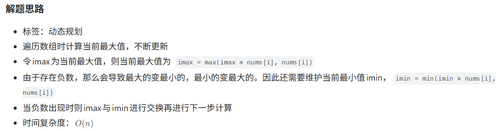

- 代码：

```python
class Solution:
    def maxProduct(self, nums: List[int]) -> int:
        n = len(nums)
        ans = -inf
        imax = imin = 1
        
        # 遍历过程中维护最大最小值
        for i in range(n):
            x = nums[i]
            if x < 0:           # 遇到负数则交换imax和imin
                imax, imin = imin, imax
            imax = max(x, x * imax)
            imin = min(x, x * imin)
            ans = max(ans, imax)
        
        return ans
"""
写法二
"""
class Solution:
    def maxProduct(self, nums: List[int]) -> int:
        n = len(nums)
        fmax = [0] * n
        fmin = [0] * n
        fmax[0] = fmin[0] = nums[0]

        for i in range(1, n):
            x = nums[i]
            # x加到右端点为i - 1的子数组后 / 单独作为一个子数组
            fmax[i] = max(fmax[i - 1] * x, fmin[i - 1] * x, x)
            fmin[i] = min(fmax[i - 1] * x, fmin[i - 1] * x, x)
        ans = max(fmax)
        return ans
```

---

##### 15.9 分割等和子集

- 题目链接：[416. 分割等和子集](https://leetcode.cn/problems/partition-equal-subset-sum/)
- 题目描述：给你一个 **只包含正整数** 的 **非空** 数组 `nums` 。请你判断是否可以将这个数组分割成两个子集，使得两个子集的元素和相等。
- 思路：每个数字看成物品，背包容量为数组总和的一半，不可重复选择，是典型的01背包问题。
- 代码：

```python
class Solution:
    def canPartition(self, nums: List[int]) -> bool:
        s = sum(nums)
        if s % 2:
            return False
        
        n = s // 2
        dp = [0] * 10001      
        # 01背包，先遍历物品再遍历背包
        for x in nums:
            for j in range(n, x - 1, -1):       # 每个元素不可重复，倒着遍历
                dp[j] = max(dp[j], dp[j - x] + x)
        
        if dp[n] == n:
            return True
        return False
```

---

##### 15.10 最长有效括号

- 题目链接：[32. 最长有效括号](https://leetcode.cn/problems/longest-valid-parentheses/)
- 题目描述：找出字符串中最长的有效连续的括号子串的长度。
- 思路：1. 用一个栈存还未匹配的左括号以及断点的位置，初始时设置栈底为-1，每次遇到`(`入栈，遇到`)`出栈，如果栈为空表示左边没有与之匹配的左括号，将当前断点位置入栈，否则更新答案。

> 注：弹出后栈顶保存的是子串左边界的前一个位置，所以更新长度时后面不需要+1

- 代码：

```python
class Solution:
    def longestValidParentheses(self, s: str) -> int:
        st = [-1]           # 栈中存还未匹配的左括号的下标以及断点的位置
        ans = 0
        
        for i, c in enumerate(s):
            if c == '(':
                st.append(i)
            else:
                st.pop()    # 弹出栈顶
                if st:      # 栈不空说明匹配成功，更新答案
                    ans = max(ans, i - st[-1])  # 现在的栈顶保留的是左边界的前一个位置，所以长度为i - st[-1]
                else:       # 栈空说明不能匹配成功，当前断点下标入栈
                    st.append(i)
        return ans
"""
DP写法
"""
class Solution:
    def longestValidParentheses(self, s: str) -> int:
        n = len(s)
        dp = [0] * n        # dp[i]为以s[i]为结尾的最长有效括号的长度
        ans = 0

        for i in range(1, n):
            if s[i] == ')':                 # 结尾为右括号
                if s[i - 1] == '(':
                    dp[i] = (dp[i - 2] if i >= 2 else 0) + 2
                else:
                    j = i - dp[i - 1] - 1   # 和当前右括号匹配的左括号的位置
                    if j >= 0 and s[j] == '(':
                        dp[i] = dp[i - 1] + 2
                        if j - 1 >= 0:
                            dp[i] += dp[j - 1]  # 和j前面的子串相连
            ans = max(ans, dp[i])
        return ans
```

---

#### 16. 多维动态规划

##### 16.1 不同路径

- 题目链接：[62. 不同路径](https://leetcode.cn/problems/unique-paths/)
- 题目描述：m * n的网格从(0, 0)出发，每次只能向下或向右移动，走到终点(m - 1, n - 1)有多少种不同路径。
- 思路：二维DP，定义`dp[i][j]`为从(0, 0)到(i, j)的不同路径数，则有递推方程：`dp[i][j] = dp[i - 1][j] + dp[i][j - 1]`。

> 注意：起点和边界需要初始化为1，因为第一行和第一列都只有一条路径。

- 代码：

```python
class Solution:
    def uniquePaths(self, m: int, n: int) -> int:
        dp = [[0] * (n + 1) for _ in range(m + 1)]
        # 初始化
        dp[0][0] = 1
        for i in range(m): dp[i][0] = 1
        for j in range(n): dp[0][j] = 1

        # 递推
        for i in range(1, m):
            for j in range(1, n):
                dp[i][j] = dp[i - 1][j] + dp[i][j - 1]
        
        return dp[m - 1][n - 1]
```

---

##### 16.2 最小路径和

- 题目链接：[64. 最小路径和](https://leetcode.cn/problems/minimum-path-sum/)
- 题目描述：给定一个包含非负整数的 `m x n` 网格 `grid` ，请找出一条从左上角到右下角的路径，使得路径上的数字总和为最小。
- 思路：DP。定义`dp[i][j]`为从(0, 0)到(i, j)的最小路径和，那么有递推公式：`dp[i][j] = min(dp[i - 1][j], dp[i][j - 1]) + grid[i][j]`。

> 注意：第一行和第一列的边界情况，由于只有唯一的一条路径，所以直接把总和加起来即可。

- 代码：

```python
class Solution:
    def minPathSum(self, grid: List[List[int]]) -> int:
        m, n = len(grid), len(grid[0])
        dp = [[inf] * (n + 1) for _ in range(m + 1)]
        dp[0][0] = grid[0][0]
        for i in range(1, m): dp[i][0] = grid[i][0] + dp[i - 1][0]
        for j in range(1, n): dp[0][j] = grid[0][j] + dp[0][j - 1]

        minv = inf
        for i in range(1, m):
            for j in range(1, n):
                dp[i][j] = min(dp[i - 1][j], dp[i][j - 1]) + grid[i][j]

        return dp[m - 1][n - 1]
"""
写法二
"""
class Solution:
    def minPathSum(self, grid: List[List[int]]) -> int:
        m, n = len(grid), len(grid[0])
        dp = [[inf] * (n + 1) for _ in range(m + 1)]
        
        for i in range(m):
            for j in range(n):
                if i == 0 and j == 0:           # 起点需要特判
                    dp[1][1] = grid[i][j]
                else:
                    dp[i + 1][j + 1] = min(dp[i + 1][j], dp[i][j + 1]) + grid[i][j]
        return dp[m][n]
```

---

##### 16.3 最长回文子串

- 题目链接：[5. 最长回文子串](https://leetcode.cn/problems/longest-palindromic-substring/)
- 题目描述：给你一个字符串 `s`，找到 `s` 中最长的 回文子串。
- 思路：1. DP，定义`dp[i][j]`表示字符串s[i: j]的子串是否是回文串，则递推方程为：`dp[i][j] = dp[i + 1][j - 1] && s[i] == s[j]`。2. 中心扩展法，分别枚举奇回文串和偶回文串的中心，然后再进行扩展，更新最大长度的区间。
- 代码：

```python
class Solution:
    def longestPalindrome(self, s: str) -> str:
        n = len(s)
        if n < 2:       # 单个字符一定是回文串
            return s

        max_len = 1
        pos = 0
        dp = [[None] * n for _ in range(n)]
        
        for i in range(0, n):   # 初始化，所有长度为1的子串均为回文串
            dp[i][i] = True

        for l in range(2, n + 1):       # 枚举子串长度
            for i in range(0, n):       # 枚举左边界
                j = l + i - 1           # 确定右边界
                if j >= n:
                    break
                if s[i] != s[j]:
                    dp[i][j] = False
                else:
                    if j - i < 3:
                        dp[i][j] = True
                    else:
                        dp[i][j] = dp[i + 1][j - 1]
                
                if dp[i][j] and j - i + 1 > max_len:
                        max_len = j - i + 1
                        pos = i
            
        return s[pos:pos + max_len]
"""
中心扩展法
"""
class Solution:
    def expandCenter(self, s, l, r):
        while l >= 0 and r < len(s) and s[l] == s[r]:
            l -= 1
            r += 1
        return l + 1, r - 1                         # 返回回文子串的边界 

    def longestPalindrome(self, s: str) -> str: 
        st, ed = 0, 0
        for i in range(len(s)):
            l1, r1 = self.expandCenter(s, i, i)         # 奇数回文串
            l2, r2 = self.expandCenter(s, i, i + 1)     # 偶数回文串
            if r1 - l1 > ed - st:
                st, ed = l1, r1
            if r2 - l2 > ed - st:
                st, ed = l2, r2
        return s[st: ed + 1]
```

---

##### 16.4 最长公共子序列

- 题目链接：[1143. 最长公共子序列](https://leetcode.cn/problems/longest-common-subsequence/)

- 题目描述：给定2个字符串，求它们的最长**公共子序列** 的长度。

- 思路：定义`dp[i][j]`：长度为[0, i - 1]的字符串text1与长度为[0, j - 1]的字符串text2的最长公共子序列的长度。递推公式：

  - ```python
    if text1[i - 1] == text2[j - 1]: dp[i][j] = dp[i - 1][j - 1] + 1 		
    else: dp[i + 1][j + 1] = max(dp[i + 1][j], dp[i][j + 1])
    ```

    如果当前字符相同则比较前面的子序列，如果不相同则去掉其中任意一个字符来比较。

- 代码：

```python
class Solution:
    def longestCommonSubsequence(self, text1: str, text2: str) -> int:
        m, n = len(text1), len(text2)
        dp = [[0] * (n + 1) for _ in range(m + 1)]
        
        for i, x in enumerate(text1):
            for j, y in enumerate(text2):
                if x == y:
                    dp[i + 1][j + 1] = dp[i][j] + 1
                else:
                    dp[i + 1][j + 1] = max(dp[i + 1][j], dp[i][j + 1])
        
        return dp[m][n]
    
"""
写法二
"""
class Solution:
    def longestCommonSubsequence(self, text1: str, text2: str) -> int:
        m, n = len(text1), len(text2)
        dp = [[0] * (n + 1) for _ in range(m + 1)]
        
        for i in range(1, m + 1):
            for j in range(1, n + 1):
                if text1[i - 1] == text2[j - 1]:
                    dp[i][j] = dp[i - 1][j - 1] + 1
                else:
                    dp[i][j] = max(dp[i - 1][j], dp[i][j - 1])
        return dp[m][n]
```

---

##### 16.5 编辑距离

- 题目链接：[72. 编辑距离](https://leetcode.cn/problems/edit-distance/)
- 题目描述：给你两个单词 `word1` 和 `word2`， *请返回将 `word1` 转换成 `word2` 所使用的最少操作数* 。（可以对单词进行插入、删除和替换）
- 思路：定义`dp[i][j] `**表示以下标i-1为结尾的字符串word1，和以下标j-1为结尾的字符串word2，最近编辑距离**。那么递推公式为：`if (word1[i - 1] == word2[j - 1]): dp[i][j] = dp[i - 1][j - 1]`说明不需要进行操作，否则`if (word1[i - 1] != word2[j - 1]):`操作1：word1删除一个元素，即`dp[i][j] = dp[i - 1][j] + 1`，操作2：word2删除一个元素，即`dp[i][j] = dp[i][j - 1] + 1`，操作3：替换一个元素：即`dp[i][j] = dp[i - 1][j - 1] + 1`，然后对上述三种操作取最小值。

> 注意：初始化第一行和第一列，由于`dp[i][0]`表示以下标i-1为结尾的字符串word1，和空字符串word2，最近编辑距离，因此直接将word1里的元素全部删除，即`dp[i][0] = i`， 同理可得`dp[0][j] = j`。

- 代码：

```python
class Solution:
    def minDistance(self, word1: str, word2: str) -> int:
        m, n = len(word1), len(word2)
        dp = [[0] * (n + 1) for _ in range(m + 1)]

        # 初始化
        for i in range(m + 1): dp[i][0] = i
        for j in range(n + 1): dp[0][j] = j

        for i in range(1, m + 1):
            for j in range(1, n + 1):
                if word1[i - 1] == word2[j - 1]:        # 不操作
                    dp[i][j] = dp[i - 1][j - 1]
                else:
                    dp[i][j] = min(dp[i - 1][j], dp[i][j - 1], dp[i - 1][j - 1]) + 1
        
        return dp[m][n]
"""
写法二
"""
class Solution:
    def minDistance(self, word1: str, word2: str) -> int:
        m, n = len(word1), len(word2)
        dp = [[0] * (n + 1) for _ in range(m + 1)]

        # 初始化
        for i in range(m + 1): dp[i][0] = i
        for j in range(n + 1): dp[0][j] = j

        # for i in range(1, m + 1):
        #     for j in range(1, n + 1):
        #         if word1[i - 1] == word2[j - 1]:        # 不操作
        #             dp[i][j] = dp[i - 1][j - 1]
        #         else:
        #             dp[i][j] = min(dp[i - 1][j], dp[i][j - 1], dp[i - 1][j - 1]) + 1

        for i in range(m):
            for j in range(n):
                if word1[i] == word2[j]:        # 不操作
                    dp[i + 1][j + 1] = dp[i][j]
                else:
                    dp[i + 1][j + 1] = min(dp[i][j + 1], dp[i + 1][j], dp[i][j]) + 1
        
        return dp[m][n]
```

---

#### 17. 技巧

##### 17.1 只出现一次的数字

- 题目链接：[136. 只出现一次的数字](https://leetcode.cn/problems/single-number/)
- 题目描述：给你一个 **非空** 整数数组 `nums` ，除了某个元素只出现一次以外，其余每个元素均出现两次。找出那个只出现了一次的元素。(必须设计并实现线性时间复杂度的算法来解决此问题，且该算法只使用常量额外空间。)
- 思路：使用异或运算，对数组中的所有数做一遍异或运算，剩下的那个即为答案。

> 异或运算的性质：
>
> 1. 任何数和 0 做异或运算，结果仍然是原来的数，如a ^ 0 = a。
> 2.  任何数和其自身做异或运算，结果是 0，如a ^ a = 0。
> 3. 异或运算满足交换律和结合律，如 a ^ b ^ a = b ^ a ^ a = b ^ (a ^ a)。

- 代码：

```python
class Solution:
    def singleNumber(self, nums: List[int]) -> int:
        ans = 0
        for x in nums:
            ans ^= x
        
        return ans
```

---

##### 17.2 多数元素

- 题目链接：[169. 多数元素](https://leetcode.cn/problems/majority-element/)
- 题目描述：给定一个大小为 `n` 的数组 `nums` ，返回其中的多数元素。多数元素是指在数组中出现次数 **大于** `⌊ n/2 ⌋` 的元素。
- 思路：1. 哈希表统计元素个数，然后返回其中最多的或者大于一半的元素。2. 数组排序，然后返回中间的那个元素。3. 摩尔投票法。
- 代码：

```python
class Solution:
    def majorityElement(self, nums: List[int]) -> int:
        cnt = Counter(nums)
        ans = 0
        for k, v in cnt.items():
            if v > len(nums) // 2:
                return k
"""
排序
"""
class Solution:
    def majorityElement(self, nums: List[int]) -> int:
        nums.sort()
        return nums[len(nums) // 2]
"""
投票法
"""
class Solution:
    def majorityElement(self, nums: List[int]) -> int:
        cnt = 0
        cand = 0
        for x in nums:
            if cnt == 0:
                cand = x
            if x == cand:
                cnt += 1
            else:
                cnt -= 1
        
        return cand
```

---

##### 17.3 颜色分类

- 题目链接：[75. 颜色分类](https://leetcode.cn/problems/sort-colors/)
- 题目描述：

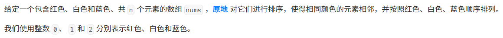

- 思路：三指针分区法。p0指向0的右边界，p2指向2的左边界，cur指向当前需要检查的数。遇到0，则交换p0和cur指向的数，同时两个指针加1；遇到2，则交换p2和cur指向的数，然后p2指针减1；遇到1，仅对cur加1即可。
- 代码：

```python
class Solution:
    def sortColors(self, nums: List[int]) -> None:
        p0, p2 = 0, len(nums) - 1           # p0指向0的右边界，p2指向2的左边界
        cur = 0
        
        while cur <= p2:
            if nums[cur] == 0:                 
                nums[cur], nums[p0] = nums[p0], nums[cur]
                cur += 1
                p0 += 1
            elif nums[cur] == 2:           
                nums[cur], nums[p2] = nums[p2], nums[cur]
                p2 -= 1
            else:
                cur += 1
```

> 注意：遇到2与p2交换后cur先不要动，因为交换过来的数有可能是0

---

##### 17.4 下一个排列

- 题目链接：[31. 下一个排列](https://leetcode.cn/problems/next-permutation/)
- 题目描述：原地修改数组为其字典序的下一个排列，若不存在则重排为最小的排列。
- 思路：
  1. 首先从右往左找到转折点（第一个逆序对），如果一直升序即为最大排列的部分，无需进行更改。
  2. 然后再从右往左找到第一个比nums[i]（转折点）大的数，并进行交换。
  3. 最后将转折点之后的部分进行翻转。

- 代码：

```python
class Solution:
    def nextPermutation(self, nums: List[int]) -> None:
        n = len(nums)
        i = n - 2
        # 从后往前找相邻的升序对
        while i >= 0 and nums[i] >= nums[i + 1]:
            i -= 1
        
        # 找到了转折点i
        if i >= 0:
            j = n - 1
            while j >= 0 and nums[j] <= nums[i]:        # 从后往前找第一个比nums[i]大的数
                j -= 1
            nums[i], nums[j] = nums[j], nums[i]
        
        # 反转i之后的部分
        left, right = i + 1, n - 1
        while left < right:
            nums[left], nums[right] = nums[right], nums[left]
            left += 1
            right -= 1
"""
反转操作也可以这样写： nums[i + 1: ] = nums[i + 1:][::-1]
"""
```

---

##### 17.5 寻找重复数

- 题目链接：[287. 寻找重复数](https://leetcode.cn/problems/find-the-duplicate-number/)
- 题目描述：有一个长度为 n + 1 的数组，其中的元素范围为[1, n]，找出那个唯一重复的元素。

- 思路：
  1.  二分：二分值域[1, n]，统计[1, mid]的区间的元素个数，如果cnt > mid则说明重复元素在这个区间内，否则在[mid + 1, n]这个区间。
  2. 快慢指针：将数组看成链表，数组中的元素看成链表的next指针，然后使用快慢指针遍历，有环则一定相遇。

- 代码：

```python
class Solution:
    def findDuplicate(self, nums: List[int]) -> int:
        slow = fast = 0
        
        while True:
            slow = nums[slow]
            fast = nums[nums[fast]]
            if slow == fast:
                break
    
        head = 0
        while slow != head:
            slow = nums[slow]
            head = nums[head]
        return slow
"""
二分写法
"""
class Solution:
    def findDuplicate(self, nums: List[int]) -> int:
        left, right = 0, len(nums)      # 左闭右开
        
        while left < right:
            mid = (left + right) // 2
            cnt = 0             # 统计数组中[1, mid]区间的元素个数
            for x in nums:
                if x <= mid:
                    cnt += 1
                
            if cnt > mid:       # 重复元素在[1, mid]
                right = mid
            else:
                left = mid + 1

        return left
```


---

### ACM模式输入输出模板

#### 1. 链表

```python
# 构造链表节点
class ListNode:
    def __init__(self, val=0, next=None):
        self.val = val
        self.next = next

# 尾插法构造链表      
def build_linked_list(nums):
    dummy = ListNode()
    cur = dummy
    for x in nums:
        cur.next = ListNode(x)
        cur = cur.next
    return dummy.next

# 输出链表
def print_linked_list(head):
    res = []
    cur = head
    while cur:
        res.append(str(cur.val))
        cur = cur.next
    print(" ".join(res))
```

#### 2. 二叉树

```python
# 构造二叉树节点
class TreeNode:
    def __init__(self, val=0, left = None, right = None):
        self.val = val
        self.left = left
        self.right = right

# 层序数组构建普通二叉树
def build_tree(nums):
    if not nums or nums[0] == -1 # null 或者 -1 看题目要求
        return None
    
    # 创建根节点
    root = TreeNode(nums[0])
    
    # 队列中存等待分配左右孩子的节点
    q = deque([root])
    
    # i指向当前待处理的数组位置
    i = 1
    while q and i < len(nums):
        cur = q.popleft()
        
        # 处理左孩子
        if i < len(nums) and nums[i] != -1:
            cur.left = TreeNode(nums[i])
            q.append(cur.left)
        i += 1
        
        # 处理右孩子
        if i < len(nums) and nums[i] != -1:
            cur.right = TreeNode(nums[i])
            q.append(cur.right)
        i += 1
    
    return root
        
# 递归构建完全二叉树
def build_tree(nums, idx):
    n = len(nums)
    if idx >= n:
        return None
    
    node = TreeNode(nums[idx])
    node.left = build_tree(nums, 2 * idx + 1)
    node.right = build_tree(nums, 2 * idx + 2)
    return node
```

