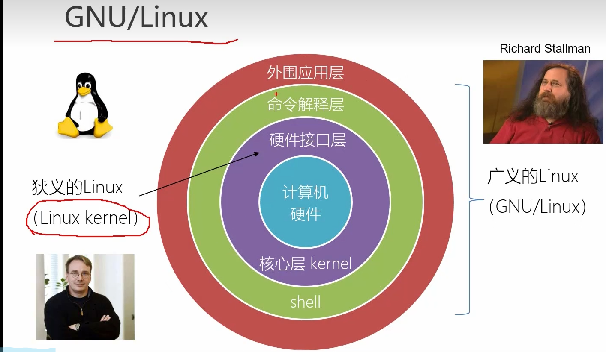
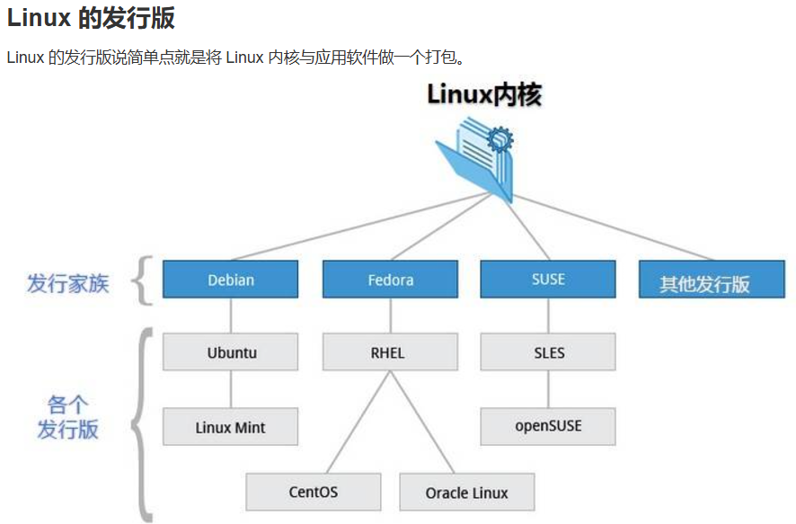
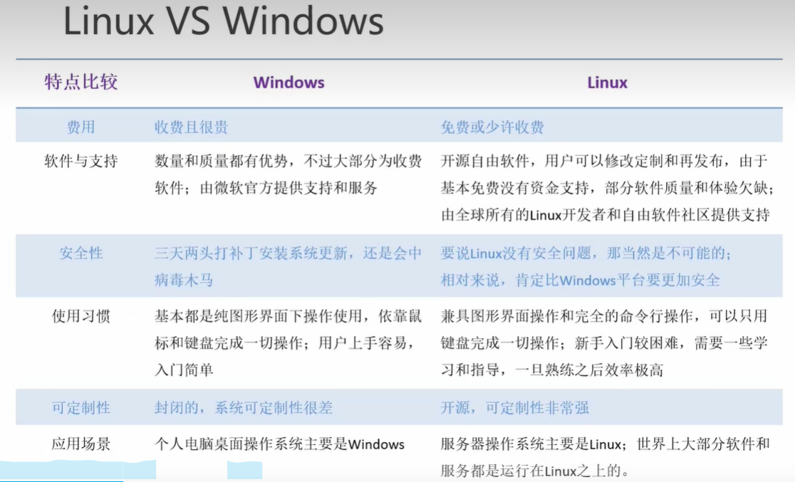

# Linux学习笔记

> **课程来源：B站《尚硅谷》**

## 一、入门篇

### 1.1 Linux 概述

 * `Linux`是一个**操作系统（`OS`）**，本质上是一个**软件**，类似于`Windows && MacOS`。`Linux`诞生于**1991年9月（内核0.01版本）**，由`Linux`之父`Linus Torvalds`在上大学期间独自完成并且将其**开源**（开源时代，启动！）。目前`Linux`是服务器主流的操作系统，并且是**后端和运维**开发人员的必备技能。
 * **广义的`Linux`：`GNU/Linux`**，**狭义的`Linux`：`Linux kernel`**（平时所用的是广义的概念）。

 * **`Linux`发行版：**将 Linux 内核与应用软件做一个打包。
 * 可以按照性质将其分为两大类，一类是商业公司维护的收费版本，另一类是开源社区维护的免费版本。

* **目前市面上主流的Linux发行版：**`RedHat`系列、`Debian`系列和`SUSE`系列

> `RedHat`的性能十分强悍、饱受高手青睐。有以下几类
>
> 1. `RedHat Enterprise Linux`：企业版，收费（简称为RHEL）
> 2. `Fedora`：实验版，功能新但不够稳定（看起来更像是一个测试版），免费
> 3. `CentOS`：基于已经发布的企业版除去商标信息和有版权的代码之后重构的一个版本，免费（稳定性和功能跟企业版接近）
>
> `Debian`是最遵循`GNU`规范的，比较著名的发行版是`Ubuntu`，特点是**有最新的软件包、非常激进，整体来讲更前沿一点，但这也意味着拥有更多的`bug`**。基于ubuntu做进一步变化的版本（比较小众）是**Linux Mint**，在外观上更像Windows。
>
> `SUSE`是德国公司开发出来的一个Linux发行版，在欧洲较为流行（号称是世界上最华丽的操作系统）。分为企业版（SEL）和社区版（openSUSE）

* **Linux VS Windows：**

### 1. 2 Linux安装

