### 前言
《算法基础课》的核心在于熟悉各类算法模板，相当于数学中的背定理和公式；而《算法提高课》的核心在于将问题抽象出一个模型，并使用之前学过的算法来进行解决，相当于数学中的对定理和公式的应用。
> 说实话感觉y总的算法提高课讲得确实要比基础课好很多，多了许多细节

### 一、动态规划
#### 1.1 数字三角形模型
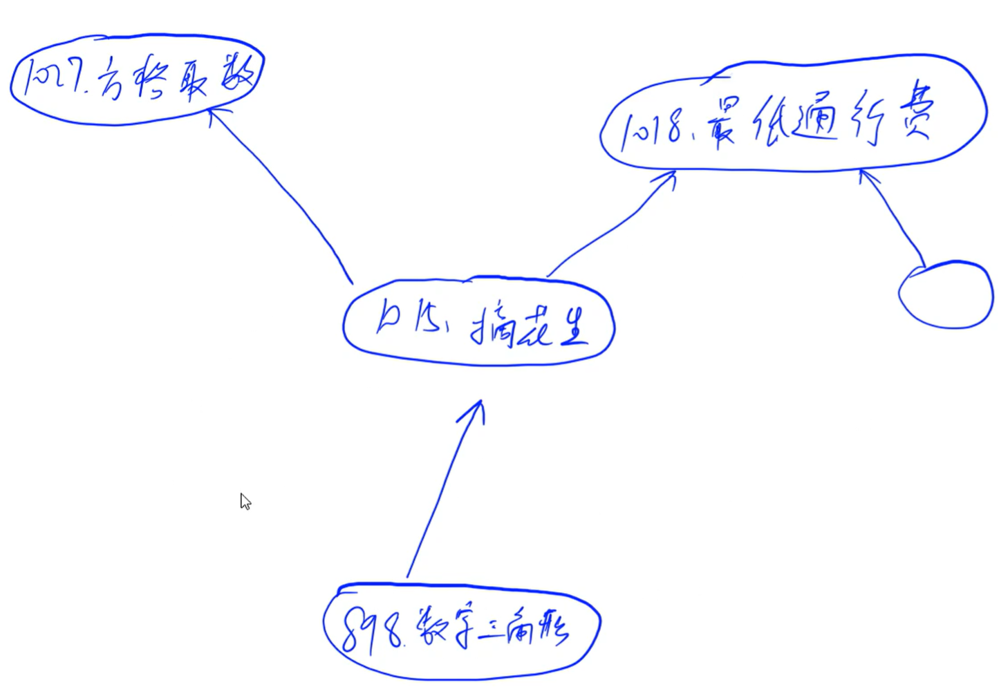

相同模型中，每个题目之间都有一定的相关性，它们之间多为递进（或扩展）关系。

##### 1.1.1 闫氏DP分析法介绍（以摘花生的题为例）
* DP问题的新的思考方式——闫氏DP分析法（从**集合角度**来思考问题）
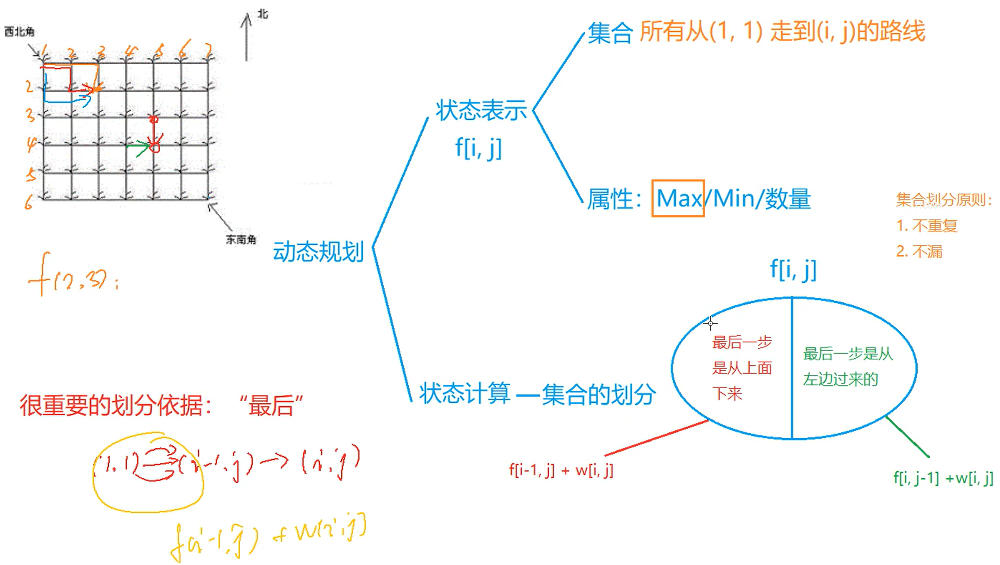
**关键点：**
1. 分为**状态表示**和**状态计算**两部分考虑
2. 状态表示是指用**一个状态来表示一个集合**，并且这个集合有一个具体的属性
3. 状态计算本质是**对集合进行划分**（并推导出状态转移方程）
> * 从上述分析可以得到每一个状态由哪些状态算出来
> * 在进行状态计算时考虑顺序问题，本题中的当前状态是有前面的状态计算而来，可以看成是一个拓扑序，因此行和列均从小到大进行枚举
> * 状态表示的维度一般怎么考虑：根据**经验**来，比如网格图一般用f[i][j]，线形图一般用f[i]，背包问题一般用f[i][j]（第一维表示物体，第二维表示容量）

##### 1.1.2 摘花生求解
**C++ 代码**
```c++
#include <iostream>
#include <algorithm>

using namespace std;

const int N = 110;

int n, m;
int w[N][N];
int f[N][N];    // 状态表示：f[i][j]表示从(1, 1)走到(i, j)的所有路径集合（属性为max，即路径上的花生数量的最大值）

int main()
{
    int T;
    scanf("%d", &T);
    
    while (T -- )
    {
        scanf("%d%d", &n, &m);
        for (int i = 1; i <= n; i ++ )
            for (int j = 1; j <= m; j ++ )
                scanf("%d", &w[i][j]);
        
        for (int i = 1; i <= n; i ++ )
            for (int j = 1; j <= m; j ++ )
                f[i][j] = max(f[i - 1][j], f[i][j - 1]) + w[i][j];  // 状态计算：(i, j)是由(i-1, j)或者(i, j-1)走过来的
        
        printf("%d\n", f[n][m]);
    }
    
    return 0;
}
```

##### 1.1.3 最低通行费
问题分析：由`2n-1`步可以推出，不能走回头路，所以本质上和**摘花生**这个题一样
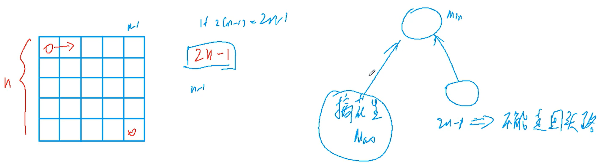
**C++ 代码**
```c++
#include <iostream>
#include <algorithm>

using namespace std;

const int N = 110, INF = 1e9;

int n;
int w[N][N];
int f[N][N];

int main()
{
    scanf("%d", &n);
    
    for (int i = 1; i <= n; i ++ )
        for (int j = 1; j <= n; j ++ )
            scanf("%d", &w[i][j]);
    
    for (int i = 1; i <= n; i ++ )
        for (int j = 1; j <= n; j ++ )
            if (i == 1 && j == 1) f[i][j] = w[i][j];    // 起点位置
            else
            {
                f[i][j] = INF;
                if (i > 1) f[i][j] = min(f[i][j], f[i - 1][j] + w[i][j]);   // 可以从上面走过来
                if (j > 1) f[i][j] = min(f[i][j], f[i][j - 1] + w[i][j]);   // 可以从左边走过来
            }
    
    printf("%d\n", f[n][n]);
    
    return 0;
}
```
> 注：求min值时可能需要特殊处理一下边界（比如该题，第0行和第0列的值都是0，若直接使用状态转移方程那么在求第1行和第1列的状态时最小值肯定是0，所以只能从第2行和第2列开始进行状态转移）

##### 1.1.4 方格取数
**要点：**
* 跟摘花生这个题类似，区别在于如何从走一次扩展到走两次？
> 解决思路：扩展一下状态维度，从`f(i, j)==>f(i1, j1, i2, j2)`
* 如何处理同一个格子不能被重复选择的问题？
> 解决思路：利用`i1 + j1 == i2 + j2`时两条路径的格子可能会重合这个性质来减少一维状态，然后每次在状态计算的时候判断这个格子是否重合，如果重合就只加一个方格的数，不重合就加两个方格的数

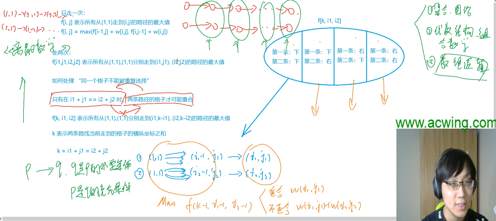
**C++ 代码**
```c++
#include <iostream>
#include <algorithm>

using namespace std;

const int N = 15;

int n;
int w[N][N];
int f[N * 2][N][N];

int main()
{
    int a, b, c;
    
    scanf("%d", &n);
    
    while (cin >> a >> b >> c, a || b || c) w[a][b] = c;
    
    for (int k = 2; k <= n + n; k ++ )                          // k表示两条路径走过的行+列之和
        for (int i1 = 1; i1 <= n; i1 ++ )
            for (int i2 = 1; i2 <= n; i2 ++ )
            {
                int j1 = k - i1, j2 = k - i2;
                if (j1 >= 1 && j1 <= n && j2 >= 1 && j2 <= n)   // 判断边界
                {
                    int t = w[i1][j1];
                    if (i1 != i2) t += w[i2][j2];
                    int &x = f[k][i1][i2];
                    x = max(x, f[k - 1][i1 - 1][i2 - 1] + t);   // 下 + 下
                    x = max(x, f[k - 1][i1 - 1][i2] + t);       // 下 + 右
                    x = max(x, f[k - 1][i1][i2 - 1] + t);       // 右 + 下
                    x = max(x, f[k - 1][i1][i2] + t);           // 右 + 右
                }
            }
    
    printf("%d\n", f[n + n][n][n]);
    
    return 0;
}
```

> 拓展：
> 1. k取方格数，即需要走k次然后求最大值【需要使用**最小费用流**（图的最优化问题）来做】
> 2. DP与最短路问题的联系：90%的DP问题可以转化成最短路问题，当图为拓扑图时，最短路问题也可以转为DP问题

#### 1.2 最长上升子序列（LIS）模型
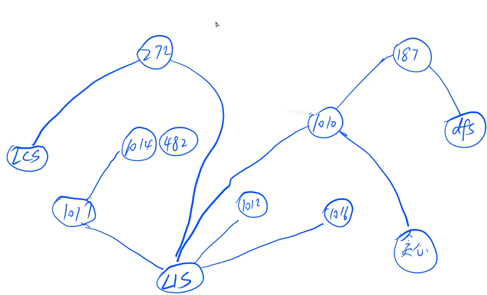
> LCS是指最长公共子序列问题
> 题目之间存在逻辑关系，能够形成一种系统的思维

##### 1.2.1 闫氏DP分析法分析LIS问题
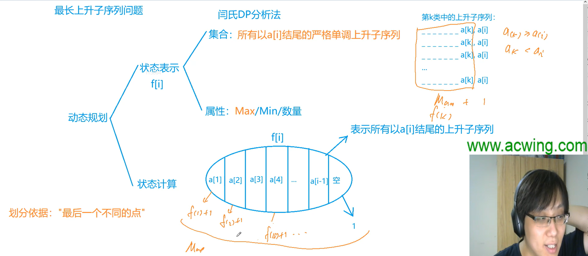

* 状态表示集合时要根据具体的问题来定义
* 状态计算中在划分集合时的划分依据：**最后一个不同的点**
* 以倒数第二个数来划分集合时，注意**特殊情况**：序列中只有一个a[i]，不存在倒数第二个数，因此其划分的部分集合为空
* 注意：在状态计算时还要考虑该类集合是否存在（以第k类集合为例），如果`a[k] >= a[i]`说明它不满足LIS的特征，因此不用计算该类；如果`a[k] < a[i]`，则需要计算该类

##### 1.2.2 最长上升子序列
**C++ 代码**
```c++
#include <iostream>
#include <algorithm>

using namespace std;

const int N = 1010;

int n;
int a[N], f[N];

int main()
{
    scanf("%d", &n);
    for (int i = 1; i <= n; i ++ ) scanf("%d", &a[i]);
    
    for (int i = 1; i <= n; i ++ )
    {
        f[i] = 1;                               // 所有以a[i]结尾的最长公共上升子序列的初始长度为1
        for (int j = 1; j < i; j ++ )
            if (a[j] < a[i])                    // 满足条件时才进行计算
                f[i] = max(f[i], f[j] + 1);
    }
    
    int res = 0;
    for (int i = 1; i <= n; i ++ ) res = max(res, f[i]);
    printf("%d\n", res);
    
    return 0;
}
```

##### 1.2.3 怪盗基德的滑翔翼
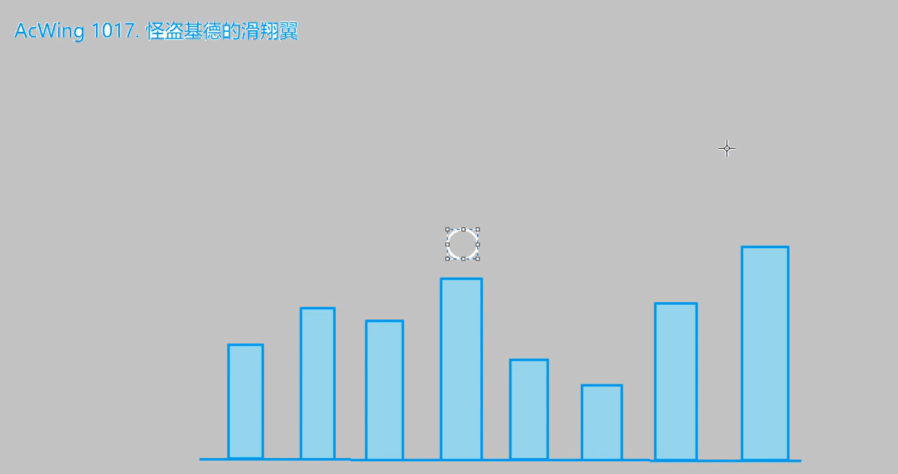
**题意**：每次怪盗基德选一个楼房作为起点，然后确定一个方向（可以往左或者右），接下来会在楼房进行跳跃，并且每次跳跃只能跳到高度较低的楼房去，求最多能跳多少楼房？

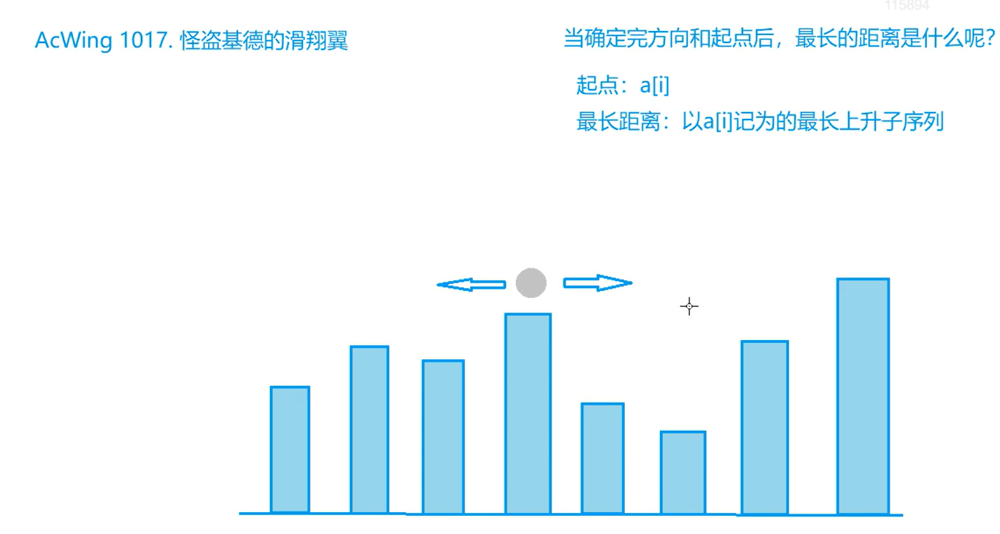
**要点：**
* 可以将问题看作**以a[i]（起点）为结尾的最长上升子序列问题**
* 分为两种情况（分别对应两个方向）：
  1. 从起点往左走：从左往右看以a[i]结尾的最长上升子序列
  2. 从起点往右走：从右往左看以a[i]结尾的最长上升子序列

> 其实该问题的本质是求最长下降子序列，只是我们使用逆向思维来把问题转化成了求最长上升子序列

**C++ 代码**
```c++
#include <iostream>
#include <algorithm>

using namespace std;

const int N = 1010;

int n;
int a[N], f[N];

int main()
{
    int T;
    scanf("%d", &T);
    while (T -- )
    {
        scanf("%d", &n);
        for (int i = 1; i <= n; i ++ ) scanf("%d", &a[i]);
        
        // 正向求解LIS问题（相当于从左往右看）
        int res = 0;
        for (int i = 1; i <= n; i ++ )
        {
            f[i] = 1;
            for (int j = 1; j < i; j ++ )
                if (a[i] > a[j])
                    f[i] = max(f[i], f[j] + 1);
                    
            res = max(res, f[i]);
        }
        
        // 反向求解LIS问题（相当于从右往左看）
        for (int i = n; i; i -- )
        {
            f[i] = 1;
            for (int j = n; j > i; j -- )
                if (a[i] > a[j])
                    f[i] = max(f[i], f[j] + 1);
            
            res = max(res, f[i]);
        }
        
        printf("%d\n", res);
    }
    
    return 0;
}
```

##### 1.2.4 登山

**要点：**
* 走过的路线一定是先严格上升再严格下降，求满足该形状的子序列长度的最大值
* 相当于怪盗基德那个题走两次（不同的方向）
* 以a[k]为顶点，左右两边的路线是相互独立的，因此在求第k类集合的最大值时可分别求出左右两边的最大值（用f[k]和g[k]表示），然后再进行求和：`f[k] + g[k] - 1`（这里减1是因为a[k]算了两次）

**C++ 代码**
```c++
#include <iostream>
#include <algorithm>

using namespace std;

const int N = 1010;

int n;
int a[N];
int f[N], g[N];

int main()
{
    scanf("%d", &n);
    for (int i = 1; i <= n; i ++ ) scanf("%d", &a[i]);
    
    // 先预处理上山和下山（左右两边路线）
    for (int i = 1; i <= n; i ++ )
    {
        f[i] = 1;
        for (int j = 1; j < i; j ++ )
            if (a[i] > a[j])
                f[i] = max(f[i], f[j] + 1);
    }
    
    for (int i = n; i; i -- )
    {
        g[i] = 1;
        for (int j = n; j > i; j -- )
            if (a[i] > a[j])
                g[i] = max(g[i], g[j] + 1);
    }
    
    // 枚举山顶
    int res = 0;
    for (int i = 1; i <= n; i ++ ) res = max(res, f[i] + g[i] - 1);
    
    printf("%d\n", res);
    
    return 0;
}
```
> 注：先预处理出两条路线是为了降低时间复杂度（$O(n^2)$），如果不进行预处理则时间复杂度增至$O(n^3)$

##### 1.2.5 合唱队形
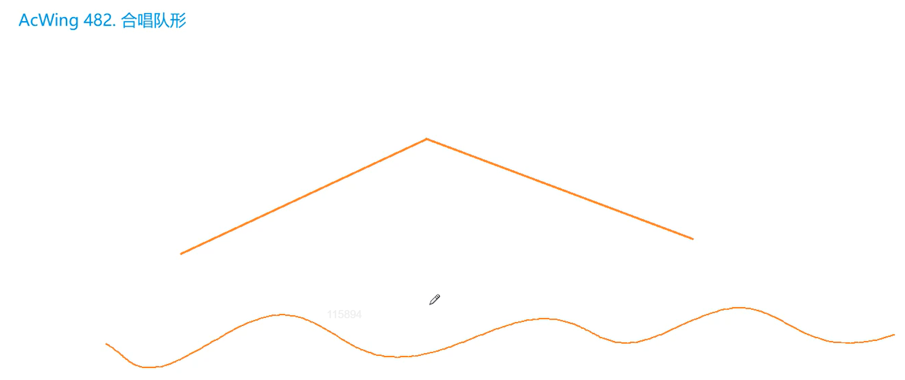
**要点：**
* 合唱队形即先严格上升再严格下降的形状
* 跟登山那道题存在对偶关系（本题求的是最少选择几个同学，让剩下的成为合唱队形）
* 用逆向思维将问题转化成选择最长的合唱队形，然后答案为用总数减去该队形的长度

**C++ 代码**
```c++
#include <iostream>
#include <algorithm>

using namespace std;

const int N = 1010;

int n;
int a[N];
int f[N], g[N];

int main()
{
    scanf("%d", &n);
    for (int i = 1; i <= n; i ++ ) scanf("%d", &a[i]);
    
    for (int i = 1; i <= n; i ++ )
    {
        f[i] = 1;
        for (int j = 1; j < i; j ++ )
            if (a[i] > a[j])
                f[i] = max(f[i], f[j] + 1);
    }
    
    for (int i = n; i; i -- )
    {
        g[i] = 1;
        for (int j = n; j > i; j -- )
            if (a[i] > a[j])
                g[i] = max(g[i], g[j] + 1);
    }
    
    int res = 0;
    for (int i = 1; i <= n; i ++ ) res = max(res, f[i] + g[i] - 1);
    
    printf("%d\n", n - res);    // 选出的最小值即为总数减去合唱队形的最大值
    
    return 0;
}
```

##### 1.2.6 友好城市
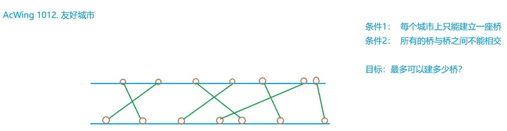

* 题意：给定n条边（每条边的两个顶点组成一对友好城市），问最多能选择多少条边，使得这些边不会相交？

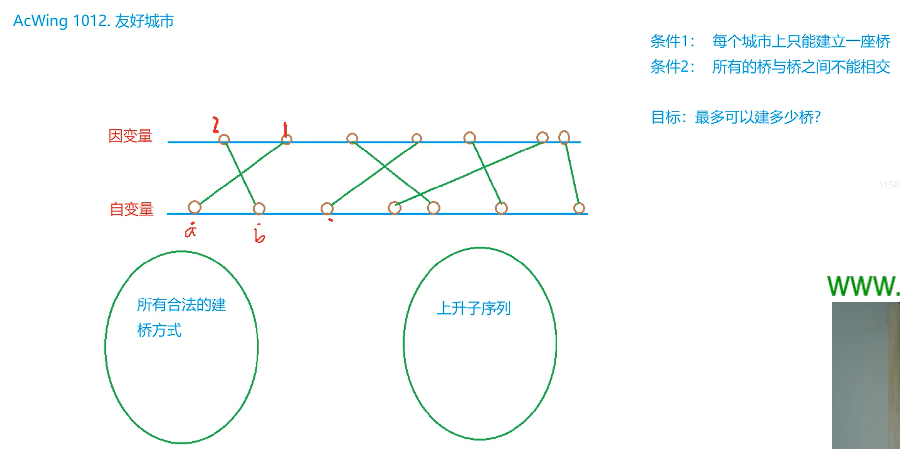
> 要点：
> 1. 特点：当两岸的点的序列都是严格上升的时候才会满足构建的桥不会相交
> 2. 所有合法的建桥方式与上升子序列一一对应（因此本题所求的答案为最长上升子序列的长度）

**C++ 代码**
```c++
#include <iostream>
#include <algorithm>

#define x first
#define y second

using namespace std;

typedef pair<int, int> PII;

const int N = 5010;

int n;
PII q[N];
int f[N];

int main()
{
    scanf("%d", &n);
    for (int i = 0; i < n; i ++ ) scanf("%d%d", &q[i].x, &q[i].y);
    sort(q, q + n);             // 对pair进行排序（按照字典序）
    
    int res = 0;
    for (int i = 0; i < n; i ++ )
    {
        f[i] = 1;
        for (int j = 0; j < i; j ++ )
            if (q[i].y > q[j].y)                // 因变量找出上升子序列
                f[i] = max(f[i], f[j] + 1);
        
        res = max(res, f[i]);
    }
    
    printf("%d\n", res);
    
    return 0;
}
```
> tips:
> 1. 一般结构体中只包含两个元素时采用pair来存储
> 2. 得先去发现问题的性质，然后再去求解问题（这样会容易很多，因为这时你就知道采用什么方法来解决）
> 3. 为什么不使用数组排序？因为数组下标的范围是$10^4$，排序需要循环$10^8$，数据较为敏感（在TLE的边缘）

##### 1.2.7 最大上升子序列和

**题意**: 求上升子序列的各个数字之和的最大值（并不是求最长的上升子序列）

**闫氏dp分析法分析**
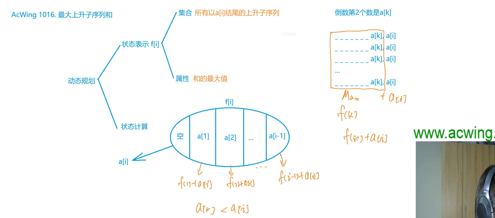

> 要点：
> * 与LIS问题的分析过程类似，区别在于其状态表示的属性和状态计算不同（仅将`f[k] + 1`变成了`f[k] + a[i]`）

**C++ 代码**
```c++
#include <iostream>
#include <algorithm>

using namespace std;

const int N = 1010;

int n;
int a[N], f[N];

int main()
{
    scanf("%d", &n);
    for (int i = 1; i <= n; i ++ ) scanf("%d", &a[i]);
    
    for (int i = 1; i <= n; i ++ )
    {
        f[i] = a[i];                        // 初始的和为a[i]本身
        for (int j = 1; j < i; j ++ )
            if (a[i] > a[j])
                f[i] = max(f[i], f[j] + a[i]);
                
        
    }
    
    int res = 0;
    for (int i = 1; i <= n; i ++ )
        res = max(res, f[i]);
    
    printf("%d\n", res);
    
    return 0;
}
```
> tips: 注意f[i]在初始时为a[i]本身而不是1（因为状态表示发生改变）

##### 1.2.8 拦截导弹
**思想：** LIS + 贪心
**题意：** 第一发炮弹能够到达任意的高度，但是以后每一发炮弹都只能低于上一发炮弹的高度。
问1：炮弹的最长下降子序列
问2：多少个最长上升子序列能够覆盖掉整个序列？
> 问1分析：可以用最长上升子序列来求
> 问2分析：使用贪心思想
> 贪心流程：从前往后扫描每个数，对于每个数：
> * 情况1：如果现有的子序列的结尾都小于当前数，则创建新子序列
> * 情况2：将当前数放到结尾大于等于它的最小的子序列后面
> 发现性质：最少用多少非下降子序列覆盖整个序列的方案数等于最长上升子序列的方案数

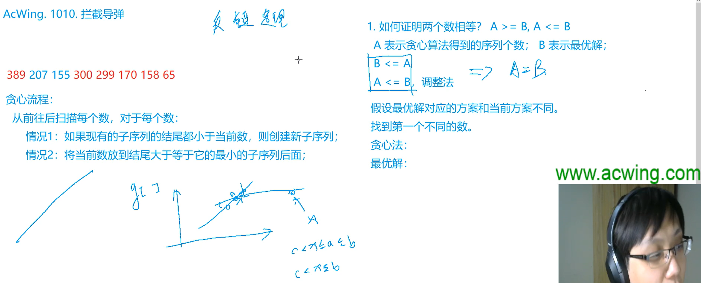

**C++ 代码**

```c++
#include <iostream>
#include <algorithm>

using namespace std;

const int N = 1010;

int n;
int q[N];
int f[N], g[N];

int main()
{
    while (cin >> q[n]) n ++ ;  // 如果能读到，n ++ （未说明导弹个数）
    
    int res = 0;
    for (int i = 0; i < n; i ++ )       // 求最长下降子序列长度
    {
        f[i] = 1;
        for (int j = 0; j < i; j ++ )
            if (q[i] <= q[j])
                f[i] = max(f[i], f[j] + 1);
        
        res = max(res, f[i]);
    }
    
    cout << res << endl;
     
    // 贪心求第二问
    int cnt = 0;                        // 序列个数
    for (int i = 0; i < n; i ++ )
    {
        int k = 0;                      // 枚举到第几个序列
        while (k < cnt && g[k] < q[i]) k ++ ;       // 未枚举完所有序列且当前数q[i]比当前序列的结尾g[k]大，枚举下一个序列
        g[k] = q[i];                    // 当前数作为该序列的结尾
        if (k >= cnt) cnt ++ ;          // 没有序列的结尾比当前数大，则新构建一个系统
    }
    
    cout << cnt << endl;
    
    return 0;
}
```

