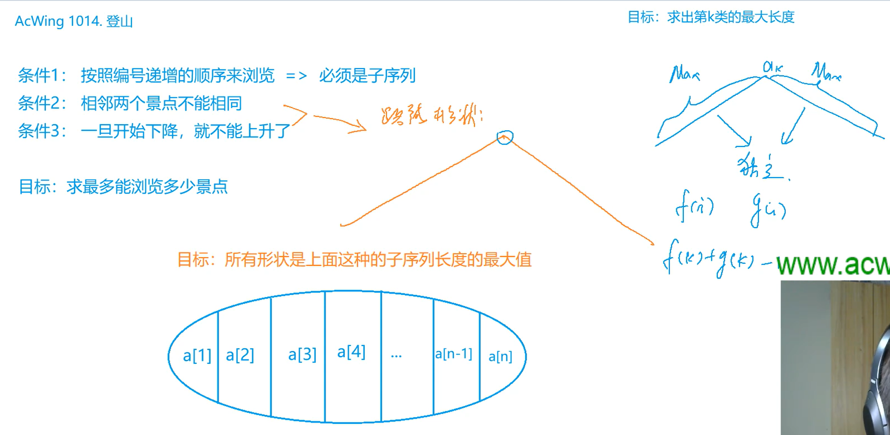
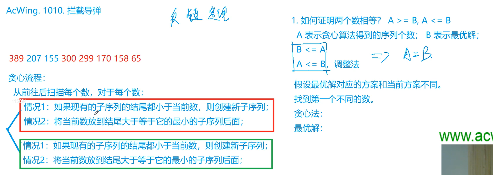

### 前言
《算法基础课》的核心在于熟悉各类算法模板，相当于数学中的背定理和公式；而《算法提高课》的核心在于将问题抽象出一个模型，并使用之前学过的算法来进行解决，相当于数学中的对定理和公式的应用。
> 说实话感觉y总的算法提高课讲得确实要比基础课好很多，多了许多细节

### 一、动态规划
#### 1.1 数字三角形模型


相同模型中，每个题目之间都有一定的相关性，它们之间多为递进（或扩展）关系。

##### 1.1.1 闫氏DP分析法介绍（以摘花生的题为例）
* DP问题的新的思考方式——闫氏DP分析法（从**集合角度**来思考问题）

**关键点：**
1. 分为**状态表示**和**状态计算**两部分考虑
2. 状态表示是指用**一个状态来表示一个集合**，并且这个集合有一个具体的属性
3. 状态计算本质是**对集合进行划分**（并推导出状态转移方程）
> * 从上述分析可以得到每一个状态由哪些状态算出来
> * 在进行状态计算时考虑顺序问题，本题中的当前状态是有前面的状态计算而来，可以看成是一个拓扑序，因此行和列均从小到大进行枚举
> * 状态表示的维度一般怎么考虑：根据**经验**来，比如网格图一般用f[i][j]，线形图一般用f[i]，背包问题一般用f[i][j]（第一维表示物体，第二维表示容量）

##### 1.1.2 摘花生求解
**C++ 代码**
```c++
#include <iostream>
#include <algorithm>

using namespace std;

const int N = 110;

int n, m;
int w[N][N];
int f[N][N];    // 状态表示：f[i][j]表示从(1, 1)走到(i, j)的所有路径集合（属性为max，即路径上的花生数量的最大值）

int main()
{
    int T;
    scanf("%d", &T);
    
    while (T -- )
    {
        scanf("%d%d", &n, &m);
        for (int i = 1; i <= n; i ++ )
            for (int j = 1; j <= m; j ++ )
                scanf("%d", &w[i][j]);
        
        for (int i = 1; i <= n; i ++ )
            for (int j = 1; j <= m; j ++ )
                f[i][j] = max(f[i - 1][j], f[i][j - 1]) + w[i][j];  // 状态计算：(i, j)是由(i-1, j)或者(i, j-1)走过来的
        
        printf("%d\n", f[n][m]);
    }
    
    return 0;
}
```

##### 1.1.3 最低通行费
问题分析：由`2n-1`步可以推出，不能走回头路，所以本质上和**摘花生**这个题一样

**C++ 代码**
```c++
#include <iostream>
#include <algorithm>

using namespace std;

const int N = 110, INF = 1e9;

int n;
int w[N][N];
int f[N][N];

int main()
{
    scanf("%d", &n);
    
    for (int i = 1; i <= n; i ++ )
        for (int j = 1; j <= n; j ++ )
            scanf("%d", &w[i][j]);
    
    for (int i = 1; i <= n; i ++ )
        for (int j = 1; j <= n; j ++ )
            if (i == 1 && j == 1) f[i][j] = w[i][j];    // 起点位置
            else
            {
                f[i][j] = INF;
                if (i > 1) f[i][j] = min(f[i][j], f[i - 1][j] + w[i][j]);   // 可以从上面走过来
                if (j > 1) f[i][j] = min(f[i][j], f[i][j - 1] + w[i][j]);   // 可以从左边走过来
            }
    
    printf("%d\n", f[n][n]);
    
    return 0;
}
```
> 注：求min值时可能需要特殊处理一下边界（比如该题，第0行和第0列的值都是0，若直接使用状态转移方程那么在求第1行和第1列的状态时最小值肯定是0，所以只能从第2行和第2列开始进行状态转移）

##### 1.1.4 方格取数
**要点：**
* 跟摘花生这个题类似，区别在于如何从走一次扩展到走两次？
> 解决思路：扩展一下状态维度，从`f(i, j)==>f(i1, j1, i2, j2)`
* 如何处理同一个格子不能被重复选择的问题？
> 解决思路：利用`i1 + j1 == i2 + j2`时两条路径的格子可能会重合这个性质来减少一维状态，然后每次在状态计算的时候判断这个格子是否重合，如果重合就只加一个方格的数，不重合就加两个方格的数


**C++ 代码**
```c++
#include <iostream>
#include <algorithm>

using namespace std;

const int N = 15;

int n;
int w[N][N];
int f[N * 2][N][N];

int main()
{
    int a, b, c;
    
    scanf("%d", &n);
    
    while (cin >> a >> b >> c, a || b || c) w[a][b] = c;
    
    for (int k = 2; k <= n + n; k ++ )                          // k表示两条路径走过的行+列之和
        for (int i1 = 1; i1 <= n; i1 ++ )
            for (int i2 = 1; i2 <= n; i2 ++ )
            {
                int j1 = k - i1, j2 = k - i2;
                if (j1 >= 1 && j1 <= n && j2 >= 1 && j2 <= n)   // 判断边界
                {
                    int t = w[i1][j1];
                    if (i1 != i2) t += w[i2][j2];
                    int &x = f[k][i1][i2];
                    x = max(x, f[k - 1][i1 - 1][i2 - 1] + t);   // 下 + 下
                    x = max(x, f[k - 1][i1 - 1][i2] + t);       // 下 + 右
                    x = max(x, f[k - 1][i1][i2 - 1] + t);       // 右 + 下
                    x = max(x, f[k - 1][i1][i2] + t);           // 右 + 右
                }
            }
    
    printf("%d\n", f[n + n][n][n]);
    
    return 0;
}
```

> 拓展：
> 1. k取方格数，即需要走k次然后求最大值【需要使用**最小费用流**（图的最优化问题）来做】
> 2. DP与最短路问题的联系：90%的DP问题可以转化成最短路问题，当图为拓扑图时，最短路问题也可以转为DP问题

#### 1.2 最长上升子序列（LIS）模型

> LCS是指最长公共子序列问题
> 题目之间存在逻辑关系，能够形成一种系统的思维

##### 1.2.1 闫氏DP分析法分析LIS问题


* 状态表示集合时要根据具体的问题来定义
* 状态计算中在划分集合时的划分依据：**最后一个不同的点**
* 以倒数第二个数来划分集合时，注意**特殊情况**：序列中只有一个a[i]，不存在倒数第二个数，因此其划分的部分集合为空
* 注意：在状态计算时还要考虑该类集合是否存在（以第k类集合为例），如果`a[k] >= a[i]`说明它不满足LIS的特征，因此不用计算该类；如果`a[k] < a[i]`，则需要计算该类

##### 1.2.2 最长上升子序列
**C++ 代码**
```c++
#include <iostream>
#include <algorithm>

using namespace std;

const int N = 1010;

int n;
int a[N], f[N];

int main()
{
    scanf("%d", &n);
    for (int i = 1; i <= n; i ++ ) scanf("%d", &a[i]);
    
    for (int i = 1; i <= n; i ++ )
    {
        f[i] = 1;                               // 所有以a[i]结尾的最长公共上升子序列的初始长度为1
        for (int j = 1; j < i; j ++ )
            if (a[j] < a[i])                    // 满足条件时才进行计算
                f[i] = max(f[i], f[j] + 1);
    }
    
    int res = 0;
    for (int i = 1; i <= n; i ++ ) res = max(res, f[i]);
    printf("%d\n", res);
    
    return 0;
}
```

##### 1.2.3 怪盗基德的滑翔翼

**题意**：每次怪盗基德选一个楼房作为起点，然后确定一个方向（可以往左或者右），接下来会在楼房进行跳跃，并且每次跳跃只能跳到高度较低的楼房去，求最多能跳多少楼房？


**要点：**
* 可以将问题看作**以a[i]（起点）为结尾的最长上升子序列问题**
* 分为两种情况（分别对应两个方向）：
  1. 从起点往左走：从左往右看以a[i]结尾的最长上升子序列
  2. 从起点往右走：从右往左看以a[i]结尾的最长上升子序列

> 其实该问题的本质是求最长下降子序列，只是我们使用逆向思维来把问题转化成了求最长上升子序列

**C++ 代码**
```c++
#include <iostream>
#include <algorithm>

using namespace std;

const int N = 1010;

int n;
int a[N], f[N];

int main()
{
    int T;
    scanf("%d", &T);
    while (T -- )
    {
        scanf("%d", &n);
        for (int i = 1; i <= n; i ++ ) scanf("%d", &a[i]);
        
        // 正向求解LIS问题（相当于从左往右看）
        int res = 0;
        for (int i = 1; i <= n; i ++ )
        {
            f[i] = 1;
            for (int j = 1; j < i; j ++ )
                if (a[i] > a[j])
                    f[i] = max(f[i], f[j] + 1);
                    
            res = max(res, f[i]);
        }
        
        // 反向求解LIS问题（相当于从右往左看）
        for (int i = n; i; i -- )
        {
            f[i] = 1;
            for (int j = n; j > i; j -- )
                if (a[i] > a[j])
                    f[i] = max(f[i], f[j] + 1);
            
            res = max(res, f[i]);
        }
        
        printf("%d\n", res);
    }
    
    return 0;
}
```

##### 1.2.4 登山

**要点：**
* 走过的路线一定是先严格上升再严格下降，求满足该形状的子序列长度的最大值
* 相当于怪盗基德那个题走两次（不同的方向）
* 以a[k]为顶点，左右两边的路线是相互独立的，因此在求第k类集合的最大值时可分别求出左右两边的最大值（用f[k]和g[k]表示），然后再进行求和：`f[k] + g[k] - 1`（这里减1是因为a[k]算了两次）

**C++ 代码**
```c++
#include <iostream>
#include <algorithm>

using namespace std;

const int N = 1010;

int n;
int a[N];
int f[N], g[N];

int main()
{
    scanf("%d", &n);
    for (int i = 1; i <= n; i ++ ) scanf("%d", &a[i]);
    
    // 先预处理上山和下山（左右两边路线）
    for (int i = 1; i <= n; i ++ )
    {
        f[i] = 1;
        for (int j = 1; j < i; j ++ )
            if (a[i] > a[j])
                f[i] = max(f[i], f[j] + 1);
    }
    
    for (int i = n; i; i -- )
    {
        g[i] = 1;
        for (int j = n; j > i; j -- )
            if (a[i] > a[j])
                g[i] = max(g[i], g[j] + 1);
    }
    
    // 枚举山顶
    int res = 0;
    for (int i = 1; i <= n; i ++ ) res = max(res, f[i] + g[i] - 1);
    
    printf("%d\n", res);
    
    return 0;
}
```
> 注：先预处理出两条路线是为了降低时间复杂度（$O(n^2)$），如果不进行预处理则时间复杂度增至$O(n^3)$

##### 1.2.5 合唱队形

**要点：**
* 合唱队形即先严格上升再严格下降的形状
* 跟登山那道题存在对偶关系（本题求的是最少选择几个同学，让剩下的成为合唱队形）
* 用逆向思维将问题转化成选择最长的合唱队形，然后答案为用总数减去该队形的长度

**C++ 代码**
```c++
#include <iostream>
#include <algorithm>

using namespace std;

const int N = 1010;

int n;
int a[N];
int f[N], g[N];

int main()
{
    scanf("%d", &n);
    for (int i = 1; i <= n; i ++ ) scanf("%d", &a[i]);
    
    for (int i = 1; i <= n; i ++ )
    {
        f[i] = 1;
        for (int j = 1; j < i; j ++ )
            if (a[i] > a[j])
                f[i] = max(f[i], f[j] + 1);
    }
    
    for (int i = n; i; i -- )
    {
        g[i] = 1;
        for (int j = n; j > i; j -- )
            if (a[i] > a[j])
                g[i] = max(g[i], g[j] + 1);
    }
    
    int res = 0;
    for (int i = 1; i <= n; i ++ ) res = max(res, f[i] + g[i] - 1);
    
    printf("%d\n", n - res);    // 选出的最小值即为总数减去合唱队形的最大值
    
    return 0;
}
```

##### 1.2.6 友好城市


* 题意：给定n条边（每条边的两个顶点组成一对友好城市），问最多能选择多少条边，使得这些边不会相交？


> 要点：
> 1. 特点：当两岸的点的序列都是严格上升的时候才会满足构建的桥不会相交
> 2. 所有合法的建桥方式与上升子序列一一对应（因此本题所求的答案为最长上升子序列的长度）

**C++ 代码**
```c++
#include <iostream>
#include <algorithm>

#define x first
#define y second

using namespace std;

typedef pair<int, int> PII;

const int N = 5010;

int n;
PII q[N];
int f[N];

int main()
{
    scanf("%d", &n);
    for (int i = 0; i < n; i ++ ) scanf("%d%d", &q[i].x, &q[i].y);
    sort(q, q + n);             // 对pair进行排序（按照字典序）
    
    int res = 0;
    for (int i = 0; i < n; i ++ )
    {
        f[i] = 1;
        for (int j = 0; j < i; j ++ )
            if (q[i].y > q[j].y)                // 因变量找出上升子序列
                f[i] = max(f[i], f[j] + 1);
        
        res = max(res, f[i]);
    }
    
    printf("%d\n", res);
    
    return 0;
}
```
> tips:
> 1. 一般结构体中只包含两个元素时采用pair来存储
> 2. 得先去发现问题的性质，然后再去求解问题（这样会容易很多，因为这时你就知道采用什么方法来解决）
> 3. 为什么不使用数组排序？因为数组下标的范围是$10^4$，排序需要循环$10^8$，数据较为敏感（在TLE的边缘）

##### 1.2.7 最大上升子序列和

**题意**: 求上升子序列的各个数字之和的最大值（并不是求最长的上升子序列）

**闫氏dp分析法分析**


> 要点：
> * 与LIS问题的分析过程类似，区别在于其状态表示的属性和状态计算不同（仅将`f[k] + 1`变成了`f[k] + a[i]`）

**C++ 代码**
```c++
#include <iostream>
#include <algorithm>

using namespace std;

const int N = 1010;

int n;
int a[N], f[N];

int main()
{
    scanf("%d", &n);
    for (int i = 1; i <= n; i ++ ) scanf("%d", &a[i]);
    
    for (int i = 1; i <= n; i ++ )
    {
        f[i] = a[i];                        // 初始的和为a[i]本身
        for (int j = 1; j < i; j ++ )
            if (a[i] > a[j])
                f[i] = max(f[i], f[j] + a[i]);
                
        
    }
    
    int res = 0;
    for (int i = 1; i <= n; i ++ )
        res = max(res, f[i]);
    
    printf("%d\n", res);
    
    return 0;
}
```
> tips: 注意f[i]在初始时为a[i]本身而不是1（因为状态表示发生改变）

##### 1.2.8 拦截导弹
**思想：** LIS + 贪心
**题意：** 第一发炮弹能够到达任意的高度，但是以后每一发炮弹都只能低于上一发炮弹的高度。
问1：炮弹的最长下降子序列
问2：多少个最长上升子序列能够覆盖掉整个序列？
> 问1分析：可以用最长上升子序列来求
> 问2分析：使用贪心思想
> 贪心流程：从前往后扫描每个数，对于每个数：
> * 情况1：如果现有的子序列的结尾都小于当前数，则创建新子序列
> * 情况2：将当前数放到结尾大于等于它的最小的子序列后面
> 发现性质：最少用多少非下降子序列覆盖整个序列的方案数等于最长上升子序列的方案数


**C++ 代码**

```c++
#include <iostream>
#include <algorithm>

using namespace std;

const int N = 1010;

int n;
int q[N];
int f[N], g[N];

int main()
{
    while (cin >> q[n]) n ++ ;  // 如果能读到，n ++ （未说明导弹个数）
    
    int res = 0;
    for (int i = 0; i < n; i ++ )       // 求最长下降子序列长度
    {
        f[i] = 1;
        for (int j = 0; j < i; j ++ )
            if (q[i] <= q[j])
                f[i] = max(f[i], f[j] + 1);
        
        res = max(res, f[i]);
    }
    
    cout << res << endl;
     
    // 贪心求第二问
    int cnt = 0;                        // 序列个数
    for (int i = 0; i < n; i ++ )
    {
        int k = 0;                      // 枚举到第几个序列
        while (k < cnt && g[k] < q[i]) k ++ ;       // 未枚举完所有序列且当前数q[i]比当前序列的结尾g[k]大，枚举下一个序列
        g[k] = q[i];                    // 当前数作为该序列的结尾
        if (k >= cnt) cnt ++ ;          // 没有序列的结尾比当前数大，则新构建一个系统
    }
    
    cout << cnt << endl;
    
    return 0;
}
```

##### 1.2.9 导弹防御系统
**思想：** LIS + 贪心 + 暴搜（DFS）
**题意:** 跟上一道题的区别在于存在两种防御系统：一种是不断抬高（拦截高度），另一种是不断下降，且每次可以选择用哪一种来进行拦截。



> **Tips：** 
> 1. 跟上一题的思路相似，对于每一个数分两种情况讨论，**不同之处**在于该题在对每个数进行讨论之前要先对数进行划分，即这个数应该作为上升子序列还是下降子序列。
> 2. 采用暴搜（DFS）的方式进行划分，决策空间为$O(2^n)$，因为每个数有两种情况。
> 3. dfs求最小步数的做法：① 记一个全局最小值，然后不断更新它；② 迭代加深的方式。
> **该题的本质：** 在上一道题目的基础上套一个暴搜。

Q: 为什么不使用bfs来求最小值？
1. 需要的空间太大，bfs需要把每一层都存下来，即每一层都需要指数级别的空间，很容易爆栈；
2. dfs容易进行剪枝操作，bfs很难做到这一点。

**C++ 代码**
```c++
#include <iostream>
#include <algorithm>

using namespace std;

const int N = 55;

int n;
int q[N];
int up[N], down[N];     // up表示上升子序列的结尾，down表示下降子序列的结尾
int ans;                // 定义全局最小值

void dfs(int u, int su, int sd)         // 当前枚举到第几个数，当前上升子序列的个数，当前下降子序列的个数
{
    if (su + sd >= ans) return;         // 不可能再把答案变小了，直接返回（su + sd相当于所创建的系统个数）
    if (u == n)                         // 找到一套防御方案
    {
        ans = su + sd;                  // 能执行到这一步说明su+sd一定小于ans，所以更新它，否则在前一个判断就直接返回了
        return;
    }
    
    // 情况1：将当前数放到上升子序列中
    int k = 0;
    while (k < su && up[k] >= q[u]) k ++ ;  // 要将当前数q[u]放到上升子序列的结尾
    int t = up[k];                          // 因为要恢复现场，所以先提前备份
    up[k] = q[u];
    if (k < su) dfs(u + 1, su, sd);         // 没有构建新的上升子序列
    else dfs(u + 1, su + 1, sd);
    up[k] = t;
    
    // 情况2：将当前数放到下降子序列中
    k = 0;
    while (k < sd && down[k] <= q[u]) k ++ ;
    t = down[k];
    down[k] = q[u];
    if (k < sd) dfs(u + 1, su, sd);
    else dfs(u + 1, su, sd + 1);
    down[k] = t;
}

int main()
{
    while (cin >> n, n)
    {
        for (int i = 0; i < n; i ++ ) cin >> q[i];
        
        ans = n;
        dfs(0, 0, 0);
        
        cout << ans << endl;
    }
    
    return 0;
}
```

##### 1.2.10 最长公共上升子序列
**思想：** LCS（最长公共子序列） + LIS
**题意：** 求两个序列中一段公共的严格上升的子序列，求该子序列的最长的长度。


> **状态表示：** 
> 集合：所有由**第一个序列的前i个字母和第二个序列的前j个字母构成的**，且**以b[j]结尾**的公共上升子序列。
> 属性：max 
> **状态计算：** 


通过分析可以发现在**所有包含a[i]的公共上升子序列**中有`a[i] = b[j]`，但是左边这个集合并没有一个显式的状态转移方程式来计算，因此还需要对其进行划分，持续划分后一定可以得到一个解。

**C++ 代码（朴素版，TLE）**
```c++
#include <iostream>
#include <algorithm>

using namespace std;

const int N = 3010;

int n;
int a[N], b[N];
int f[N][N];

int main()
{
    scanf("%d", &n);
    for (int i = 1; i <= n; i ++ ) scanf("%d", &a[i]);
    for (int i = 1; i <= n; i ++ ) scanf("%d", &b[i]);
    
    for (int i = 1; i <= n; i ++ )
        for (int j = 1; j <= n; j ++ )
        {
            f[i][j] = f[i - 1][j];              // 不包含a[i]的序列的集合
            if (a[i] == b[j])                   // 包含a[i]的序列的集合(此时a[i] == b[j])
            {
                f[i][j] = max(f[i][j], 1);      // 以b[j]结尾，倒数第二个数为空（序列长度至少为1）
                for (int k = 1; k < j; k ++ )   // 以b[j]结尾，按倒数第二个数进行分类
                    if (b[k] < b[j])
                        f[i][j] = max(f[i][j], f[i][k] + 1);
            }
        }
    
    int res = 0;
    for (int i = 1; i <= n; i ++ ) res = max(res, f[n][i]);
    
    printf("%d\n", res);
    
    return 0;
}
```
> TLE原因：时间复杂度为$O(n^3)$，容易超时（但是实际运行的时候，由于a[i]==b[j]的情况很少，所以也有可能过）

**C++ 代码（优化后版本）**
```c++
#include <iostream>
#include <algorithm>

using namespace std;

const int N = 3010;

int n;
int a[N], b[N];
int f[N][N];

int main()
{
    scanf("%d", &n);
    for (int i = 1; i <= n; i ++ ) scanf("%d", &a[i]);
    for (int i = 1; i <= n; i ++ ) scanf("%d", &b[i]);
    
    for (int i = 1; i <= n; i ++ )
    {
        int maxv = 1;                           // 存储1~j-1的前缀的最大值
        for (int j = 1; j <= n; j ++ )
        {
            f[i][j] = f[i - 1][j];
            if (a[i] == b[j]) f[i][j] = max(f[i][j], maxv);
            if (b[j] < a[i]) maxv = max(maxv, f[i][j] + 1);
            
            
            // 原来内层循环的含义：从1~j-1里找到满足小于a[i]的f[i][k]的最大值
            //  for (int k = 1; k < j; k ++ )   // 以b[j]结尾，按倒数第二个数进行分类
            //         if (b[k] < a[i])         // 这个条件跟j没有关系，因此可以直接提到外面
            //             f[i][j] = max(f[i][j], f[i][k] + 1);
        }
    }
    
    int res = 0;
    for (int i = 1; i <= n; i ++ ) res = max(res, f[n][i]);
    
    printf("%d\n", res);
    
    return 0;
}
```

> 优化就是对代码做**等价变形**
> 内层循环的两个判断：第一个`a[i]==b[j]`，实际上就是在找包含a[i]的公共上升子序列的集合的最大值，第二个`b[j]<a[i]`，实际上是在找对上述集合划分之后（按b[j]结尾的前一个数）的集合的最大值。

#### 1.3 背包模型

**背包题图**


##### 1.3.1 闫氏DP分析法
* 01背包问题分析


* 完全背包问题分析

> 状态表示和01背包完全一样


状态计算时发现：第一行对应的值 = 第二行对应的值 + w
最终状态转移方程式：`f[i, j] = max(f[i - 1, j], f[i, j - v] + w)`

> Tips: 
> 1. 当空间优化成一维后，只有完全背包问题的体积是从小到大循环的，其他背包问题都是从大到小循环
> 2. 循环的顺序：先物品再体积后决策

* 多重背包问题分析


> 分析过程与完全背包问题类似：（多重背包表达式在最后会多一项）
>
> 完全背包：可以看成求所有前缀的最大值
>
> 多重背包：可以看成求滑动窗口内的最大值（**注意要加上偏移量**）

 这里讲的是用单调队列来优化的写法，感觉可以看一下这篇博客：[多重背包问题 III【单调队列优化+图示】](https://www.acwing.com/solution/content/53507/)

* **题图**


##### 1.3.2 采药

**题意：**草药 == 物品，每采一株草药所花费时间 == 物品体积，每株草药的价值 == 物品的价值，**是一个很裸的背包问题**

**C++ 代码**

```c++
#include <iostream>
#include <algorithm>

using namespace std;

const int N = 1010;

int n, m;
int f[N];

int main()
{
    cin >> m >> n;      // 输入体积和草药数目
    for (int i = 0; i < n; i ++ )
    {
        int v, w;
        cin >> v >> w;
        for (int j = m; j >= v; j -- )          // 从大到小枚举
            f[j] = max(f[j], f[j - v] + w);
    }
    
    cout << f[m] << endl;
    
    return 0;
}
```

##### 1.3.3 装箱问题

**题意：**把n个物品（每个物品体积为v）装入容量为V的箱子，使得箱子的剩余空间最小

**思路：**题目中并没有提到体积，可以把物品体积看做它的价值，因为**箱子的剩余空间最小==装入箱子的总体积最大**

**C++ 代码**

```c++
#include <iostream>

using namespace std;

const int N = 20010;

int n, m;
int f[N];

int main()
{
    cin >> m >> n;
    for (int i = 0; i < n; i ++ )
    {
        int v;
        cin >> v;
        
        for (int j = m; j >= v; j -- ) f[j] = max(f[j], f[j - v] + v);  // 物品价值==物品体积
    }
    
    cout << m - f[m] << endl;
    
    return 0;
}
```

##### 1.3.4 宠物小精灵之收服

**题意：**已知小智的**精灵球数量**和皮卡丘的**初始体力**，已知收服每个小精灵所需要**花费的精灵球**和对皮卡丘造成的**伤害**，需要收服**尽可能多**的野生小精灵且保证皮卡丘剩余的体力越大越好

**分析：**


> 该题本质上是01背包的扩展——**二维费用01背包问题**
>
> 普通01背包只有一个花费（即物品的体积），而该题可以定义多个花费

**C++ 代码（优化到二维空间）**

```c++
#include <iostream>
#include <algorithm>

using namespace std;

const int N = 1010, M = 510, K = 110;

int n, m, t;
int f[N][M];            // 第一维花费为精灵球的数量，第二维花费为皮卡丘的体力值    

int main()
{
    cin >>  m >> t >> n;
    for (int i = 0; i < n; i ++ )
    {
        int v1, v2;
        cin >> v1 >> v2;
        for (int j = m; j >= v1; j -- )
            for (int k = t - 1; k >= v2; k -- )     // t-1是因为皮卡丘的体力值不能为0，即你的花费最多为t-1
                f[j][k] = max(f[j][k], f[j - v1][k - v2] + 1);
    }
    
    cout << f[m][t - 1] << ' ';
    
    // 找到所有满足最大价值的状态里第二维费用最小的
    int min_cost = t;
    for (int k = 0; k <= t - 1; k ++ )              // 这里k=0表示没有消耗皮卡丘的体力值(一只宠物都没有收服)
    {
        if (f[m][t - 1] == f[m][k])
            min_cost = min(min_cost, k);
    }
    
    cout << t - min_cost << endl;
    
    return 0;
}
```

> tips: 需要注意每一维的花费是什么，要和定义的对应起来

##### 1.3.5 二维费用的背包问题

**题意：**N个物品和容量为V的背包，最大承重为M，问在不超过容量和重量的情况下装物品（体积v，重量m，价值w）可获得的最大价值为多少？

**闫氏DP分析法**


> 本质上是01背包的拓展，但是状态表示有所不同（**与宠物小精灵题目思路解法一样**）
>
> tips：二维费用可以和01背包、完全背包、多重背包以及分组背包拼在一起

**C++ 代码**

```c++
#include <iostream>
#include <algorithm>

using namespace std;

const int N = 110;

int n, V, M;
int f[N][N];

int main()
{
    cin >> n >> V >> M;
    for (int i = 0; i < n; i ++ )
    {
        int v, m, w;
        cin >> v >> m >> w;
        for (int j = V; j >= v; j -- )
            for (int k = M; k >= m; k -- )
                f[j][k] = max(f[j][k], f[j - v][k - m] + w);
    }
    
    cout << f[V][M] << endl;
    
    return 0;
}
```

##### 1.3.5 数字组合

**题意：**从N个正整数中选择若干个数使其和为M，求选择方案个数

**分析：**

> 可以把总和M看成背包容量，将每个数看成物品，数的大小看成体积
>
> **目标：**总体积恰好为M的方案数


> 注意在**状态表示**中：
>
> **集合：**所有从前i个物品中选，总体积**恰好为j**的方案的集合
>
> **属性：**count
>
> 在**状态计算**中：
>
> **状态转移方程：**`f[i, j] = f[i - 1, j] + f[i - 1, j - ai]`

**C++ 代码**

```c++
#include <iostream>
#include <algorithm>

using namespace std;

const int N = 10010;

int n, m;
int f[N];                   // f[i]表示和恰好为i的方案数

int main()
{
    cin >> n >> m;
    
    f[0] = 1;               // 注意记得初始化（f[0, 0]表示什么都不选，也是一种方案）
    
    for (int i = 0; i < n; i ++ )
    {
        int v;
        cin >> v;
        for (int j = m; j >= v; j -- )
            f[j] += f[j - v];   
    }
    
    cout << f[m] << endl;
    
    return 0;
}
```

---

##### 1.3.6 庆功会

**题意：**给m的拨款金额（**背包容量**）去买n种奖品（价格v，价值w，能买s个），求能获得的最大价值

**分析：**

> 直接使用朴素的多重背包去做即可，时间复杂度为3e7，不会TLE

**C++ 代码**

```c++
#include <iostream>
#include <algorithm>

using namespace std;

const int N = 6010;

int n, m;
int f[N];

int main()
{
    cin >> n >> m;
    for (int i = 0; i < n; i ++ )
    {
        int v, w, s;
        cin >> v >> w >> s;
        
        for (int j = m; j >= 0; j -- )                      // 枚举总体积
            for (int k = 0; k <= s && k * v <= j; k ++ )    // 枚举所买的该类物品的数量
                f[j] = max(f[j], f[j - k * v] + k * w);
    }
    
    cout << f[m] << endl;
    
    return 0;
}
```

---

##### 1.3.7 买书

**题意：**用n块钱来买书（书的价格有10,20,50,100元），问有多少种方案？

**分析：**


> 最终**状态计算表达式**：`f[i, j] = f[i - 1, j] + f[i, j - v]`
>
> tips：当状态表示的属性为count时记得要进行初始化

**C++ 代码**

```c++
#include <iostream>

using namespace std;

const int N = 1010;

int v[4] = {10, 20, 50, 100};
int f[N];

int main()
{
    int m;
    cin >> m;
    
    f[0] = 1;
    for (int i = 0; i < 4; i ++ )
    {
        for (int j = 0; j <= m; j ++ )          // 完全背包从小到大枚举
            if (j >= v[i])                      // 只有满足条件的方案才加上
                f[j] += f[j - v[i]];
    }
    
    cout << f[m] << endl;
    
    return 0;
}
```


